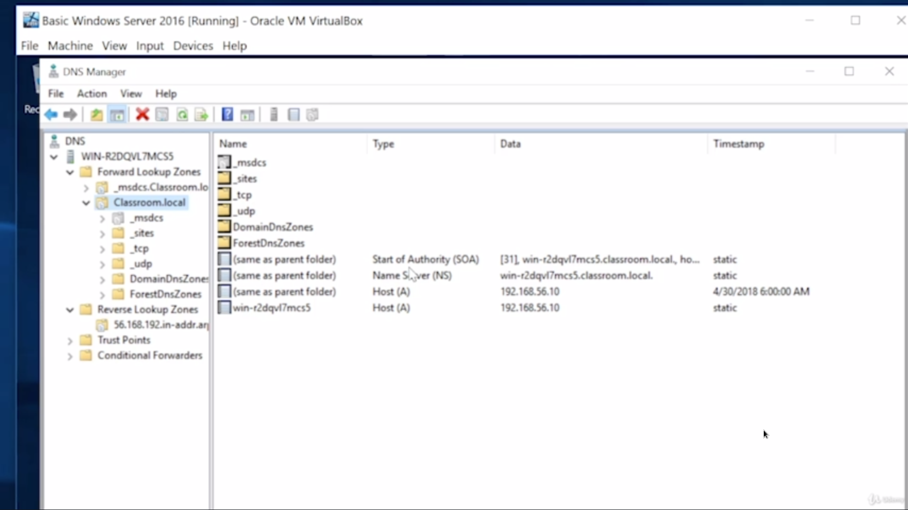
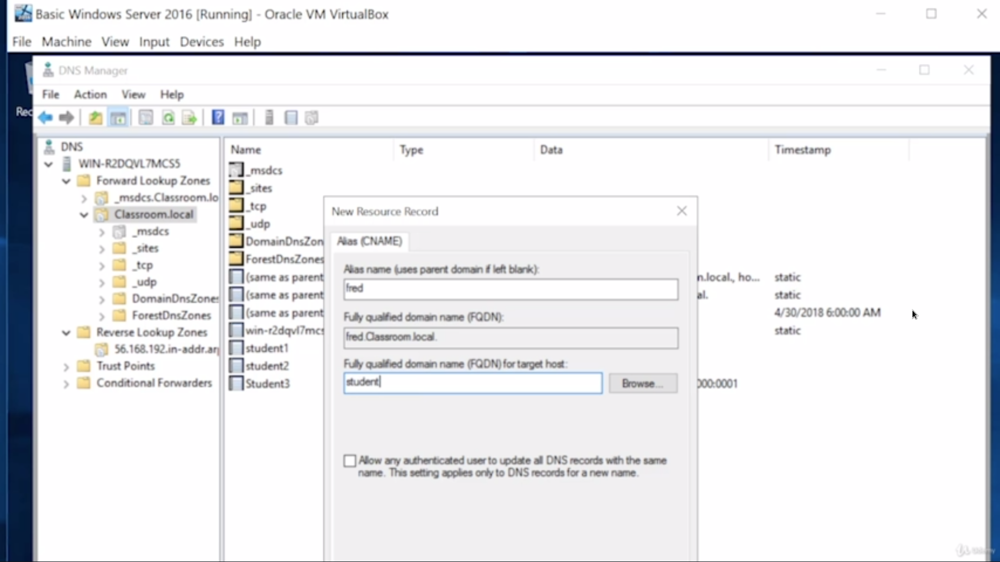
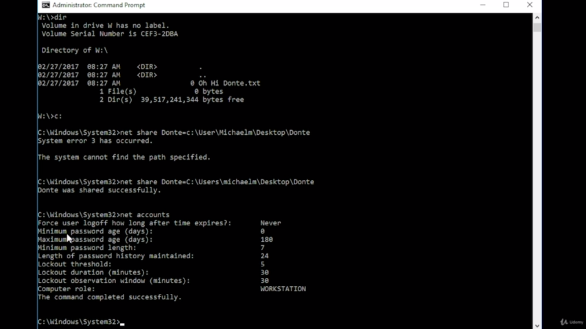
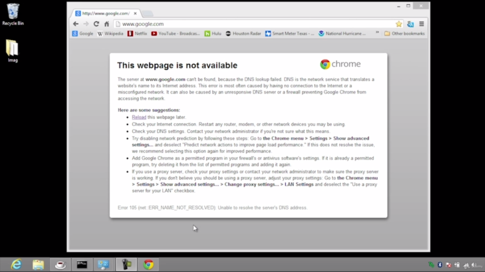

# Network naming

### Understanding DNS

***DNS or Domain Name System*** resolves names into IP addresses.

www - host
google - secondary
com - top level domain

**The total length of a fully qualified domain name (FQDN) cannot exceed 256 characters**.

DNS servers have 2 jobs:
+ respond to DNS queries
+ create DNS queries

Computers have `root hints` built into them.

Root hints provides one with root DNS servers.

The root server will get you to the closest top level domain DNS server (e.g the `.com` DNS server - its job is to know every webpage ending in `.com`). Additionally computers and DNS servers cache IP address information for a while to enable faster resolution.

Google's DNS server - `8.8.8.8`

### Applying DNS

The entire Internet runs on pretty much 2 famous DNS softwares:
+ Freeware bind (Unix & Unix-like)
+ Microsoft Windows Server DNS

The image above displays a local DNS server, called `student.local`. The DNS server can talk through the hierarchy to get to the Internet, but it will also be the ***authoritative DNS server*** for the local domain seen on the image. The IPs to resolved to can be stored in (what's known) as *lookup zones* (FQDN => IP), to most important of which is *the forward lookup zone*.

The image above - 4 records (bottom of the folder tree) were placed in the lookup zone.
+ The first one is called *Start of Authority or SOA*. It's the primary DNS server for the zone.
+ Second are *Name Servers (NS)*. Any server that's part of `student.local` would be placed here. In this case, there is only one.
+ The *Host A record*. Only for IPv4.
+ The *IPv6 Host (AAAA)*. Only for IPv6.

DHCP can be configured to work in tandem with DNS. Everything statically added (like an A record) will be automatically added within DHCP.

A ***Canonical Name (CNAME or alias)*** is basically a pointer or a soft link. When called, it will point the caller to the direct place. In the image above, `student1` was given a CNAME of `fred`.

***MX (Mail Exchanger) record*** - all of SMTP mail servers exchanging mail use DNS and get a special host record called an MX record.

A ***reverse lookup zone*** - gets a domain name (FQDN) from an IP address (IP => FQDN). Not critical that often, but one place they're basically required if you're using a mail server.

***PTR (Pointer Record)*** - Using the IP address you can get the associated domain/hostname. An A record should exist for every PTR record.

***SRV (Server Record)*** - a specification of data in the Domain Name System defining the location, i.e., the hostname and port number, of servers for specified services. VoIP services are quite common in this situation.

***TXT (Text Record)*** - a type of resource record in the Domain Name System used to provide the ability to associate arbitrary text with a host or other name, such as human readable information about a server, network, data center, or other accounting information. There are 2 important types of TXT:
+ DKIM - email authentication method; adds a digital signature to outgoing emails, allowing the receiver to verify that an email coming from a domain was indeed authorized by the owner of that domain.
+ SPF - lists all authorized hostnames / IP addresses that are permitted to send email on behalf of your domain.

### The hosts file

There was a time when the Internet ran without DNS. There weren't many computers then, just a few thousand.

There was just a hosts file with a bunch of names and then their associated IP address.

> It was a mess, but it worked

***The hosts file still exists and will take precedence over DNS***

It is found in:
+ Windows: *Local Disk (usually C)\Windows\System32\Drivers\etc\hosts*
+ Unix-like: */etc/hosts*

A great place for personal preference and shortcuts.

### Net command

The `net` command predates Windows.

Some notable commands include:
+ `net` - gives a detailed summary of executable commands for the `net` keyword
+ `net view` - shows computers that can be seen on the network
+ `net user` - which computer is being used, account on that computer and privileges
+ `net view $PC_name` - see the actual shares on that particular system
+ `net share $alias > $resource` - shares a `$resource` with everyone on the internal network and renames it to `$alias`
+ `net accounts` - shows the type of settings for all accounts (image below)

+ `net stop '$service'` - terminates a particular `$service` (it has to be in quotes)

### Windows name resolution

Pre-Vista:
+ If the machine is a member of a domain, it will immediately go to its domain controller, which is also going to be its own DNS server and everything is done through DNS

+ If not, NetBIOS will be used: ports 137, 138, 139 to handle name resolution

Around Vista's time, the ***Link Local Multicast Name Resolution (LLMNR)*** came online. It runs on UDP port 5355 and is a vastly improved name resolving service.

If not a member of the domain and Windows 10 professional is used, both NetBIOS and LLMNR will be run simultaneously.

In Windows home, only LLMNR is used.

Sometimes, its quite difficult to do name resolution with Windows.

Luckily, a great tool exists for such purposes: the `nbstat` tool.

**`nbtstat` is not fully compatible with LLMNR** (not on Kali)

+ `nbtstat` - help screen
+ `nbtstat -n` - prints the NetBIOS Local Name Table
+ `nbtstat -c` - show the `nbtstat` cache
+ `nbtstat -a $system_name` - go to another computer by the name of `$system_name`
+ `nbtstat -r` - statistics in terms of what it's been doing lately (pretty much deprecated)
+ `nbtstat -R` - purge the remote cache table
+ `nbtstat -RR` - all of the registered information has been rebroadcast to the world

### Dynamic DNS

***Dynamic DNS (DDNS)*** - automatically updating a name server in the DNS, often in real time, with the active DDNS configuration of its configured hostnames, addresses or other information

In order for someone to use DDNS, they must sign up with a DDNS company (e.g [tzo](www.tzo.com))

### DNS Troubleshooting

The number one clue that there is a DNS problem is a situation shown on the image below:

A trick to verify the DNS problem: the prerequisite is knowing the IP address of any website ahead of time (e.g 149.20.54.45) - if the IP address gets a response, but the name doesn't, there is a DNS problem.

Fixes:
+ Check configuration
+ Clear the DNS cache and force the resolution
+ Put in fallback DNS servers (*the best is Google's DNS - it never goes down... ever: 8.8.8.8*)
+ Query the DNS server to determine whether it's working or not
  - `nslookup` - most DNS servers are designed to ignore anything coming from `nslookup`
  - `dig (Unix-like) | EzDig (Windows)`
  - `ping`
