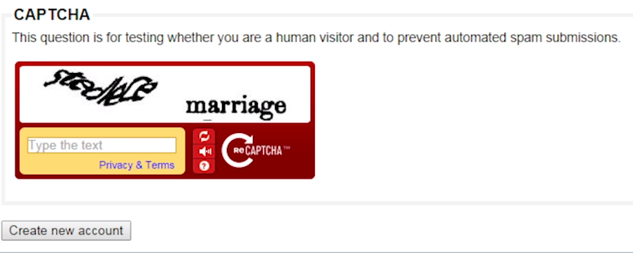
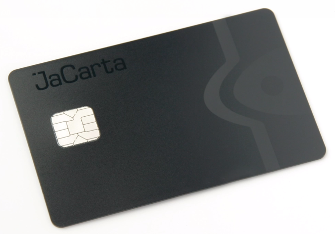
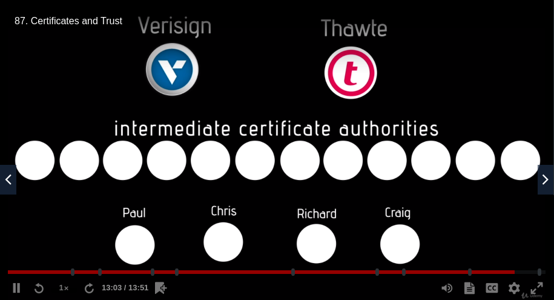
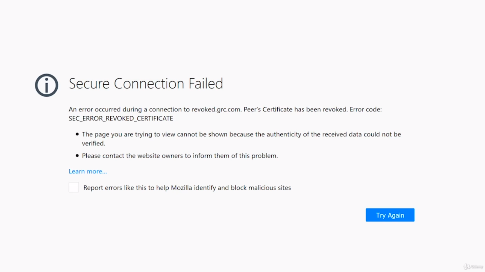

# Securing TCP/IP

### Making TPC/IP secure

**The CIA of security**:
1. *Confidentiality* - nobody can see the data being sent except for the recipient and the sender
1. *Integrity* - was data received in the same format it was sent; is it good in a way it should be good
1. *Availability* - can I gain access to my data if I really need it

***The core problems are balancing out the confidentiality and integrity, while making the application easy to use and contents thereof available.***

Additional things added to the CIA:
+ *Authentication* - giving someone the right to access something (username & pass/smart card/SSH key)
+ *Authorization* - permissions given to a person after authentication has been completed

*Non-repudiation* - concept tied to integrity: **if someone hands me something, I have no doubt that that's the person who handed it to me**

### Symmetric encryption

There are different methods of encryption and securing data, ranging from simple ciphers to full-fledged algorithms specifically designed for the purpose

The most popular is the Caesar's Cipher - increment (or decrement) a letter by a certain number (e.g increment by 1 means that A becomes B, B becomes C, C becomes D, etc)

Using Caesar's Cipher and incrementing the values by 3, the message *I love you* becomes *l oryh brx*

Vigenère cipher - Caesar's Cipher with a key. If the key is shorter, it will repeat until it completely covers the plaintext

Using Vigenère's Cipher with a key of 123:

I love you
1231231231
__________
J opxh arv

**Symmetric encryption** works like Vigenère cipher: using a key a value is encrypted: a cyphertext is returned as a value. The same key is used for decrypting the cyphertext.

Common in wereless networks - RC4 or AES

### Asymmetric encryption

2 keys:
+ Public key - only encrypt data
+ Private key - only decrypt data

For sending data, a *key exchange* happens.

> Either computer can encrypt data and send it to the receiver, where it will be decrypted

### Cryptographic hashes

A ***hash*** is an algorithm that creates a fixed-size hash value.

Hashes are used to verify data integrity.

Most common case to see hashes is when downloading stuff (e.g Ubuntu - it has checksums as well).

The 2 most common hashes are *MD5* and *SHA-1*

### Identification, authentication and authorization

+ Identification - proves identity
+ Authentication - proves rights to interact with the system
+ Authorization - proves the permissions and privileges

Authentication factors:
+ Something you know - e.g password
+ Something you have - e.g smart card
+ Something about you - e.g retinal scan
+ Something you do - rhythm of typing
+ Somewhere you are - credit cards

##### Something you know

+ Passwords aren't the only type of *something you know*.

+ Another example are PIN codes.

+ Captcha is another great example. Just by reading it, it becomes something you know.

+ Security questions are also in this category.
__________

##### Something you have

+ Smartcards can easily be used to identify someone. Embedded within the card is a chip with a unique code.

+ RSA key or RSA token are a piece of software (or a key) that stores some kind of secret code.
__________

##### Something about you

+ Fingerprint scanners (fingers)
+ Iris patterns (eyes)
+ Patterns of veins (hand/wrist/body/...)
+ Facial recognition
__________

Windows allows for creation of authentication *based on federated trust*.

> Federated trust means "if you have somebody you trust, I trust them as well"

***Multifactor authentication*** - a combination of multiple factors to ensure a lower probability of fraud.

### Access control

An *access control list* is a list of usernames, passwords and what people can do on the machine.

3 types:
+ Mandatory Access Control (MAC) - labels on resources themselves (access granted/denied)
+ Discretionary Access Control (DAC) - put the term owner onto a user's accounts
+ Role-Based Access Control (RBAC) - put users in groups and give groups certain permissions (in business, e.g sales department doesn't need access to system-critical files)

### AAA

*Kerberos* is designed to do authentication for local area networks.

A server can be turned into a *key distribution center (KDC)*.

Key distribution center consists of 2 really important services:
+ Authentication Service (AS)
+ Ticket-Granting Service (TGS)

When a computer logs in, it sends over a hash with his username/password values. The server looks at the values and if correct, it sends back a *Ticket-Granting Ticket (TGT)*. The TGT is then time stamped by the client and sent back over to the TGS. The TGS takes this and time stamps it itself and turns it into a *token*. The token is then returned for the client. The token will be used in order to access to files on other computers.

Downsides:
+ Kerberos is a Microsoft proprietary technology
+ Everything is timestamped
+ Designed for wired networks

To try to fix this, *EAP (Extensible Authentication Protocol)* was designed.

EAP allows transactional based authentication mechanisms to be able to talk to talk to each other and allows for a lot of flexibility. It's used pretty much only for wireless access

There's a number of EAP's, but the big ones are:
+ EAP-PSK (Pre-Shared Key) - a common key used for login
+ PEAP (Protected Extensible Authentication Protocol) - uses standard username and password
+ EAP-MD5 - uses a hash
+ EAP-TLS - clients use certificates
+ EAP-TTLS - clients and servers use certificates

### Single Sign-On

*Single-Sign On* - whenever a user logs in, they are automatically logged in to everything needed to do what they intended to.

LAN uses Windows Active Directory

Windows Active Directory makes it easier for maintenance and use, so it's the most widespread.

***There's another type of single sign on and its based on SMAL (Security Assertion Markup Language)***

SAML starts off with an Identity Provider (IP). Signing on to the IP returns a token and allows access to any device on the network based on that token.

### Certificates and trust

When logging on to a web app, during asymmetric key exchange, the public key also sends a hash of the web page, thereby establishing a *digital signature*.

A **digital signature** is nothing more than a hash of whatever chunk of data one happens to be looking at that says what private key it came from. It's incomplete and still vulnerable to attacks.

To get around the initial uncertainty of identity, a handshake is performed and a third party invited before the transaction.

The third party will generate its own digital signature and attach it to that device's public key along with its signature to be sent to the client.

If public key is never sent by itself, but instead a certificate is sent containing a digital signature, a third party signature and the public key itself.

3 ways to do trust:
+ Generate your own certificates (*unsigned certificate*)
+ Web of trust - getting other people to sign your certificate, thereby creating a *web of trust* - a group of people who trust each other because they had a hand at helping each other (requires a lot of people doing a lot of work)
+ Public Key Infrastructure (PKI) - a hierarchy with root servers at the top, intermediate servers in the middle and goes down to users. At the top of this hierarchy is what is called a *Certificate Authority (CA)* - they issue certificates. Since there are way too many certificates to be issued, *intermediate certificate authorities* are there to take the load off of the CA's. Below is an example of PKI.

### Certificate error scenarios

*Self-signed certificate*

Sc: A client sees the following image:

Sol: Click Details > Proceed to website (Not recommended)

*Expired certificates*

Sc: Similar webpage

Sol: Inspect the certificate and decide whether it is to be used or not. If in Mozilla, Settings > Privacy and Security > Check the "Query OCSP responder servers to confirm the current validity of certificates", if it isn't already checked. 
