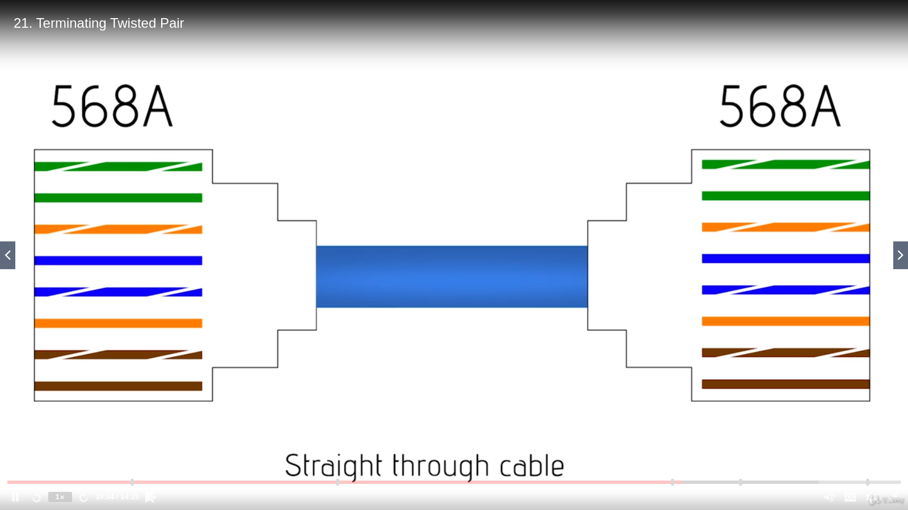
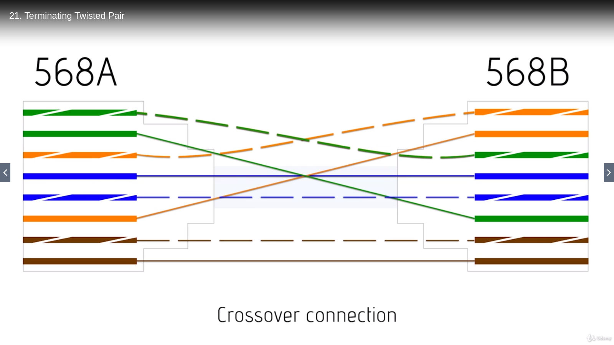

# Ethernet basics

### What is Ethernet?

IEEE 802.3 (standard) - Ethernet book

Addendums IEEE 802.3a, IEEE 802.3b, IEEE 802.3c, ..., IEEE 802.3ae (a lot of them)

**Ethernet, in terms of one piece, never really changes. The Ethernet frame has stayed pretty much the same since the beginning.**

Ethernet lives in the MAC addresses (to & from)

When talking about Eternet, CRC is called **Frame Check Sequence or FCS**

*Standard nomenclature for 802.3:* **10Base5**

1. 10 - speed in *megabits* per sec
1. Base - everything is being used to send one thing at a time [broad: there are multiple channels]
1. 5 - before switches, this measured the length of a cable connecting the network using <num * 100 m> as a pattern (this is *500m*)
1. instead of last number (5), today a letter like (T) is used to describe what it uses (T is *unshielded twisted pair with a switch in the middle*)

### Ethernet frame

1. The preamble - Determines if a frame is coming
1. Destination MAC
1. Source MAC
1. Data type or Ether type (2 bytes)
1. Data - minimum 64 bytes (or octets), maximum 1522 bytes (also called **Maximum Transition Unit** or **MTU**)
1. Pad - if the data is too small pad pushes it to min size
1. FCS - 32 bit CRC
1. jumbo frame - in more advanced types of Ethernet today (can push frame to haul up to 9000 bytes)

### Early Ethernet

**Segmented Ethernet**

**CSMA/CD** - *Carrier Sense Multiple Access/Collision Detection*

1. Computers are mounted on a long cable with transistors
1. Using CSMA/CD only 1 computer at a time can talk
1. **Terminating resistors** are placed at the ends of the Ethernet cable, so that the signal wouldn't bounce back
1. If 2 computers talk at the same time, a collision is detected and both computers generate a random number. This is the number of *miliseconds (ms)* they would wait before re-transmitting their signal

**10Base2** - 10Mbps base band with 200m segments

### The Daddy of Ethernet, 10BaseT

Worked great, but if the segment itself broke somewhere, the entire connection would drop

Late 1980s: **Token ring**

**MSAU - MultiStation Access Unit**

Problems
+ Came only from IBM and no one else made it
+ It was expensive

Ethernet shortened a bus to the size of a box and used cheap unshielded twisted pair instead of expensive coaxial cabling

That was called 10BaseT

It introduced the cornerstone topology of every single Ethernet ever since.

1. It runs at 10Mbps
1. Cable maximum of 100 meters between switch and node
1. Maximum of 1024 nodes per switch
1. Designet to run on cat 3 or better UTP

### Terminating twisted pair

Everything necessary for a basic Ethernet connection
1. Motherboard RJ-45 connection
1. Unshielded twisted pair (or a terminated piece of Ethernet twisted pair cable)
1. Switch (any port)

Crimping the cable
+ Cable
+ Crimper
+ *(optional)* scissors

TIA-568A

+ Cut the protective plastic around the wires
+ Untwist the wires and put them in a specific order
+ Put them in specific positions:

| Position | Colour       |
| -------- | ------------ |
| 1st      | Green-white  |
| 2nd      | Green        |
| 3rd      | Orange-white |
| 4th      | Blue         |
| 5th      | Blue-white   |
| 6th      | Orange       |
| 7th      | Brown-white  |
| 8th      | Brown        |

+ Make them into a broom shape
+ Put the cables in the guider
+ Put the guided cables into the plastic (into the individual metal points)
+ Crimp the plastic (so the wires are always touching the metal)
+ Repeat the process with the other end
+ Plug & use

Based on the crimping and termination type, the cables can be:

+ **Straight-through cable** - what ever is on pin 1 on one end is the same on the other end: most common type of cable

+ **Crossover cable** - 2 wires are used to transmit and 2 to receive: usually terminate one end as 568A and the other as 568B

### Hubs vs Switches

> A **hub** is nothing more than a *multiport repeater*

Two machines plugged to the same hub can listen on each other's traffic

Downsides (with e.g 10BaseT hubs)
+ Max bandwith 10Mbps
+ Degradation of throughput
+ Members of the same *collision domain* (if something happens, all computers connected to the hub will know about it)

> A switch is a *multiport repeater*, which uses MAC addresses

Two machines plugged to the same hub cannot listen on each other's traffic, as switches use MAD addresses.
A switch will also create a MAC table, so that it knows where to send the data

A switch will act as a hub if the destination MAC address is broadcast (FF-FF-FF-FF-FF-FF): the members are in the same *broadcast domain*
