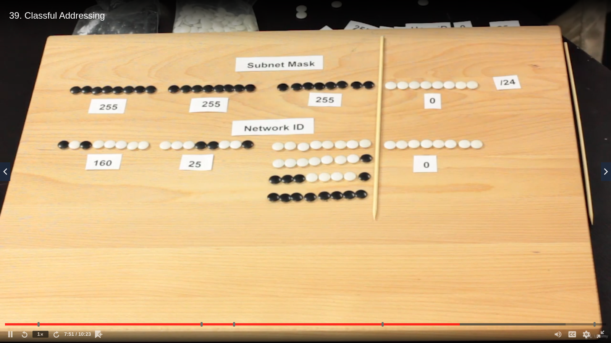
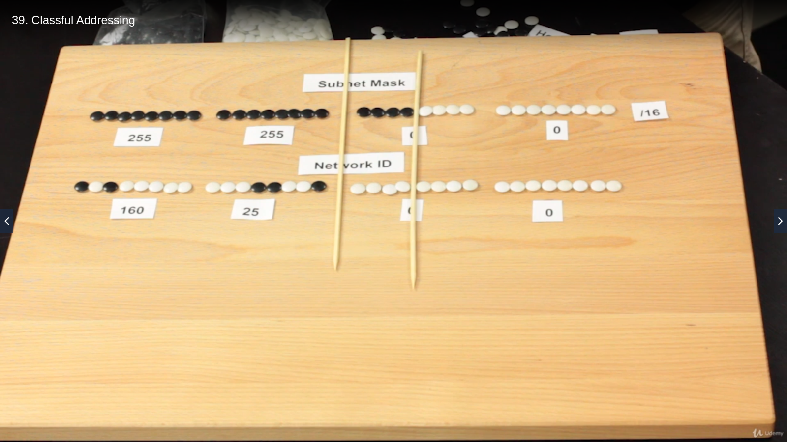
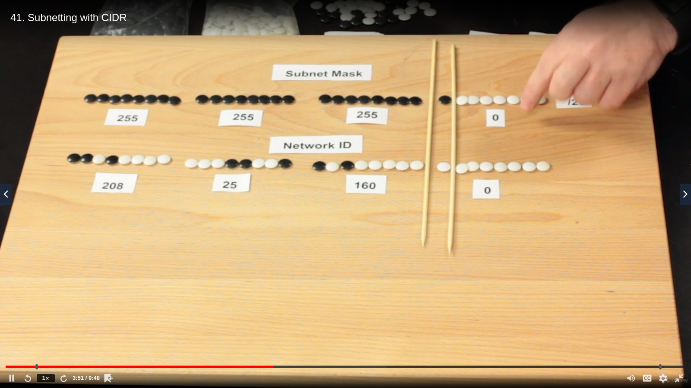
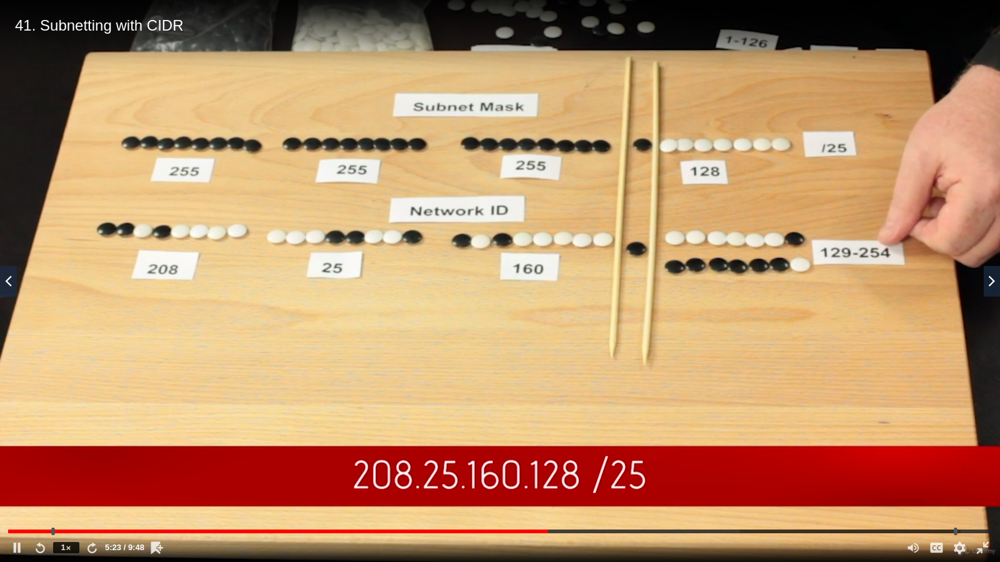
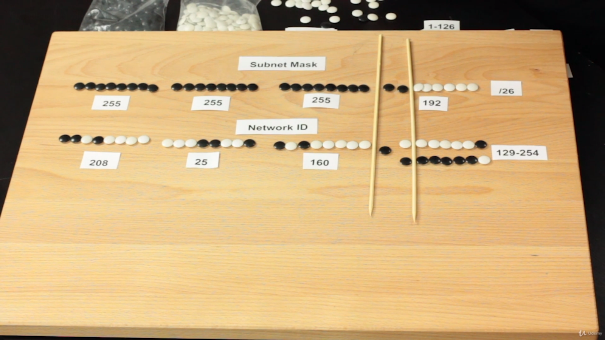
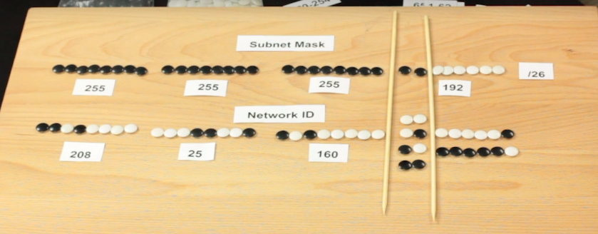
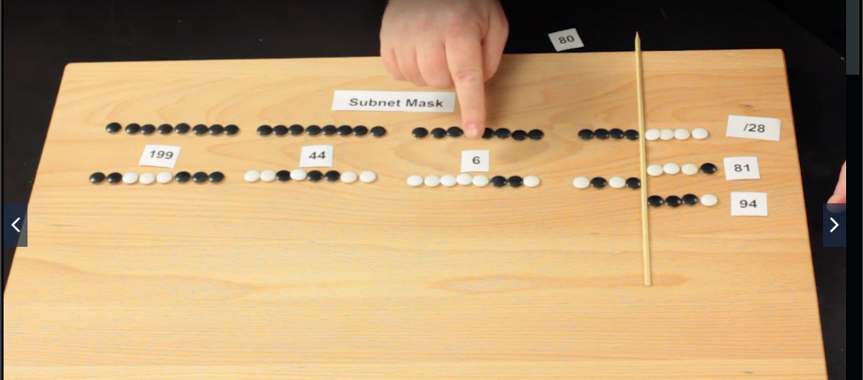

# TCP/IP Basics

### Introduction to IP Addressing and Binary

> **IP Addresses** are a bunch of 1's and 0's. The dots in the IP are separators.

They are 4 groups of 8 bits

We us ethe *dotted decimal notation* for binary IP addresses

There are exactly 2^8 or 256 combinations in each of those 4 groups: ***from 0 to 255***

##### Conversion

+ Make this cheat sheet: 128, 64, 32, 16, 8, 4, 2, 1
+ Pick a value: e.g 11000101
+ Where ever there are 1's, those numbers are added together

By now it looks like:

| Number | Bit |
| ------ | --- |
|  128   |  1  |
|   64   |  1  |
|   32   |  0  |
|   16   |  0  |
|    8   |  0  |
|    4   |  1  |
|    2   |  0  |
|    1   |  1  |

So: `128 + 64 + 0 + 0 + 0 + 4 + 0 + 1`, which adds to 197. *This is the first number. Repeat 3 times*

If we have the following IP address:
+ 00001110 (14)
+ 10101010 (170)
+ 00000000 (0)
+ 11111111 (255)

It gives us ***14.170.0.255***

##### Reveng (bin to dec)

e.g 171 to binary

How many 128's in 171? 1
171 - 128 = 43
How many 64's in 43? 0
43 - 0 = 43
etc

| Number | Times | Operation | Result |
| ------ | ----- | --------- | ------ |
|  128   |   1   | 171 - 128 |   43   |
|   64   |   0   | `noop`    |   43   |
|   32   |   1   | 43 - 32   |   11   |
|   16   |   0   | `noop`    |   11   |
|    8   |   1   | 11 - 8    |   3    |
|    4   |   0   | `noop`    |   3    |
|    2   |   1   | 3 - 2     |   1    |
|    1   |   1   | 1 - 1     |   0    |

Therefore, **171 converted is 10101011**

Using this logic, 95 in binary is 01011111

### Introduction to ARP

**ARP - Address Resolution Protocol** - ARP resolves MAC addresses from IP addresses

+ ARP asks all computers in the network for a specific computer.
+ The correct computer will respond with its MAC address.
+ The ARP cache is updates with the MAC address received.
+ The Ethernet frame is sent as usual.

ARP cache can be seen in windows with the command `arp -a`, where the `-a` flag stands for *all*

### Classful addressing

**IANA - Internet Assignet Numbers Authority**

IANA passes chunks of available IP addresses to **Regional Internet Registry (RIR)**

RIR is broken down geographically

| Land                               | RIR         | Name                                                   |
| ---------------------------------- | ----------- | ------------------------------------------------------ |
| Africa                             | AfriNIC     | African Network Information Center                     |
| North America w/o Mexico           | ARIN        | American Registry for Internet Numbers                 |
| Mexico & Latin America             | LACNIC      | Latin America and Caribbean Network Information Centre |
| Australia, China, India, Indochina | APNIC       | Asia-Pacific Network Information Centre                |
| The rest of Eurasia                | RIPE NCC    | Reseaux IP Europeens Network Coordination Centre       |

RIR passes big chunks of IP addresses to **Internet Service Providers (or ISP)**

Class licenses

1. Class A range: 0 - 126/8 (~ 16.7 million IP addresses)
2. Class B range: 128 - 191/16 (65534 IP addresses)
3. Class C range: 192 - 223/24

##### Subnetting

### Subnet masks

Subnet mask: ***255.255.255.0***

The IP is broken into:
+ Network ID: first 3 octets, e.g 232.25.208
+ Host ID: the last octet that can be between 1 and 254, e.g 118

The `/num` in IP addresses comes from the subnet mask by turning it into binary and counting all of the 1's

> So, the full IP with subnet in the previous example is ***232.25.208.118/24***. If the host ID isn't known, it's written as ***232.25.208.xxx/24***

Whereever there's are 1's in subnet, that part of the address is looked at firstly. If it's the same as the receiver's address, it's a local call. Else, it's an external request.

If local req: ARP-ing happens and data is sent.

If external req: ARP-ing happens through the **default gateway** and data is sent.

### Subnetting with CIDR

**CIDR stands for Classless Inter-Domain Routing**

> Subnets can be chopped up in many different ways, not just /24, /16 and /8

In this case, the subnet will be 255.255.255.128

By changing the 0 (white bead) to 1 (black bead), we get 2 separate subnets

Two chops:

The 2 bits can be arranged as follows

The generated subnets are:
+ 1 - 62
+ 65 - 126
+ 129 - 190
+ 193 - 254

The more subnets made, the less hosts it can have

### More CIDR subnetting practices

/24 = 254 hosts

| Subnet | # hosts        |
| ------ | -------------- |
|  /24   |  256 - 2 (254) |
|  /25   |  128 - 2 (126) |
|  /26   |  64 - 2  (62)  |
|  /27   |  32 - 2  (30)  |
|  /28   |  16 - 2  (14)  |
|  /29   |   8 - 2  (6)   |
|  /30   |   4 - 2  (2)   |
|  /31   |   2 - 2  (0)   |

Example 1: game server needs 4 IP addresses

Solution: get /29 subnet mask

Example 2: 8 IP addresses needed

Solution: get a /28 subnet mask (write down the subnet mask and the network ID)

### Dynamic and static IP addressing

Every computer on the network has to have:
+ An IP address
+ A subnet mask
+ Default gateway

**DHCP - Dynamic Host Configuration Protocol or BOOTP - Bootstrap Protocol**

+ On boot, the computer sends a broadcast called a DHCP discover
+ The DHCP server sends back a DHCP offer (DHCP gives the IP address, submask and some other stuff)
+ When computer gets that information, it sends a DHCP request
+ The DHCP server responds with DHCP acknowledgement

Each broadcast domain must have only one DHCP server

DHCP server has to be run within broadcast domain and it must only be 1.

Modern OS have DHCP enabled by default

DHCP Relay enables a single DHCP server to service more than one broadcast system.

### Rogue DHCP servers

All DHCP problems manifest in the same way.

How to deal with DHCP:
+ Locate **APIPA - Automatic Private IP Address** (it starts with ***169.254***)
+ If it exists, the DHCP connection could not be established and APIPA acts as a fallback
+ Check the physical connections
+ If it's all good, the problem is with the DHCP server

1. The DHCP should exist in your broadcast domain
1. It should be properly configured (does it have a pool of addresses, the IP information, etc)

On Windows, if there are DHCP problems, everything will still work within the internal network, but the Internet access won't.

*A Rogue DHCP server:*

There are 2 DHCP servers - the legitimate one and the rogue one.

The computer just happened to have connected to the wrong one

The servers will race to be the first one to respond to the computer

### Special IP addresses

+ 3 different group of IPs used in private networks:
  1. Any IP address that starts with 10, or ***10.x.x.x***
  1. Any IP address that goes from ***172.16.x.x*** to ***172.31.x.x***
  1. ***192.168.x.x*** (you can search the Internet, but nobody can get to you: working behind a **NAT device**)
+ Loopback address
  1. ***127.0.0.1*** in IPv4 - for the exam
  1. ***127.x.x.x*** in IPv4 - for practical purposes
  1. ***::1*** in IPv6
+ APIPA
  1. ***169.254.x.x***

### IP Addressing Scenarios

+ Duplicate IP address

Sc: Two computers are connected to a NAT device, which also acts as a DHCP server. For fun, one is running Win 10, and the other Ubuntu Linux.

Reason: If we had a rogue DHCP server, the addresses might collide. The IPs might also have been set statically (e.g these machines were used as servers).

Sol: Windows 10 will throw an error and solve the problem by itself, if you press `Okay`. Alternatively, know your network ID (e.g 192.168.4.x) and assign a different IP to one of the machines.

+ Duplicate MAC addresses

Sc: Same scenario

Reason: Every MAC address is different. The problem arises when playing with virtual machines.

Sol: Change the MAC of the VM to something random. Commands like `sudo ifconfig eth0 hw ether 00:11:22:33:44:55` are quite useful

+ Incorrect gateway

Sc: Gateway is set as something other than the router's IP address

Reason: Someone set up a DHCP server with almost identical IP address. Classic MitM attack or a typo.

Sol: See if you made a typo. If not, alert someone.

+ Incorrect subnet mask

Sc: Ubuntu can ping Win 10, but Win 10 can't ping Ubuntu

Reason: Windows autocompletes the subnet mask as 255.255.0.0 (/16), but it might have been further subnetted into /24.

Sol: Check your subnet mask and correct it.

+ Expired IP address

Sc: The DHCP server died. The IP addresses it sent throughout its use time are now defunct and expired.

Reason: The DHCP server died or the computer didn't connect for the duration of the lease.

Sol: Windows will keep the IP address until the end of the DHCP lease. Eventually, it will switch it to APIPA. `ipconfig` and `tracert` or `ifconfig` and `traceroute` are helpful for either Windows or Linux respectively.
