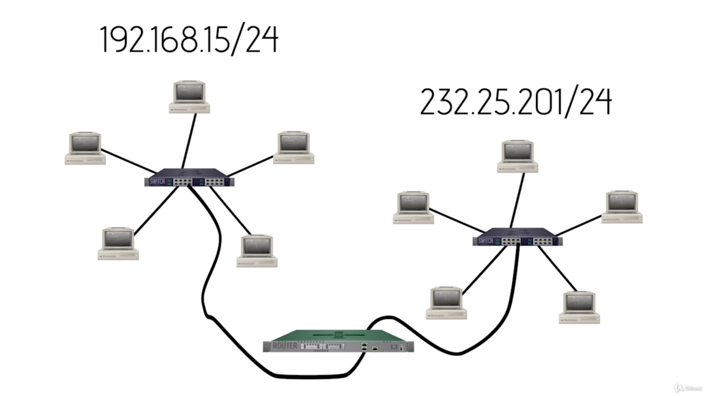
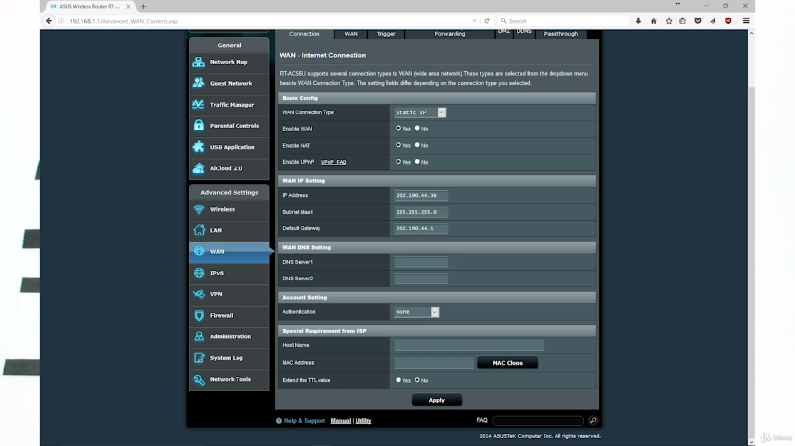
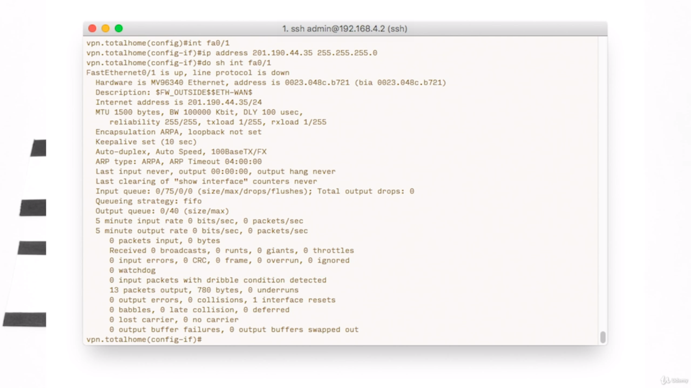
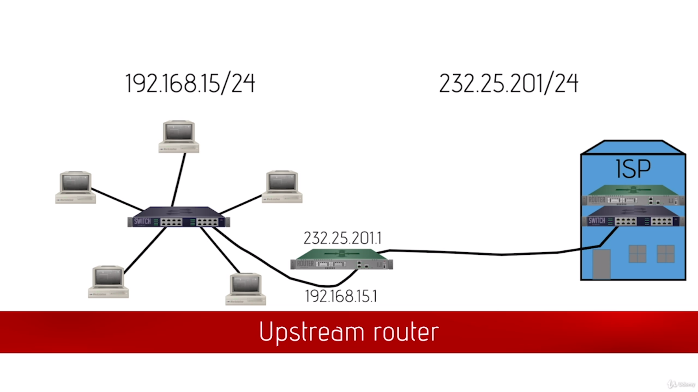
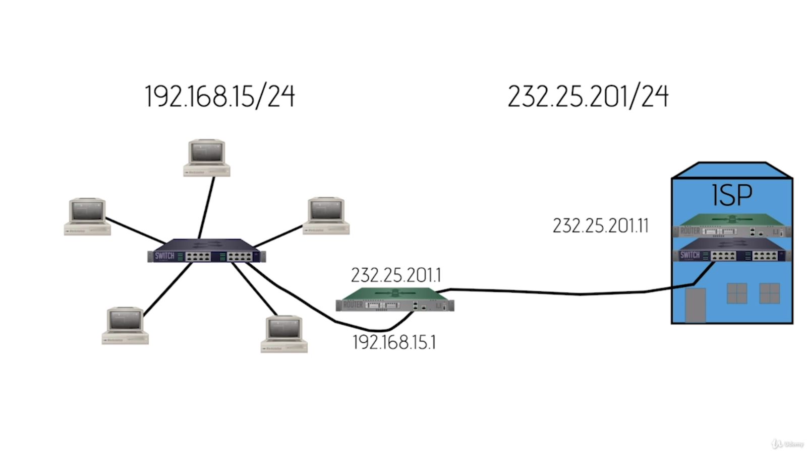
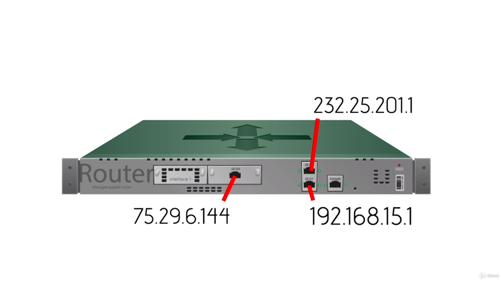
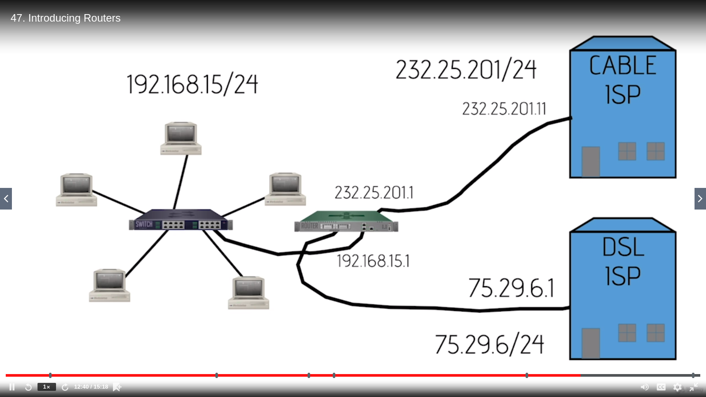
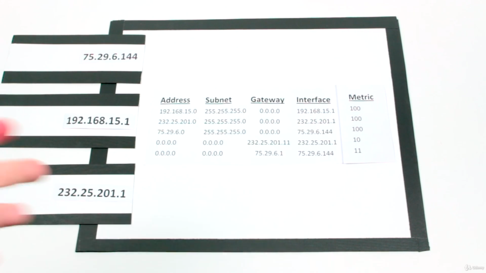

# Routing

### Introducing routers

**Routers** filter and forward based on IP address

> They are also built-in switches and wireless access points and all kinds of other stuff

***Routers interconnect different network IDs***

##### The journey through the router

+ A package comes with all the extra stuff attached (IP addresses)
+ It comes from *232.25.201.191* and is going to *192.168.15.30*
+ Built into every router is a routing table, and it looks something like this:

| Address      | Subnet        | Gateway | Interface    |
| ------------ | ------------- | ------- | ------------ |
| 192.168.15.0 | 255.255.255.0 | 0.0.0.0 | 192.168.15.1 |
| 232.25.201.0 | 255.255.255.0 | 0.0.0.0 | 232.25.201.1 |

The first entry means:
+ Address: The router's IP address (everything that is 192.168.15 network)
+ Subnet: The router's subnet (/24)
+ Gateway: This router is directly connected to that network (0.0.0.0)
+ Interface: Where to send data for that network

Built into every router is something called the ***default router***

An ***upstream*** router is a router (usually belonging to an ISP), which may be connected to other routers, not internal, but external.

To take advantage of this, we will update our routing table to add a default route, like this:

| Address      | Subnet        | Gateway       | Interface    |
| ------------ | ------------- | ------------- | ------------ |
| 192.168.15.0 | 255.255.255.0 | 0.0.0.0       | 192.168.15.1 |
| 232.25.201.0 | 255.255.255.0 | 0.0.0.0       | 232.25.201.1 |
| 0.0.0.0      | 0.0.0.0       | 232.25.201.11 | 232.25.201.1 |

The IP address of the ISP has been put as the default gateway, so that the Internet traffic can encompass a large number of people.

If the address is 0.0.0.0, the router knows that it can ARP that system.

Since the address and the subnet are all 0's, the router will ARP the gateway (which was intended for business).

Some routers have more than 2 connections

If the connection has more options, which way does it go?

That's where another column of the routing table comes into play: ***the metric***. The route will go in the direction of the gateway with the lowest metric.

+ Routers don't care where the packet came from: only where it's going
+ Routers are not tied to Ethernet: they support many types of connections
+ They care about the IP packet, which almost never changes

### Understanding ports

Every time a TCP packet is sent, the package will contain a ***destination port number*** and a ***source port number***

The destination port number is set by the type of application (FTP - 21, HTTP - 80, mail - 110 [maybe])

Ports 0 - 1023 are ***well known ports*** - their purpose is known

> The computer itself generates the ephemeral port number (src) incrementally, between 1024 and 65535.

### Network Address Translation

> Instead of using a private IP address (192.168.x.x), the router changes that address to its IP (on the WAN side) and puts the IP in the routing table

***NAT*** allows us to have lots of devices on the Internet without using legitimate IPs.

There are different versions of nat:
1. Static NAT (or SNAT)
  + There is a single IP address linked to a single computer, so whatever traffic comes to that particular PC.
1. Dynamic/pooled NAT (DNAT)
  + 2 IP addresses built-in to the router, to be given to people who connect to the Internet. Drawback: there's a fixed number of IP addresses.
1. Port Address Translation (PAT)
  + It translates internal IPs to an Internet address and tracks the packets.

### Implementing NAT

> Every home router in existence has NAT turned on **by default**. Big, serious routers (enterprise companies' routers) almost never have NAT enabled.

Some older routers call NAT differently, like **gateway** or **router mode**
