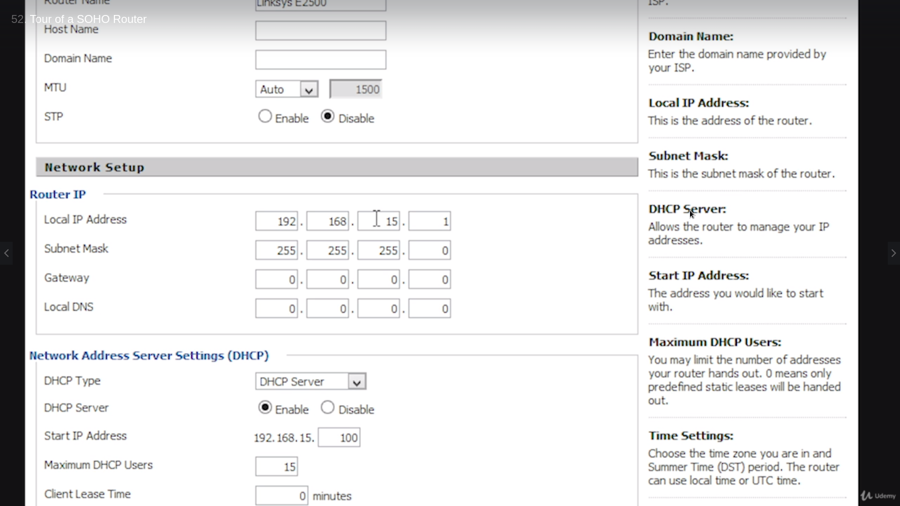
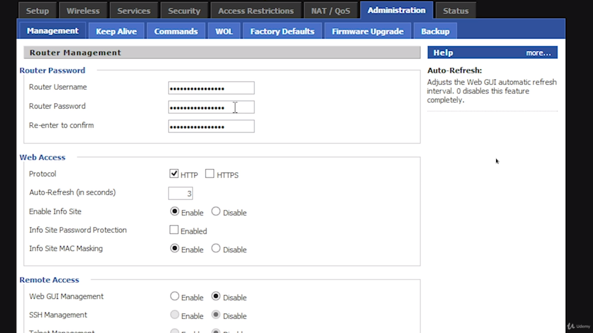
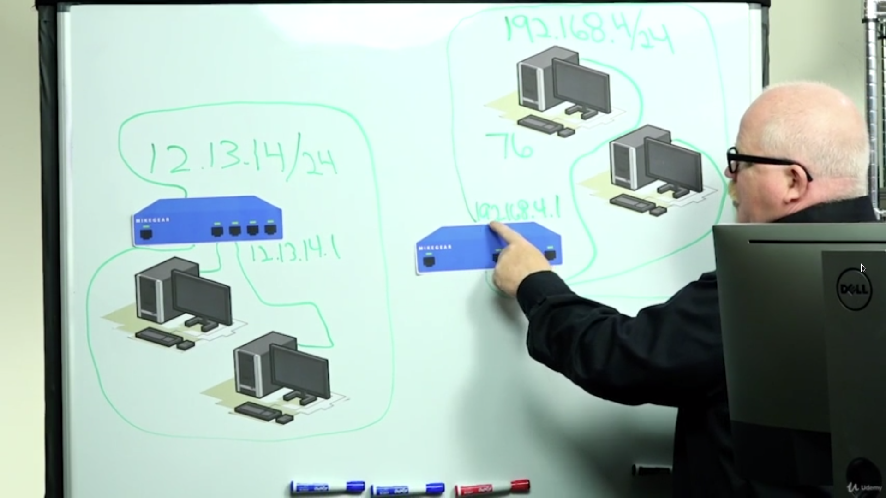
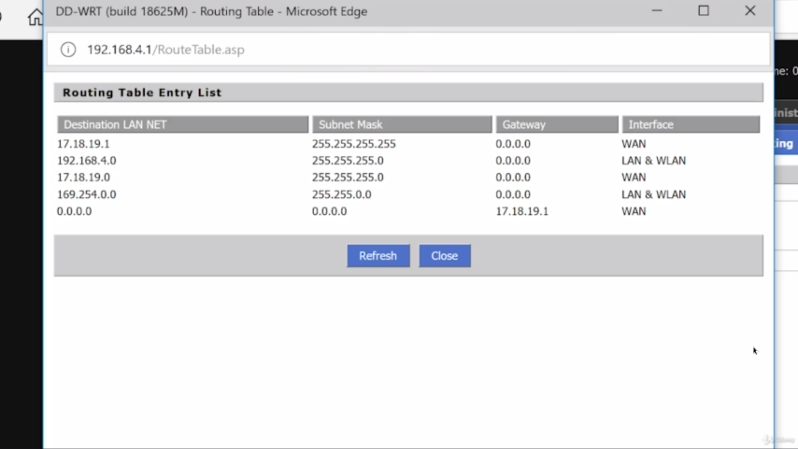

# Routing

### Introducing routers

**Routers** filter and forward based on IP address

> They are also built-in switches and wireless access points and all kinds of other stuff

***Routers interconnect different network IDs***

##### The journey through the router

+ A package comes with all the extra stuff attached (IP addresses)
+ It comes from *232.25.201.191* and is going to *192.168.15.30*
+ Built into every router is a routing table, and it looks something like this:

| Address      | Subnet        | Gateway | Interface    |
| ------------ | ------------- | ------- | ------------ |
| 192.168.15.0 | 255.255.255.0 | 0.0.0.0 | 192.168.15.1 |
| 232.25.201.0 | 255.255.255.0 | 0.0.0.0 | 232.25.201.1 |

The first entry means:
+ Address: The router's IP address (everything that is 192.168.15 network)
+ Subnet: The router's subnet (/24)
+ Gateway: This router is directly connected to that network (0.0.0.0)
+ Interface: Where to send data for that network

Built into every router is something called the ***default router***

An ***upstream*** router is a router (usually belonging to an ISP), which may be connected to other routers, not internal, but external.

To take advantage of this, we will update our routing table to add a default route, like this:

| Address      | Subnet        | Gateway       | Interface    |
| ------------ | ------------- | ------------- | ------------ |
| 192.168.15.0 | 255.255.255.0 | 0.0.0.0       | 192.168.15.1 |
| 232.25.201.0 | 255.255.255.0 | 0.0.0.0       | 232.25.201.1 |
| 0.0.0.0      | 0.0.0.0       | 232.25.201.11 | 232.25.201.1 |

The IP address of the ISP has been put as the default gateway, so that the Internet traffic can encompass a large number of people.

If the address is 0.0.0.0, the router knows that it can ARP that system.

Since the address and the subnet are all 0's, the router will ARP the gateway (which was intended for business).

Some routers have more than 2 connections

If the connection has more options, which way does it go?

That's where another column of the routing table comes into play: ***the metric***. The route will go in the direction of the gateway with the lowest metric.

+ Routers don't care where the packet came from: only where it's going
+ Routers are not tied to Ethernet: they support many types of connections
+ They care about the IP packet, which almost never changes

### Understanding ports

Every time a TCP packet is sent, the package will contain a ***destination port number*** and a ***source port number***

The destination port number is set by the type of application (FTP - 21, HTTP - 80, mail - 110 [maybe])

Ports 0 - 1023 are ***well known ports*** - their purpose is known

> The computer itself generates the ephemeral port number (src) incrementally, between 1024 and 65535.

### Network Address Translation

> Instead of using a private IP address (192.168.x.x), the router changes that address to its IP (on the WAN side) and puts the IP in the routing table

***NAT*** allows us to have lots of devices on the Internet without using legitimate IPs.

There are different versions of nat:
1. Static NAT (or SNAT)
  + There is a single IP address linked to a single computer, so whatever traffic comes to that particular PC.
1. Dynamic/pooled NAT (DNAT)
  + 2 IP addresses built-in to the router, to be given to people who connect to the Internet. Drawback: there's a fixed number of IP addresses.
1. Port Address Translation (PAT)
  + It translates internal IPs to an Internet address and tracks the packets.

### Implementing NAT

> Every home router in existence has NAT turned on **by default**. Big, serious routers (enterprise companies' routers) almost never have NAT enabled.

Some older routers call NAT differently, like **gateway** or **router mode**

### Forwarding ports

Imagine a situation:

Assume an external connection is coming from 1.1.1.1:8181 (random port)

It will be redirected to the client who made the request and the port predetermined for that operation (e.g 80 for HTTP, 21 for FTP, etc.)

Something with a private IP address can, in essence, act like a public server.

> I wouldn't do this with much more than cameras. You could put a web server here, but you would literally murder your poor router with the amount of work you'd have to do. - Mike

Given a linksys router, it can be accessed by going to the webpage of its IP address.

Routers have a built-in port forwarding capability

In this case, the fields mean:

+ Application: Name of the app you're forwarding to (this is a camera, so *Camera*)
+ Protocol: TCP or UDP (or both)
+ Source: What IP address will be allowed in (*blank* - allow anything)
+ Port from: which port to emit the camera app from (*8181 for security reasons instead of 80*)
+ IP address: the internal address of the camera (*192.168.5.13*)
+ Port to: port to forward to (*80*)
+ Enable: checked

**Add**

*After searching the IP of the camera and the port, it should broadcast back to the browser.*

##### Port range forwarding

**Allows for multiple forwards at once**

Configuration looks like this:

##### Port triggering

Type of port forwarding done for a different reason:

Assume a machine wants to use FTP in order to obtain some files from the wider web.

The FTP uses ports 20 and 21.

The machine will set up an FTP client and go out to communicate with the FTP server on port 21.

The server will *respond on port 20*.

The FTP server can go into ***passive mode*** (responding on port 21 instead of 20, which gets turned off)

However, the FTP works better in ***active mode*** where it can respond to port 20.

The configuration for port triggering looks similar to the following:

+ Application: app name
+ Start: which port the action/trigger starts from (machine) - 21
+ End: which port the response is sent from (machine) - 21
+ Protocol: TCP/UDP/both - TCP
+ Start: which port the action/trigger starts from (server) - 20
+ End: which port the response is sent from (server) - 21
+ Enable - checked

**Save & add**

This is usually used with FTP, VoIP, some game servers, but not much else.

***DMZ*** - Demilitarized zone between Koreas and ports as well

**SOHO DMZ** is a type of port forwarding that, not only allows any type of unsolicited data from the Internet, but sends it to a particular computer in the internal network.

SOHO DMZ setup

+ Use DMZ: Enable/Disable
+ DMZ Host IP Address: 192.168.1.*HOST_ID* - ***extremely unsafe***

### Tour of a SOHO router

Default IP Address: ***192.168.0.1 or 192.168.0.1***
Default Username: Usually ***admin***
Default Password: Depends. ***1234***, ***0000***, ***admin***

+ Plug the computer to one of the LAN side ports (any one)
+ Assuming the router is passing DHCP, an IP address will be given ***192.168.x.x***
+ Run `ipconfig` (Windows), `ifconfig || iwconfig` (Linux-like) to see the IP *(optional)*

*ddwrt* (mentioned in the previous lesson) adds a bit of additional functionality, but is a bit unstable currently.

___

___

Network Setup Router

___

MAC Address Clone

___

Soho additional services

*ddwrt* allows for some features normal routers (here, Linksys firmware) don't offer, such as SSH and Telnet

___

Admin page

+ It is crucial to change the router password to something difficult to crack, hack or guess
+ The web access protocol can be set to HTTPS for some additional security
+ Remote access should (obviously) be disabled, or else ***> you're asking for a lot of trouble - Mike <***

___

Security page

___

WAN access page

___

Firmware management and update/upgrade capability

+ Download a file from the router company (or in ddwrt's case - a third party) and load the file

> ***WARNING***: If you fail on this, you will turn your router into an ashtray. We upgrade routers, because there's a compelling reason and not because we simply like to do it. - Mike

__

If a mistake is made, a ***hard reset*** must be done:

1. Unplug all cables out of the router
1. A reset button will be somewhere on the back, the bottom...
1. The ***30-30-30 rule***: Hold the reset button down for 30s, then without releasing the reset button, unplug the router and keep holding the button for another 30s, and after that plug it back in, holding the reset button for another 30s. There are a few different must do's while resetting the router and the 30-30-30 rule covers all of them - that's why it's still being used.
1. Everything resets to the factory default, so change that (for security reasons)
1. **Done!**

### SOHO vs Enterprise

SOHO will usually be a **gateway router** - it will have one connection to the Internet and one to the internal network.

This SOHO in particular has 4 connections, because it's a router with a built-in switch. They also come with a built-in wireless access point (WAP) - 802.11

So, the SOHO acts like a router. And a switch. And a WAP. And software, such as a Firewall, a DHCP server, etc. Therefore, that's not a router.

The following monstrocity, however, is:

Taking a look at the back, there are a lot of slots, which can be removed, in order to add more connections.

An enterprise router is, therefore, undoubtedly vastly more powerful.

They:
+ have strong power supplies (sometimes even redundant power supplies, acting as a fallback),
+ are made out of steel, as opposed to plastic, which is the main constituent of most SOHO routers,
+ have more robust components...
+ have NO wireless
+ are just routers... switches must be purchased separately
+ offer around 100 times the bandwidth that SOHO routers do (e.g SOHO could support 5-6 computers, while enterprise could support 200-300 computers without anyone slowing down)
+ some additional non-SOHO features
+ usually does not have a web interface (SOHO routers usually do)

> This is the kind of box that you put on a rack and you let it run for 3 years and you never think about it. That's the goal of a real router - Mike

This is what an enterprise router interface looks like:

They can have their own language, OS, nomenclature, rules, etc

Some running configuration:

### Static routes

Every router on Earth has a routing table.

Every computer that's on a TCP/IP network, also has a routing table.

The most common routes put in the routing table are ***static routes***.

Static routes are fixed routes, which can be typed and they never change - the most basic type of routes.

To get the routing table, simply execute `routeprint` in command-line (= Windows) or `netstat -r` in terminal (=  Linux & MAC OS)

1. Network destination: the destination IP address (if 0.0.0.0, it's anywhere)
1. Netmask: the subnet mask (0.0.0.0 is any subnet mask - doesn't matter)
1. Gateway: the configured gateway (usually ISP's IP address)
1. Interface: Network card IP address
1. Metric: sets priority

| Network destination | Netmask     | Gateway     | Interface    | Metric |
| ------------------- | ----------- | ----------- | ------------ | ------ |
| 0.0.0.0             | 0.0.0.0     | 192.168.4.1 | 192.168.4.76 | 25     |
| 127.0.0.0           | 255.0.0.0   | On-link     | 127.0.0.1    | 331    |

These 2 table lines can be formed into the following sentence:

> I don't care where it's going or what it's subnet mask is, just send it out on my gateway through my network card, **unless** I'm going to 127.0.0.1 with a netmask of /8 and there is no gateway (*that's what on-link means*), do this yourself and send it out through your *loopback*

The 3rd line (consult the previous image) means: ...**unless** something is sent to 127.0.0.1/0 (all 255 in subnet), send traffic to 127.0.0.1 (redundant convention, unchanged for a lot of time - some 40-odd years)

The 5th line: ...**unless** it's network ID is 192.168.4 with a /24 subnet, do not send it out the gateway, just send it at the NIC

The 6th line: If I'm sending to myself, send it to myself.

224 IP is a *multicast*. A multicast is **a class D IP address** - it allows a computer to take up a second IP address, which starts with 224.

E.g someone is streaming a video and a lot of people want to watch it on the site. The site will generate a temporary unique 224 IP address for every viewer. That way, a video can be taken and dispersed through the Internet - all routers are designed to handle this.

In order to connect 2 routers (with host IDs of 1 and 2) in different places, a whole new subnet will be created (e.g 17.18.19/24). There are only 2 devices connected to this subnet - the WAN sides of both routers.

Since these 2 are connected to each other and not the wider web, they are ***privately connected***. This is called **intranet** - the main objective is to share data between computers far away, while not having to use the Internet as a medium (because of data confidentiality or some other security reasons)

The setup:

> Computers get to routers via default gateway. Routers also have default gateways just like anything else, in order to get to the Internet.

The summary:

In this case, *interface* defines the type of connection (local area or wireless)

What would happen if the connection between those 2 places broke? - Everything would stop.
However, another route could be added to mitigate the damage.

### Dynamic routing

The Internet should be visualized for what it really is: ***a lot of routers carrying a lot of data for a whole bunch of computers***.

But, routers go down. interconnections between routers go up in flames, lightning strikes hit poles and they run out of power and as a result of that we don't have convergence (*when everybody knows where everybody else is and everything's working*)

It's a dynamic process. This can be a bit of a problem, because if you take a look at a big network, each and every one of those particular connections could be up or down, a router could be out, etc, so routing does more than just get data from one system and send it to the next. The other big function of routers is that they have to be able to handle dynamic problems with routes and to reroute traffic on the fly, so it could get to wherever it's needed.

**Below is an example of a (somewhat) bigger network**

Instead of having a technician go through every single line in every single routing table and manually changing the addresses (which can get kind of ugly), we use ***dynamic routing***.

> Dynamic routing is nothing more than putting some "smarts" inside of routers, so that they can rewrite their own routing tables on the fly to adjust for changes and to bring all the routers back into a world of convergence.

(*Convergence is where all router tables reflect all routes*)

When talking about dynamic routing, the *metric* value can be used to talk about a lot of different issues.
For example, if a route had more ways to get to a particular address, the metric value would determine which one to use

At first, the metric was measured by *hop counts* (the number of routers it took to get to a particular network ID). But, the metric can take into consideration all kind of different issues, such as:
+ *MTU - Maximum transmission unit* - in a particular frame, how much data you can haul
+ *Bandwidth* - the speed of the connection (e.g 10Gbps line is always preferable to 56kbps line)
+ *Cost* - people will usually opt for lines what are less expensive
+ *Latency* - how long it takes for a particular route to react to whatever I'm doing

How to get information between routers? - The big separation of dynamic routing protocol
+ Distance vector - The device will be sending their entire routing tables to its neighbours. Problems:
  - Relies on hop count heavily
  - They send the routing tables at a given interval
+ Link state - Sends link state advertisements (a router's 'Hello, world!') to neighbours occasionally, especially if they detect differences. They will also let people know when/if something has changed. It gets back into convergence much faster than DV protocol.

All dynamic protocols can be broken down into 2 groups:
+ Interior gateway protocols (IGP)
+ Exterior gateway protocols (EGP)

An *autonomous system (AS)* is just one organization that has control over their own particular routers, e.g a group of 5 houses all using Comcast routers. Anytime someone wants to communicate outside of the AS, they use EGP, else they use IGP

There is only one EGP - ***Border Gateway Protocol (BGP)***. To talk externally an ***autonomous system number (ASN)*** will be assigned to a router and it will be used in the IP address' stead.

Recap: All of these are either link state or distance vector. They will use metrics in one way or another to help them figure out how to get the routes. It will either be EGB(BGP) or IGP.

### RIP - Routing Information Protocol

One of the oldest dynamic routing protocols around

It's still used quite a bit on small networks

+ RIP is an IGP
+ It's a DVP

##### RIP1

In the following picture there are:
- 3 routers - X, Y & Z
- 3 networks - A, B & C

These 3 connection have just been made with these 3 routers.

As these routers connect (pre-configured for RIP & RIP capable). Router Z already has a route to network C, X a route to network A and Y to B. Each of these routing tables have a route built into them. They don't know about each other yet. Over a period of time, they will begin to communicate and show routing tables to one another.

+ Since Z knows the route to C, it will send it to X and Y.
+ In return, X will send his table to Y & Z and Y will send its to X & Z
+ In the first sequence, Z knows how to get to C, how to get to A through X and how to get to B through Y
+ Over the same fixed amount of time, the routers will talk again
+ On the second sequence, the routers will further exchange their routing tables
+ Now, Z has 2 ways to get to e.g B: through Y and through X, which reroutes to Y
+ Because of the previous dilemma, RIP uses the hop count as part of the metric
+ Using hop count, Z will eliminate X as a possibility when Y is available

Downside:
+ Takes a while to get into convergence
+ RIP1 can only deal with class A, B & C networks, so CIDR (e.g /28) wouldn't work with RIP1

##### RIP2

Took care of 2 big problems:
+ It can now handle CIDR-based networks
+ It has security built into it

RIP had a maximum hop count of **15 hops**

### OSPF - Open Shortest Path First

The #1 dynamic routing protocol that can be seen on individual areas on the Internet itself

OSPF is difficult to configure

+ It is IGP
+ It uses link state protocol

In this case, each router knows about one particular network ID, but they don't know anything else. The moment OSPF routers are plugged together, they begin sending link state advertisements. The link is based mainly on bandwidth than anything else. Then they will communicate what other networks they're connected to.

Downsides:
+ There will be one "boss", or the **designated router** (let's say X)

Every router will have a particular **area ID** (***they look like IP addresses, but they ARE NOT IPs!!!***)
When setting up, each one of the routers is put into a particular area ID.
Once they know what their area ID is, they start talking to each other.
One router is elected to be the designated router and another one to be the backup designated router.
They start sending link advertisements: X says it's connected to A, Y to B and Z to C.
Instead of sending out the entire routing table, the individual link states are sent, so that every router can quickly update. OSPF converges extremely quickly compared to RIP

Completely compatible with CIDR

### BGP

BGP has been around for a long time

+ Hybrid protocol (aspects of both DVP and link state)
+ It is the cornerstone of how the big ISPs connect to the Internet

+ This is LAN - one of millions other local area networks, each with its own separate subnet that are used to do most of the actual work on the Internet. If there is a web server, an e-mail server, a client - all of these computers are connected to a LAN.

+ Router networks - groups of highly interconnected routers owned by a single organization (usually an ISP), often a long distance apart that carry the data from LAN to LAN.

To understand this better, we will take a look at the continental United States (without Alaska).

The 3 colours represent 3 router networks and many LANs that use those router networks to connect to the Internet. There are also places where these routers interconnect (around Houston and Austin, TX, Washington state, border between Illinois and Indiana). That's because no single router covers everything. Interconnection facilities are needed, so that these ISPs can share traffic to get complete interconnection across the Internet. The goal is to achieve complete interconnection, but the problem with OSPF is that it's routers are not designed to keep an entry of tens of millions of IP addresses. If every router needed to know the path to every LAN on the Internet, it would simply fail.

BGP breaks the entire Internet into just over 20000 autonomous systems (AS)

An AS is a group of 1 or more router networks under the control of a single entity: big ISP, the government, a big university system. They have direct/indirect control of all the routers, all of the networks, all the subnets within their own AS.

> An AS can route however it wants and it's usually done via OSPF, but as the Internet, we don't care, we just care that the job is done correctly. However, when an AS connects to another, they **MUST USE** BGP.
___

> BGP is a heavy-duty routing protocol that is designed from the ground up to do only one thing well, and that is route data between 2 AS's. A router sending data out to the Internet needs only know where its own BGP router is located. It will connect to an edge router, which only has to know the ASN of where the data is going, thereby reducing the load of all BGP routers.
