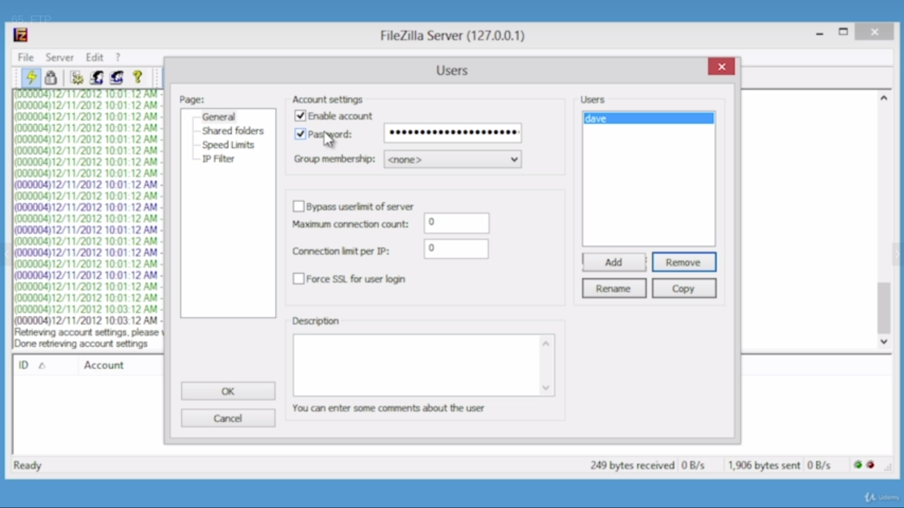

# TCP/IP applications

### TCP and UDP

***Protocol Data Units (PDU)*** is a single unit of information transmitted among peer entities of a computer network.


> An entire Ethernet frame (image above)

+ The moment this frame comes out of the network card, the frame check sequence (FCS), and both of the MAC addresses are stripped off.
+ The rest is passed to the computer itself.


+ After this happens, we are not talking about an Ethernet frame anymore, but rather an ***IP packet***. This is enough to get the packet to the computer.


+ When the packet gets to a computer, both of the IP addresses are stripped. At this point, we're talking about ***TCP and/or UDP***.

TCP is a connection-based protocol - UDP is a connectionless-based protocol.

If it's TCP, it's called a *TCP segment*, if it's UDP, it's called a *UDP datagram*.

Talking about switches - interested in the Ethernet part
Talking about IP addresses - interested in IPs

##### UDP

Take a frame and send it. That's it. No response, no communication, no verification. UDP has no overhead

TFTP (trivial file transfer protocol) uses UDP

##### TCP

Internet uses TCP.

**THE TCP 3-WAY HANDSHAKE**

1. The client sends a ***SYN*** packet. The SYN packet goes to the server.
1. If/When the server is ready, it sends a response back, called the ***SYN/ACK*** response.
1. The client receives a SYN/ACK and sends an ***ACK*** response to the server.
1. Until the connection is closed, or a timeout occurs, the connection will stay open on the computer.

### ICMP and IGMP

***ICMP - Internet Control Message Protocol***


ICMP & IGMP don't work at the transport layer of the TCP/IP model; they work at the IP (Internet) layer

The ICMP sends 2 things:
+ The ***type***
+ The ***checksum*** as verification

The best example of ICMP is `ping`

Another example is ARP - as we resolve MACs to IPs, ARP doesn't really need much data, just the type response.

***IGMP - Internet Group Management Protocol***


IGMP sends 4 things:
+ The ***source address*** - the IP address of the server a group of people is connected to
+ The ***group address*** - the multicast address a group of devices will be using (224.x.x.x)
+ The ***type***
+ The ***checksum*** as verification

Process:
+ Three people on the same network want to download software and watch a popular video.
+ They will connect to a video server
+ The server will broadcast it to a multicast address of the router (which was assigned by the server)
+ Only the computers running the software will be able to listen to the multicast address and watch the video
___

So: ICMP works at the Internet (2) layer in the TCP/IP model and the network (3) in the OSI (Open Systems Interconnection) model

### Handy tools

`traceroute || tracert` - traces the route from (each new entry is a hop - a packet going through a new router)

```bash
traceroute 8.8.8.8 # This is Google's external IP address
# Results/spitback:
traceroute to 8.8.8.8 (8.8.8.8), 30 hops max, 60 byte packets
 1  192.168.53.1 (192.168.53.1)  127.670 ms  127.588 ms  127.548 ms
 2  syscore-10.exe-net.net (92.60.224.10)  127.517 ms  127.478 ms  127.439 ms
 3  syscore-1.exe-net.net (92.60.224.1)  127.383 ms  127.341 ms  127.303 ms
 4  195.178.35.25 (195.178.35.25)  127.234 ms  127.195 ms  127.157 ms
 5  212.200.7.80 (212.200.7.80)  127.163 ms  127.124 ms  127.085 ms
 6  212.200.7.84 (212.200.7.84)  127.046 ms  169.222 ms  169.160 ms
 7  79.101.106.2 (79.101.106.2)  169.139 ms  169.121 ms  169.103 ms
 8  74.125.242.225 (74.125.242.225)  169.128 ms 74.125.242.241 (74.125.242.241)  169.062 ms  169.045 ms
 9  209.85.255.243 (209.85.255.243)  169.032 ms 72.14.239.201 (72.14.239.201)  169.059 ms 209.85.255.243 (209.85.255.243)  168.999 ms
10  dns.google (8.8.8.8)  168.979 ms  168.962 ms  168.945 ms
```

Tracing routes help determine whether the problem encountered was an internal or an external problem

However, some routers don't work well with `traceroute`, so we will use another command, called `pathping` (not on Kali)

Path ping uses a variant of the ping command to go ahead and generate information. It uses different protocol than traceroute, so it will often work when traceroute doesn't.

Another tool is a ***bandwidth speedtester***. It's colloquially called *Internet speed test*. It measures upload and download speeds and sometimes ping and/or latency.

This tool comes in handy to see whether:
+ you're being ripped off by your ISP (which, sadly, happens all too often)
+ see the limits of the router and what it can handle

### Introduction to Wireshark

***Wireshark*** is a protocol analyser. It captures data packages from a designated source and displays a whole lot of information


Wireshark is grabbing all kinds of frames coming in and out of the network.

Wireshark will take a frame and split it into parts (the Ethernet part, the IP part, the TCP/UDP part, some app info...). Let's break the following frame apart:


1. Frame <num>: Contains some basic information about the frame, such as interface id, encapsulation type, arrival time, epoch time, frame number & length (size)...
1. The Ethernet part of the frame: the destination and source MAC addresses and the type (IPv4/6)
1. The IP packet: the source (src) and destination (dst) IP addresses, protocol (TCP/UDP)
1. Transmission Control Protocol | User Datagram Protocol, depending on which one was used: source and destination ports, seq nr & flags (for TCP), checksum...

Wireshark allows us to dismantle whatever is going on; it also segments and analyses the frames.

On a fresh HTTP(S) capture, a TCP stream can also be followed: right click on it > follow > TCP stream

Following the stream gives back a lot of information - plaintext for HTTP and garbled for HTTPS.

The following codeblock is a snippet of an HTTPS follow:

```
.........J,.}..O...."...V...h............2..\....m..sae.......e...... "..8iB...U%+7Io0.X.... .s..Z].wN...L3...Y..#.M..r0.}(....'....D!.17.._.eE.=.......9m........=.4.@._9.
...Q.~.e.....s*S:.......;.=4..S.."...%.)......*..b'...m	k2..2&.....$T..W=..\.2U...9.....~VBq.Ng.$;...f...E.2l..R...........w............V...
>..b./.T...=..D..#{.7
.....=........H.......].l.'.|.`NA...r....U.....U...x....Ux..T.s.uI..{.~......!\.K ...;.g....*.R}2^,m..|S......4L.?3~..q.U+G...p..rI...%...'........s....xj0.c..M....UU...
.............c..\..y1(..1.JH~.	`~iB|.s......0.......}..Q........s!......*8Z..&.Q.,.W....vss..T2O..m....1.,.{.8..z..$..l/..G..4..
.R.:!...o./'....as......W.....E.;..=P.".0W
4..unR....bQ>5.
c..N_....*Yh.>.8.*.
.;~c
....(.u..!.....-.r@.....}..8.."..rZ....!....R.|.M.bg;......`..wh$..b.S....D5#+...iG;.'/;..gY.................~z[)...D...d..:H..L.q}.q..o.........F.L..........E..7.....(R..|.@M..K..SVa...Z.	Y....{.l...Q....(......L..}.}@Z..K.~.....6EY
...'.........Y..B....I-fW.&...+IX...,....S/..b...#D...@
...q".j:j..Fc5.6.ke.,AG...".U......s.....)......51ju........g
...6y2.;..&.._.....
4mx.. S3.ni..s.4.....+.~....................td.W`F!.`.E.Z.%0..</....KG..CW.s..drPD.c+).4e..jj&..|..,&..[{....<..s^.[%j..,.G.E.T.n..J.%......Ix\L~z...vc...`...'Rn......-^F.6s.......SkM.tz.......L%..B.}...%..
>...5*..	h..phd.<x........|+d~..........~....K.yXS!1...J.o...%.....
......\....JW..........2......W`.G$..t....(......R\.u..M.R.R.}+...$...........sG.....**.
....$*.9k9..=?&...e}...-..pC.S.......]_........4urI..
>!.......k.+.E.M5...s...6.0...1....1......D.]..........F"...G.B.{.TI..F.S.
p......M....~.F../e.(..1..._A..GlhU.............U..C./.V.z..F.rY....D6iX....B......[..Y=x,O...#...Z......A..z.Q..<...$...........7c..M..P........0..p.=..L.wj..[{I......:.0.l{@.e)..u....Y...T.P......9}....t.J...M..Y$U.k..^.l...n...G......
2j....s.29.B.....jx..8..<|	bPg....R35E.Fj..cQ	..q89.k.$.HI.I.e.yAO.:P.6e.y7_/T.U&....^M.qO._.@.......MX"...T.o.....[<.;...{Y....*..... .3.jr.3.r.S!.5..%.....$....M.
......*........&..<.I.H.<..S....rIl....=abZ!.[z..~..sz.~6...4.$...?	.....1)..1-....=..E. ...s'.....\........._....I.P..
>GH.vA......y..M...,...X......Q*{..wE|.P.Q...[...~Z.S.......<I~Iv.>...db..IN].C....Tl.....q.2..R........kp...^PO.!.X.... .0{.A..'.1].....&...r..K|+.5....H..S,..4....oySVK..[.xI..."..)..Kd1.........L....m...2....S..s.^..g.h......,d........rF...j...4.Bx...(.......U>.x+F..R.+...H<:.'..Zun.$J.1M4.V....A.	Z.4v.<Qb.$..0958.;..0.r.p.XU.i..	K..=.:.&..gU./.YX..xq"l#..n..........Ft.M.r(Zp.ha?....P+...>..~...h.[}..t...Y.....Xv.

.......y.6N.^2D
```

Wireshark can work with wireless networks, Bluetooth, telephone, VoIP.

`tcpdump` is another capture tool (not on Kali)

`tcpdump`s capture is far more powerful than Wireshark's. It can be preprogrammed to run at certain times, look for particular IP addresses, etc...

### Introduction to netstat

Running `netstat` gives the following results back (*just a snippet, though*):

```bash
Active Internet connections (w/o servers)
Proto Recv-Q Send-Q Local Address           Foreign Address         State      
tcp        0      0 192.168.53.147:35364    server-52-222-174:https ESTABLISHED
tcp        0      0 192.168.53.147:34354    edge-star-mini-sh:https ESTABLISHED
udp        0      0 192.168.53.147:bootpc   192.168.53.1:bootps     ESTABLISHED
```

1. It says the protocol (tcp/udp) [disregard send-q and recv-q for now]
1. It gives info about local address and the src port number
1. Foreign address and what the device is connected to
1. The state of the connection

Running `netstat -n` (the `-n` flag is for numerical result display), the information received is:

```bash
Proto Recv-Q Send-Q Local Address           Foreign Address         State      
tcp        0      0 192.168.53.147:58260    35.170.0.145:443        ESTABLISHED
tcp        0      0 192.168.53.147:47754    104.16.92.52:443        ESTABLISHED
tcp        1      1 192.168.53.147:56208    216.58.220.99:80        LAST_ACK   
tcp        0      0 192.168.53.147:46904    192.168.53.72:8009      ESTABLISHED
tcp        0      0 192.168.53.147:40410    152.199.21.236:443      ESTABLISHED
tcp        0      0 192.168.53.147:56324    192.168.53.72:8008      ESTABLISHED
tcp        0      0 192.168.53.147:32850    13.107.18.11:443        ESTABLISHED
tcp        0      0 192.168.53.147:60856    3.216.152.138:443       ESTABLISHED
udp        0      0 192.168.53.147:68       192.168.53.1:67         ESTABLISHED
```

Foreign addresses are now displayed as IP addresses: most of them with port 443 (HTTPS)

`netstat -o` option will give back the process ID. The `-a` flag will show all active ports

`netstate -r` - shows the local routing table

### Web servers

HTTP - HyperText Transfer Protocol, uses TCP port 80

There are 2 competing versions of web server. Primary web server software is:
+ Microsoft IIS
+ Apache (open source)

Is a web server running in a particular system? - `netstat -a` (see if it's listening on port 80)

Browsers on the exam:
+ Internet Explorer (mainly)
+ Chrome
+ Firefox
+ Safari

How to get to settings in Internet Explorer? - Tools > Internet options

HTTPS - HTTP Secure

Encrypts data using SSL or TLS. Wireshark packets capturing HTTPS are encrypted garble.

### FTP - File Transfer Protocol

It predates www.

##### Client-side connections

Using specifically designed software:



+ Set an account

| Perm files | Perm dirs        | Web req  |
| ---------- | ---------------- | -------- |
| Read       | List (+ subdirs) | GET      |
| Write      | Create           | POST     |
| Delete     | Delete           | DELETE   |
| Append     | N/A              | PUT      |

+ Change permissions


+ In order to download stuff, a "*very very famous*" account has to be created - ***anonymous*** with Read file perm and list + subdirs dir perm


*An established FTP connection (picture above)*

But, that's not it. Pretty much every browser makes a good FTP client, too.

> Instead of starting the URL with *https://*, start with *ftp://*

OS's come with built-in ftp client in their terminal/command prompt


FTP can be connected to using:
1. Software (like FileZilla)
1. Browsers, by starting the URL with ftp://
1. The command line or terminal `open <IP>`

##### Server-side connections

A server will be required (any OS).
___

FTP is not an encrypted protocol.

***SFTP - Secure FTP*** (similar to HTTPS) uses SSL and TLS

***TFTP or Trivial FTP*** is not as robust as FTP. It's a UDP protocol and runs on port 69.

### E-mail servers and clients

##### Client

Old-school e-mail was sent and received, read and written using E-mail programs (clients), like Outlook (Windows) and Thunderbird (Linux)

More modern variations of e-mails are web based, like GMail and Yahoo!

On the sending side, ***SMTP - Simple Mail Transfer Protocol*** is used. It runs on port 25.

The older one is called ***POP3 - Post Office Protocol v3***. It runs on port 110.

POP3's competitor is called ***IMAP - Internet Message Access Protocol***. It runs on port 143.

##### Server

Below is an example of a mail server (hMailServer [Administrator, localhost])


Instead of using well known domains and endings (e.g .com, .net), anything can be used (so long as it's internal) and will work


This is how ThunderBird looks:


What is the difference between POP and IMAP? - POP is much older. Everything in POP is copied to the computer. IMAP is a lot like web-based mail

### Securing E-mail - Encryption

##### A mail server and a client

SMTP is run on 25, POP on 110, IMAP on 143

Problems: These ports are unencrypted, there are no certificates and sniffers can listen to traffic unimpeeded.

##### Standard TLS for encryption

Encrypted IMAP is on port 993, POP on 995 and SMTP on 465

Problem: Port hopping (25 => 465, 110 => 995, 143 => 993) was still an exploitable issue. Not end-to-end encrypted.

##### STARTTLS

IMAP, POP3 and SMTP were all merged into one port - 465 along with TLS, so that encryption could run end-to-end.

Problem: TLS and STARTTLS started conflicting on port 465.

Solution: STARTTLS officially re-ported to 587 (and has been there ever since).

### Telnet and secure shell (SSH)

***Telnet is a remote command-prompt to a far-away computer***

The picture below is an image of a Telnet server.


Telnet requires user accounts. Telnet runs on port 23.

For Windows, the biggest and most popular client is PuTTY (for Telnet and SSH, as well)


This is what an example Telnet connection looks like:


**Telnet is one of the oldest applications there is on the Internet. E-mail and Telnet.**

Downside: Everything's in the clear, meaning unencrypted.

This was fixed in SSH.


SSH is an encrypted version of Telnet (and much more). It runs on TCP port 22.

SSH was also meant to replace *rlogin*, which used port 513 and was increadibly insecure (no username or password - instant connection).

### Network Time Protocol

There are computers on the web that set quite accurate times, and could be used to time updates.

One of the NTP servers is [the Windows NTP](time.windows.com). NTP runs on port 123.

A system with incorrect time can cause trouble on a network. These servers help fix that problem.

### Network Service Scenarios

**DHCP issues**

Sc: Three machines are connected to a DHCP. One of the computers acts as a file server. Assuming that the DHCP has a range of 192.168.4.[2 - 254], we're already running into a problem. The file server will be making a lot of requests.

Sol: Reserve an address for the file server. Make the range smaller (e.g from 100 to 254), because there are things that shouldn't move of change their IPs (like the server we have, printers, wireless access points, ...). MAC reservation is also an idea that could work with different apps, like a camera.

Sc: John has a system, where he wants to log in and do his work, but he can't get in. He checks his IP address and sees that he got bakc 169.254.x.x. What should John consider as a problem.

Sol: Since he's getting an APIPA, he's got getting an address from his DHCP server. From the last scenario, the file server will now always get an IP address, some camera will get an IP and other systems on the networks *sometimes will and sometimes won't* get a new IP address. The scope may possibly be exhausted. In this case, the scope should be broadened. Consider shortening your DHCP lease.

We turn to an entire class of systems called ***IPAM - IP Address Management***. They can automatically create new DHCP scopes, they can set reservations, generate new blocks of addresses and keep the system up no matter what happens.
