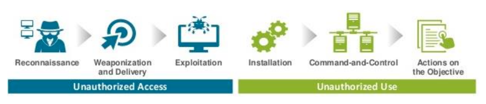
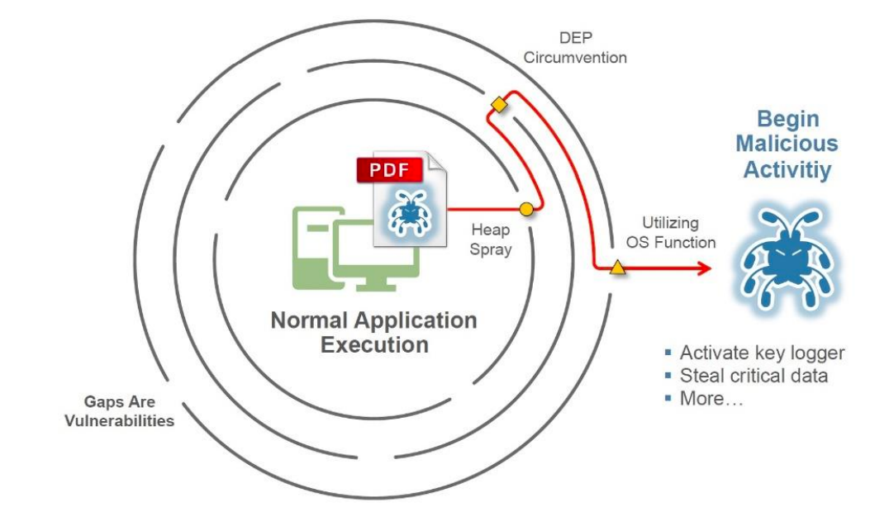
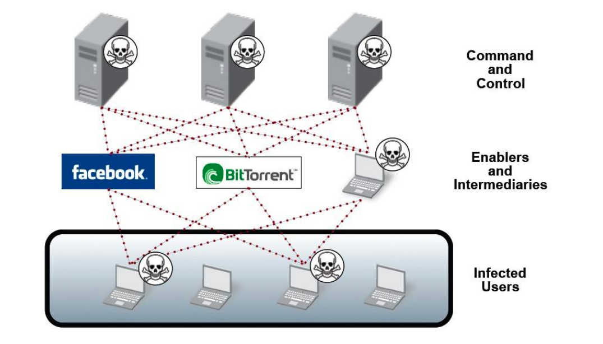
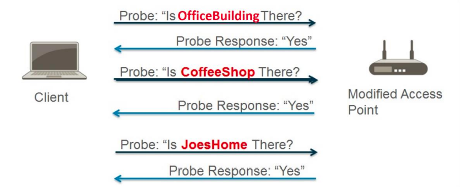

# Module 1 – Cybersecurity Foundation

**Knowledge Objectives**

+ Describe the cybersecurity landscape including modern computing trends, application frameworks and threat vectors, cloud computing and software as a service (SaaS) application challenges, information security and data protection regulations and standards, and recent cyberattacks.
+ Discuss cyberthreats including attacker motivations and the Cyber-Attack Lifecycle.
+ Describe endpoint security challenges and solutions.
+ Describe cyber-attack techniques and types including malware, vulnerabilities, exploits, spamming, phishing, bots, and botnets.
+ Discuss Wi-Fi and advanced threats including Wi-Fi vulnerabilities, Wi-Fi man-in-themiddle attacks, distributed denial-of-service (DDoS) attacks, and advanced persistent threats (APTs).

### 1.1 Cybersecurity Landscape

The modern cybersecurity landscape is a rapidly evolving, hostile environment fraught with
advanced threats and increasingly sophisticated threat actors.

##### 1.1.1 Modern computing trends

Core business applications are now commonly installed alongside **Web 2.0 "apps"** on a variety of endpoints, and networks that were originally designed to share files and printers are now used to collect massive volumes of data, exchange real-time information, transact online business, and enable global collaboration.

Similarly, **Web 3.0** will transform the enterprise computing landscape over the next decade and beyond. Web 3.0, as defined on ExpertSystem.com, is characterized by five main features:
+ **Semantic web**. "The semantic web improves web technologies in order to generate, share and connect through search and analysis based on the ability to understand the meaning of words, rather than on keywords and numbers."
+ **Artificial intelligence**. "…computers can understand information like humans in order to
provide faster and more relevant results."
+ **3D graphics**. 3D design is "…used extensively in websites and services."
+ **Connectivity**. "…information is more connected thanks to semantic metadata. As a result, the user experience evolves to another level of connectivity that leverages all the available information."
+ **Ubiquity**. "Content is accessible by multiple applications, every device is connected to
the web, [and] the services can be used everywhere."[^1]

[^1]: Expert System. 2017. “5 main features of Web 3.0.” Accessed June 3, 2018. [More information here](http://www.expertsystem.com/web3-0/.)

Typical core business applications include:
+ **Accounting software** is used to process and record accounting data and transactions such as accounts payable, accounts receivable, payroll, trial balances, and general ledger (GL) entries. Examples of accounting software include Intacct, Microsoft Dynamics AX and GP, NetSuite, Quickbooks, and Sage.
+ **Business intelligence (BI) and business analytics software** consists of tools and techniques used to surface large amounts of raw unstructured data from a variety of sources (such as data warehouses and data marts). BI and business analytics software performs a variety of functions, including business performance management, data mining, event processing, and predictive analytics. Examples of BI and analytics software include IBM Cognos, MicroStrategy, Oracle Hyperion, and SAP.
+ **Content management systems (CMS) and enterprise content management (ECM) systems** are used to store and organize files from a central management interface, with features such as indexing, publishing, search, workflow management, and versioning. Examples of CMS and ECM software include EMC Documentum, HP Autonomy, Microsoft SharePoint, and OpenText.
+ **Customer relationship management (CRM)** software is used to manage an organization’s customer (or client) information including lead validation, past sales, communication and interaction logs, and service history. Examples of CRM suites include Microsoft Dynamics CRM, Salesforce.com, SugarCRM, and ZOHO.
+ **Database management systems (DBMS)** are used to administer databases including the schemas, tables, queries, reports, views, and other objects that comprise a database. Examples of DBMS software include Microsoft SQL Server, MySQL, NoSQL, and Oracle Database.
+ **Enterprise resource planning (ERP)** systems provide an integrated view of core business processes such as product and cost planning, manufacturing or service delivery, inventory management, and shipping and payment. Examples of ERP software include NetSuite, Oracle JD Edwards EnterpriseONE and PeopleSoft, and SAP.
+ **Enterprise asset management (EAM)** software is used to manage an organization’s physical assets throughout their entire lifecycle including acquisition, upgrade, maintenance, repair, replacement, decommissioning, and disposal. EAM is commonly implemented as an integrated module of ERP systems. Examples of EAM software include IBM Maximo, Infor EAM, and SAP.
+ **Supply chain management (SCM)** software is used to manage supply chain transactions, supplier relationships, and various business processes such as purchase order processing, inventory management, and warehouse management. SCM software is commonly integrated with ERP systems. Examples of SCM software include Fishbowl Inventory, Freightview, Infor Supply Chain Management, and Sage X3.
+ **Web content management (WCM)** software is used to manage website content including administration, authoring, collaboration, and publishing. Examples of web content management software include Drupal, IBM FileNet, Joomla, and WordPress.

Common Web 2.0 apps and services (many of which are also SaaS apps) include:
+ **File sync and sharing services** are used to manage, distribute, and provide access to online content, such as documents, images, music, software, and video. Examples include Apple iCloud, Box, Dropbox, Google Drive, Microsoft OneDrive, Spotify, and YouTube.
+ **Instant messaging (IM)** is used to exchange short messages in real-time. Examples include Facebook Messenger, Skype, Snapchat, and WhatsApp.
+ **Microblogging** web services allow a subscriber to broadcast short messages to other subscribers. Examples include Tumblr and Twitter.
+ **Office productivity suites** consist of cloud-based word processing, spreadsheet, and presentation software. Examples include Google Apps and Microsoft Office 365.
+ **Remote access software** is used for remote sharing and control of an endpoint, typically for collaboration or troubleshooting purposes. Examples include Ammyy Admin, LogMeIn, and TeamViewer.
+ **Social curation** shares collaborative content about a particular topic(s) or theme(s). Social bookmarking is a type of social curation. Examples include Cogenz, Instagram, Pinterest, and Reddit.
+ **Social networks** are used to share content with business or personal contacts. Examples include Facebook, Google+, and LinkedIn.
+ **Web-based email** is an internet email service that is typically accessed via a web browser. Examples include Gmail, Outlook.com, and Yahoo! Mail.
+ **Wikis** enable users to contribute, collaborate, and edit site content. Examples include Socialtext and Wikipedia.

Enterprise infrastructures (systems, applications, and networks) are rapidly converging with personal and Web 2.0 technologies and apps, making definition of where the internet begins and the enterprise infrastructure ends practically impossible. This convergence is being driven by several important trends including:
+ **Cloud computing**. The popularity of cloud computing service models in general, and SaaS application services in particular, continues to surge. According to a January 2018 McKinsey and Company article, even though adoption of the public cloud has been limited to date, the outlook is markedly different. Just 40 percent of the companies studied have more than 10 percent of their workloads on public-cloud platforms; in contrast, 80 percent plan to have more than 10 percent of their workloads in public cloud platforms in three years or plan to double their cloud penetration.
+ **Consumerization**. The process of consumerization occurs as end users increasingly find personal technology and apps that are more powerful or capable, more convenient, less expensive, quicker to install, and easier to use than enterprise IT solutions.
+ **Bring your own device (BYOD)**. Closely related to consumerization is BYOD, a policy trend in which organizations permit end users to use their own personal devices, primarily smartphones and tablets, for work-related purposes. BYOD relieves organizations from the cost of providing equipment to employees, but creates a management challenge because of the vast number and type of devices that must be supported.
+ **Bring your own apps (BYOA)**. Web 2.0 apps on personal devices are increasingly being used for work-related purposes. As the boundary between work and personal lives becomes less distinct, end users are practically demanding that these same apps be available to them in their workplaces.
+ **Mobile computing**. The appetite for rapid, on-demand access to apps and data from anywhere, at any time, on any device is insatiable. There are now more than 4.4 billion smartphone subscriptions worldwide, and total mobile monthly data traffic (including audio, file sharing, social networking, software uploads and downloads, video, web browsing, and other sources) in the third quarter of 2017 was about 14 exabytes!

Organizations are often unsure of the potential business benefits – and the inherent risks – of these trends, and therefore either:
+ Implicitly allow personal technologies and apps by simply ignoring their use in the workplace

or

+ Explicitly prohibit their use, but are then unable to effectively enforce such policies with traditional firewalls and security technologies

Whether personal technologies and apps are implicitly allowed (and ignored) or explicitly prohibited (but not enforced), the adverse results of ineffective policies include:
+ **Lost productivity** because users must either find ways to integrate these unsupported technologies and apps (when allowed) with the enterprise infrastructure, or use applications that are unfamiliar to them or less efficient (when personal technologies and apps are prohibited)
+ **Potential disruption of critical business operations** because of underground or back-channel processes that are used to accomplish specific workflow tasks or to circumvent controls, and are known to only a few users and are fully dependent on their use of personal technologies and apps
+ **Exposure to additional risks** for the enterprise due to unknown – and therefore unpatched – vulnerabilities in personal technologies and apps, and a perpetual cat-and-mouse game between employees that circumvent controls (for example, with external proxies, encrypted tunnels, and remote desktop applications) and security teams that manage these risks
+ **Penalties for regulatory non-compliance**, for example, the E.U. General Data Protection Regulation (GDPR), the U.S. Health Insurance Portability and Accountability Act (HIPAA), and the Payment Card Industry Data Security Standard (PCI DSS)

As these trends continue to blur the distinction between the internet and the enterprise network, new security challenges and risks emerge, including:
+ New application threat vectors
+ Turbulence in the cloud
+ SaaS application risks

##### 1.1.2 New application framework and threat vectors

Many applications are designed to circumvent traditional port-based firewalls, so that they can be easily installed and accessed on any device, anywhere and anytime, using techniques such as:
+ **Port hopping**, in which ports and protocols are randomly changed during a session
+ **Use of non-standard ports**, such as running Yahoo! Messenger over TCP port 80 (HTTP) instead of the standard TCP port for Yahoo! Messenger (5050)
+ **Tunneling within commonly used services**, such as when peer-to-peer (P2P) file sharing or an instant messenger (IM) client such as Meebo is running over HTTP
+ **Hiding within SSL encryption**, which masks the application traffic, for example, over TCP port 443 (HTTPS). More than half of all web traffic is now encrypted.

Many traditional client-server business applications are also being redesigned for web use, and employ these same techniques for ease of operation while minimizing disruptions.

> As new applications are increasingly web-enabled and browser-based, HTTP and HTTPS now account for about two-thirds of all enterprise network traffic. Traditional port-based firewalls and other security infrastructure cannot distinguish whether these applications, riding on HTTP and HTTPS, are being used for legitimate business purposes. Thus, applications (including malware) have become the predominant attack vector to infiltrate networks and systems.

##### 1.1.3 Turbulence in the cloud

Many organizations have been forced into significant compromises regarding their public and private cloud environments — trading function, visibility, and security, for simplicity, efficiency, and agility. Cloud security trade-offs often include:
+ Simplicity *or* function
+ Efficiency *or* visibility
+ Agility *or* security

Many of the features that make cloud computing attractive to organizations also run contrary to network security best practices. For example:
+ **Cloud computing doesn’t mitigate existing network security risks**. The security risks that threaten your network today don’t go away when you move to the cloud. The shared responsibility model defines who (customer and/or provider) is responsible for what (related to security) in the public cloud. In general terms, the cloud provider is responsible for security ”of” the cloud, including the physical security of the cloud data centers, and for foundational networking, storage, compute, and virtualization services. The cloud customer is responsible for security ”in” the cloud, which is further delineated by the cloud service model. For example, in an infrastructure-as-a-service (IaaS) model, the cloud customer is responsible for the security of the operating systems, middleware, run time, applications, and data. In a platform-as-a-service (PaaS) model, the cloud customer is responsible for the security of the applications and data – the cloud provider is responsible for the security of the operating systems, middleware, and run time. In a SaaS model, the cloud customer is responsible only for the security of the data, and the cloud provider is responsible for the full stack, from the physical security of the cloud data centers to the application.
+ **Separation and segmentation are fundamental to security; the cloud relies on shared resources**. Security best practices dictate that mission-critical applications and data be separated in secure segments on the network, based on Zero Trust principles. On a physical network, Zero Trust is relatively straightforward, using firewalls and policies based on application and user identity. In a cloud environment, direct communication between virtual machines (VMs) within a server host occurs constantly — in some cases, across varied levels of trust, thus making segmentation a real challenge. Mixed levels of trust, combined with a lack of intra-host traffic visibility by virtualized port-based security offerings, may weaken your security posture.
+ **Security deployments are process-oriented; cloud computing environments are dynamic**. The creation or modification of your cloud workloads can often be done in minutes, yet the security configuration for this workload may take hours, days, or weeks. Security delays aren’t designed to be burdensome; they’re the result of a process that is designed to maintain a strong security posture. Policy changes need to be approved, the appropriate firewalls need to be identified, and the relevant policy updates need to be determined. In contrast, the cloud is a highly dynamic environment, with workloads being added, removed, and changed rapidly and constantly. The result is a disconnect between security policy and cloud workload deployments, which leads to a weakened security posture. Thus, security technologies and processes must be able to auto scale to take advantage of the elasticity of the cloud while maintaining a strong security posture.

##### 1.1.4 SaaS application risks

With SaaS applications, data is often stored where the application resides – in the cloud. Thus, the data is no longer under the organization’s control, and visibility is often lost. End users are now acting as their own "shadow" IT department, with control over the SaaS applications they use and how they use them. But they have little or no understanding of the inherent data exposure and threat insertion risks of SaaS, including:
+ **Malicious outsiders**. The most common source of breaches for networks overall is also a critical concern for SaaS security. The SaaS application becomes a new threat vector and distribution point for malware used by external adversaries. Some malware will even target the SaaS applications themselves, for example, by changing their shares to "public" so the data can be retrieved by anyone.
+ **Accidental data exposure**. Well-intentioned end users are often untrained and unaware of the risks their actions pose in SaaS environments. Because SaaS applications are designed to facilitate easy sharing, it’s understandable that data often becomes unintentionally exposed. Accidental data exposure by end users is surprisingly common and includes:
  1. **Accidental share**: A share meant for a particular person is accidentally sent to the wrong person or group. Accidental shares are common when a name auto fills, or is mistyped, which may cause an old email address or the wrong name, group, or even an external user, to have access to the share.
  1. **Promiscuous share**: A legitimate share is created for a user, but that user then shares with other people who shouldn’t have access. Promiscuous shares often result in the data being publicly shared because it can go well beyond the control of the original owner.
  1. **Ghost (or stale) share**: A share remains active for an employee or vendor that is no longer working with the company, or should no longer have access. Without visibility and control of the shares, the tracking and fixing of shares to ensure they are still valid is very difficult.
+ **Malicious insiders**. The least common but real SaaS application risk is the internal user who maliciously shares data for theft or revenge purposes. For example, an employee who is leaving the company might set a folder’s share permissions to "public", or share it with an external email address to later steal the data from a remote location.

##### 1.1.5 Compliance and security are not the same

Pertinent examples of current cybersecurity laws and regulations include (google for more info):
+ **Canada Personal Information Protection and Electronic Documents Act (PIPEDA)**
+ **European Union (EU) General Data Protection Regulation (GDPR)**
+ **EU Network and Information Security (NIS) Directive**
+ **North American Electric Reliability Corporation (NERC) Critical Infrastructure Protection (CIP)**
+ **Payment Card Industry Data Security Standards (PCI DSS)**
+ **U.S. Cybersecurity Enhancement Act of 2014**
+ **U.S. Cybersecurity Information Sharing Act (CISA)**
+ **U.S. Federal Exchange Data Breach Notification Act of 2015**
+ **U.S. Federal Information Security Modernization Act (FISMA)**
+ **U.S. Gramm-Leach-Bliley Act (GLBA)**
+ **U.S. Health Insurance Portability and Accountability Act (HIPAA)**
+ **U.S. National Cybersecurity Protection Advancement Act of 2015**
+ **U.S. Sarbanes-Oxley (SOX) Act**

##### 1.1.6 Recent high-profile cyber-attack examples

(pg. 16-17) Recent high-profile examples of such attacks include:
+ **Target**
+ **Home Depot**
+ **Anthem**
+ **U.S. Office of Personnel Management (OPM)**
+ **Yahoo!**
+ **Equifax**

***Key terms***
+ A *zero-day* threat is the window of vulnerability that exists from the time a new (`unknown`) threat is released until security vendors release a signature file or security patch for the threat
+ *Personally Identifiable Information* - any information about an individual maintained by an agency, including:
  1. any information that can be used to distinguish or trace an individual’s identity… and
  1. any other information that is linked or linkable to an individual, eg:
    - **Name** (such as full name, maiden name, mother’s maiden name, or alias)
    - **Personal identification number** (such as Social Security number, passport number, driver’s license number, and financial account number or credit card number)
    - **Address information** (such as street address or email address)
    - **Asset information** (such as IP or MAC address)
    - **Telephone numbers** (such as mobile, business, and personal numbers)
    - **Personal characteristics** (such as photographs, x-rays, fingerprints, and biometric data)
    - **Information about personally owned property** (such as vehicle registration number or title information)
    - **Information that is linked or linkable to any of the above** (such as birthdate, birthplace, race, religion, height, weight, and employment, medical, education, and financial records)

Important lessons to be learned from these attacks include:
+ A *low and slow* cyberattack can go undetected for weeks, months, or even years.
+ An attacker doesn’t necessarily need to run a sophisticated exploit against a hardened system to infiltrate a target organization. Often, an attacker will target an auxiliary system or other vulnerable endpoint, then pivot the attack toward the primary target.
+ Unpatched vulnerabilities are a commonly exploited attack vector.
+ The direct and indirect financial costs of a breach can be devastating for both the targeted organization and individuals whose personal and financial information is stolen or compromised.

### Cyberthreats

##### 1.2.1 Attacker profiles and motivations

In the relatively innocuous "good ol’ days" of *hackers and script kiddies*, the primary motivation
for a cyberattack was notoriety, and the attack objective was typically limited to defacing or
"owning" a website to cause inconvenience and/or embarrassment to the victim.

> The term *hacker* was originally used to refer to anyone with highly specialized computing skills, without connoting good or bad purposes. However, common misuse of the term has redefined a hacker as someone that circumvents computer security with malicious intent, such as a cybercriminal, cyberterrorist, or hacktivist, cracker, and/or black hat.

> A *script kiddie* is someone with limited hacking and/or programming skills that uses malicious programs (malware) written by others to attack a computer or network.

Modern cyberattacks are perpetrated by far more sophisticated and dangerous adversaries, motivated by far more sinister purposes:
+ **Cybercriminals**. Acting independently or as part of a criminal organization, cybercriminals commit acts of data theft, embezzlement, fraud, and/or extortion for financial gain. According to the RAND Corporation, "In certain respects, the black market [for cybercrime] can be more profitable than the illegal drug trade", and by many estimates, cybercrime is now a ***US$1 trillion industry***. E.g Edward Snowden (from US perspective).
+ **State-affiliated groups**. Sponsored by or affiliated with nation-states, these organizations have the resources to launch very sophisticated and persistent attacks, have great technical depth and focus, and are well funded. They often have military and/or strategic objectives such as the ability to disable or destroy critical infrastructure including power grids, water supplies, transportation systems, emergency response, and medical and industrial systems. The Center for Strategic and International Studies reports that "At the nation-state level, Russia, Iran, and North Korea are using coercive cyberattacks to increase their sphere of influence, while China, Russia and Iran have conducted reconnaissance of networks critical to the operation of the U.S. power grid and other critical infrastructure without penalty." E.g [the Natanz Hack](https://www.abc.net.au/triplej/programs/hack/the-worlds-first-digital-weapon-stuxnet/7926298) executed by the US government and Israeli Intelligence Group **Unit 8200**.
+ **Hacktivists**. Motivated by political or social causes, hacktivist groups (such as Anonymous) typically execute denial-of-service (DoS) attacks against a target organization by defacing their websites or flooding their networks with traffic.
+ **Cyberterrorists**. Terrorist organizations use the internet to recruit, train, instruct, and
communicate, and to spread fear and panic to advance their ideologies. Unlike other
threat actors, cyberterrorists are largely indiscriminate in their attacks and their
objectives include physical harm, death, and destruction. E.g [the Lizard Squad](https://www.extremetech.com/extreme/188583-hackers-take-down-psn-with-ddos-and-sony-presidents-plane-with-a-bomb-threat) ***grounding a Sony president's plane with a bomb threat***.

##### 1.2.2 Modern cyber-attack strategy

Modern cyber-attack strategy has evolved from a direct attack against a high-value server or
asset (*shock and awe*) to a patient, multi-step process that blends exploits, malware, stealth,
and evasion in a coordinated network attack (*low and slow*).

1. **Reconnaissance**. Like common criminals, attackers meticulously plan their cyberattacks. They research, identify, and select targets, often extracting public information from targeted employees’ social media profiles or from corporate websites, which can be useful for social engineering and phishing schemes. Attackers will also use various tools to scan for network vulnerabilities, services, and applications that they can exploit, such as:
  + **Network analyzers** (also known as packet analyzers, protocol analyzers, or packet sniffers) are used to monitor and capture raw network traffic (packets). Examples include tcpdump and Wireshark (formerly Ethereal).
  + **Network vulnerability scanners** typically consist of a suite of tools including password crackers, port scanners, and vulnerability scanners and are used to probe a network for vulnerabilities (including configuration errors) that can be exploited. Examples include Nessus and SAINT.
  + **Password crackers** are used to perform brute-force dictionary attacks against password hashes. Examples include John the Ripper and THC Hydra.
  + **Port scanners** are used to probe for open TCP or UDP (including ICMP) ports on an endpoint. Examples include Nmap (“network mapper”) and Nessus.
  + **Web application vulnerability scanners** are used to scan web applications for vulnerabilities such as cross-site scripting, SQL injection, and directory traversal. Examples include Burp Suite and OWASP Zed Attack Proxy (ZAP).
  + **Wi-Fi vulnerability scanners** are used to scan wireless networks for vulnerabilities (including open and misconfigured access points), to capture wireless network traffic, and to crack wireless passwords. Examples include Aircrack-ng and Wifite
2.  **Weaponization**. Next, attackers determine which methods to use to compromise a target endpoint. They may choose to embed intruder code within seemingly innocuous files such as a PDF or Microsoft Word document or email message. Or, for highly targeted attacks, attackers may customize deliverables to match the specific interests of an individual within the target organization.
3. **Delivery**. Attackers next attempt to deliver their weaponized payload to a target endpoint, for example, via email, instant messaging (IM), drive-by download (an end user’s web browser is redirected to a webpage that automatically downloads malware to the endpoint in the background), or infected file share.
4. **Exploitation**. After a weaponized payload is delivered to a target endpoint, it must be triggered. An end user may unwittingly trigger an exploit, for example, by clicking a malicious link or opening an infected attachment in an email, or an attacker may remotely trigger an exploit against a known server vulnerability on the target network.
5. **Installation**. Next, an attacker will escalate privileges on the compromised endpoint, for example, by establishing remote shell access and installing root kits or other malware. With remote shell access, the attacker has control of the endpoint and can execute commands in privileged mode from a command line interface (CLI), as if physically sitting in front of the endpoint. The attacker will then move laterally across the target’s network, executing attack code, identifying other targets of opportunity, and compromising additional endpoints to establish persistence.
6. **Command and Control**. Attackers establish encrypted communication channels back to command-and-control (C&C) servers across the internet so that they can modify their attack objectives and methods as additional targets of opportunity are identified within the victim network, or to evade any new security countermeasures that the organization may attempt to deploy if attack artifacts are discovered. Communication is essential to an attack because it enables the attacker to remotely direct the attack and execute the attack objectives. C&C traffic must therefore be resilient and stealthy for an attack to succeed. Attack communication traffic is usually hidden with various techniques and tools including:
  + **Encryption** with SSL, SSH (Secure Shell), or some other custom or proprietary encryption.
  + **Circumvention** via proxies, remote access tools, or tunneling. In some instances, use of cellular networks enables complete circumvention of the target network for attack C&C traffic.
  + **Port evasion** using network anonymizers or port hopping to traverse over any available open ports.
  + **Fast Flux (or Dynamic DNS)** to proxy through multiple infected endpoints or multiple ever-changing C&C servers to reroute traffic, and make determination of the true destination or attack source difficult.
7. **Actions on the Objective**. Attackers often have multiple, different attack objectives including data theft; destruction or modification of critical systems, networks, and data; and denial-of-service (DoS). This last stage of the Cyber-Attack Lifecycle can also be used by an attacker to advance the early stages of the Cyber-Attack Lifecycle against another target. The 2018 Verizon *Data Breach* Investigations Report (DBIR) describes this strategy as a secondary motive in which "[web applications] are compromised to aid and abet in the attack of another victim." For example, an attacker may compromise a company’s extranet to breach a business partner that is the primary target. According to the DBIR, in 2014 there were 23,244 "incidents where web applications were compromised with a secondary motive." The attacker pivots the attack against the initial victim network to a different victim network, thus making the initial victim an unwitting accomplice.

### 1.3 Endpoint security basics

Most organizations deploy several security products to protect their endpoints, including personal firewalls, Host-based Intrusion Prevention Systems (HIPS), mobile device management (MDM), mobile application management (MAM), data loss prevention (DLP), and antivirus software. Faced with the rapidly changing threat landscape, traditional endpoint security solutions and antivirus can no longer prevent security breaches on the endpoint.

Network firewalls may not be able to block an attacker’s delivery of a zero-day exploit until a new signature identifying the zero-day attack has been developed and delivered to the firewall. Additionally, network firewalls also may be restricted from decrypting all traffic because of regulations and laws. This restriction provides a window of opportunity for attackers to bypass a firewall’s protection and exploit a host machine, necessitating endpoint security protection.

### 1.4 Cyber-attack Techniques and Types

*Malware* and *exploits* are integral to the modern cyber-attack strategy. Once an endpoint is compromised, an attacker typically installs back doors, remote access Trojans, and other malware to ensure persistence. Compromised endpoints (*bots*) under the control of an attacker are often used to perpetrate much larger-scale attacks against other organizations or networks as part of a botnet.

##### 1.4.1 Malware

*Malware* is malicious software or code that typically takes control of, collects information from, or damages an infected endpoint. Malware broadly includes:
+ **Viruses**: Malware that is self-replicating but must first infect a host program and be executed by a user or process
+ **Worms**: Malware that typically targets a computer network by replicating itself to spread rapidly. Unlike viruses, worms do not need to infect other programs and do not need to be executed by a user or process.
+ **Trojan horses**: Malware that is disguised as a harmless program, but actually gives an attacker full control and elevated privileges of an endpoint when installed. Unlike other types of malware, Trojan horses are typically not self-replicating.
+ **Ransomware**: Malware that locks a computer or device (Locker ransomware) or encrypts data (Crypto ransomware) on an infected endpoint with an encryption key that only the attacker knows, thereby making the data unusable until the victim pays a ransom (usually cryptocurrency, such as *Bitcoin*). Reveton and LockeR are two examples of Locker ransomware. Locky, TeslaCrypt/EccKrypt, Cryptolocker, and Cryptowall are examples of Crypto ransomware.
+ **Anti-AV**: Malware that disables legitimately installed antivirus software on the compromised endpoint, thereby preventing automatic detection and removal of other malware
+ **Logic bombs**: Malware that is triggered by a specified condition, such as a given date or a particular user account being disabled
+ **Back doors**: Malware that allows an attacker to bypass authentication to gain access to a compromised system
+ **Rootkits**: Malware that provides privileged (root-level) access to a computer. Rootkits are installed in the BIOS of a machine, which means operating system-level security tools cannot detect them.
+ **Bootkits**: Malware that is a kernel-mode variant of a rootkit, commonly used to attack computers that are protected by full-disk encryption
+ **Spyware and adware**: Malware that collects information, such as internet surfing behavior, login credentials, and financial account information on an infected endpoint. Spyware often changes browser and other software settings, and slows computer and internet speeds on an infected endpoint. Adware is spyware that displays annoying advertisements on an infected endpoint, often as popup banners.

Examples of early viruses:
+ **Elk Cloner** - displayed a poem on the *50th* time that an infected floppy disk was inserted into an Apple II computer
+ **Brain** - displayed a message with the actual contact information for the creators of the virus

One of the first computer worms to gain widespread notoriety was the **Morris worm**, written by
a Harvard and Cornell University graduate student, Robert Tappan Morris, in 1988.

Examples of modern malware include:
+ **WannaCry**
+ **HenBox**
+ **TeleRAT**
+ **Rarog**

Important characteristics and capabilities of advanced malware include:
+ **Distributed, fault-tolerant architecture.**
+ **Multi-functionality**
+ **Polymorphism and metamorphism**
+ **Obfuscation**

##### 1.4.2 Vulnerabilities and exploits

An exploit is a type of malware that takes advantage of a vulnerability in installed endpoint or server software such as a web browser, Adobe Flash, Java, or Microsoft Office.

Vulnerabilities are routinely discovered in software at an alarming rate. Vulnerabilities may exist in software when the software is initially developed and released, or vulnerabilities may be inadvertently created, or even reintroduced, when subsequent version updates or security patches are installed.

Exploits can be embedded in seemingly innocuous data files (such as Microsoft Word documents, PDFs, and webpages), or they can target vulnerable network services. Exploits are particularly dangerous because they are often packaged in legitimate files that do not trigger anti-malware (or antivirus) software and are therefore not easily detected.

Regardless of the attack or its complexity, for the attack to be successful, the attacker must execute a series of these core exploit techniques in sequence, like navigating a maze to reach its objective

##### 1.4.3 Spamming and phishing

Spam and phishing emails are the most common delivery methods for malware. The volume of spam email as a percentage of total global email traffic fluctuates widely from month to month – *typically 45 to 75 percent*. Although most end users today are readily able to identify spam emails and are more savvy about not clicking links, opening attachments, or replying to spam emails, spam remains a popular and effective infection vector for the spread of malware.

Phishing attacks, in contrast to spam, are becoming more sophisticated and difficult to identify.

*Spear phishing* is a targeted phishing campaign that appears more credible to its victims by gathering specific information about the target, and thus has a higher probability of success. A spear phishing email may spoof an organization or individual that the recipient actually knows and does business with, and may contain very specific information.

*Whaling* is a type of spear phishing attack that is specifically directed at senior executives or other high-profile targets within an organization. A whaling email typically purports to be a legal subpoena, customer complaint, or other serious matter.

*Watering hole* attacks compromise websites that are likely to be visited by a targeted victim, for example, an insurance company website that may be frequently visited by healthcare providers. The compromised website will typically infect unsuspecting visitors with malware (known as a *drive-by-download*). Watering hole attacks are the second most popular infection vector for targeted attack groups (24 percent), according to Symantec.

A *pharming* attack redirects a legitimate website’s traffic to a fake site, typically by modifying an endpoint’s local hosts file or by compromising a DNS server.

##### 1.4.4 Bots and botnets

*Bots* and *botnets* are notoriously difficult for organizations to detect and defend against using traditional anti-malware solutions.

In a botnet, advanced malware works together toward a common objective, with each bot growing the power and destructiveness of the overall botnet.

Given their flexibility and ability to evade defenses, botnets present a significant threat to organizations. The ultimate impact of a botnet is largely left up to the attacker, from sending spam one day to stealing credit card data the next – and far beyond, as many cyberattacks go undetected for months or even years.

Botnets themselves are dubious sources of income for cybercriminals. The key to taking down or decapitating a botnet is to separate the bots from their brains. If the bots cannot get to their servers, they cannot get new instructions, upload stolen data, or do anything that makes botnets so unique and dangerous. This approach almost always requires an enormous amount of investigation, expertise, and coordination between numerous industry, security, and law enforcement organizations worldwide. Disabling of C&C servers often requires both physically seizing the servers and taking ownership of the domain and/or IP address range associated with the servers. However, many botnets have C&C servers all over the world, and will
specifically function in countries that have little or no law enforcement for internet crimes. Further complicating takedown efforts is the fact that a botnet almost never relies on a single C&C server, but rather uses multiple C&C servers for redundancy purposes. Each server also is typically insulated by a variety of intermediaries to cloak the true location of the server. Most botnets are also designed to withstand the loss of a C&C server, meaning that the ***entire*** botnet C&C infrastructure must be disabled almost simultaneously. If any C&C server is accessible or any of the fallback options survive, the bots will be able to get updates, rapidly populate a completely new set of C&C servers, and the botnet will quickly recover.

***1.4.4.1 Spamming botnets***

The largest botnets are often dedicated to sending spam. The premise is straightforward – the attacker attempts to infect as many endpoints as possible, and the endpoints can then be used to send out spam email messages without the end users’ knowledge.

*The Rustock botnet* is an example of a spamming botnet. It could send up to 25,000 spam email messages per hour from an individual bot and, at its peak, sent an average of 192 spam emails per minute per bot. Rustock is estimated to have infected more than 2.4 million computers worldwide. In March 2011, the U.S. Federal Bureau of Investigation (FBI), working with Microsoft and others, was able to take down the Rustock botnet, which had operated for more than five years and at the time was responsible for sending up to 60% of the world’s spam.

***1.4.4.2 DDoS botnets***

A distributed denial-of-service (DDoS) attack is a type of cyberattack in which extremely high volumes of network traffic such as packets, data, or transactions are sent to the target victim’s network to make their network and systems (such as an e-commerce website or other web application) unavailable or unusable.

DDoS attacks often target specific organizations for personal or political reasons, or to extort a ransom payment in exchange for stopping the DDoS attack. DDoS attacks are often used by hacktivists to promote or protest a particular political agenda or social cause. DDoS attacks may also be used for criminal extortion purposes to extract a hefty ransom payment in exchange for ending the attack.

***1.4.4.3 Financial botnets***

Financial botnets, such as ZeuS and SpyEye, are responsible for the direct theft of funds from all types of enterprises. These types of botnets are typically not as large as spamming or DDoS botnets, which grow as large as possible for a single attacker. Instead, financial botnets are often sold as kits that allow attackers to license the code and build their own botnets... how thoughtful.

The impact of a financial breach can be enormous, including the breach of sensitive consumer and financial information leading to significant financial, legal, and brand damage.

### 1.5 Wi-Fi and Advanced Persistent Threats

##### 1.5.1 Wi-Fi vulnerabilities

With the explosive growth in the number of mobile devices over the past decade, wireless (WiFi) networks are now everywhere. Whether you’re in an office, hotel, airport, school, or coffee shop, you’re likely in range of a Wi-Fi network somewhere. But for the average user, the unfortunate reality is that Wi-Fi
connectivity is more about convenience than security. Thus, the challenge is to not only secure your Wi-Fi networks, but also to protect the mobile devices that your organization’s employees use to perform work and access potentially sensitive data — no matter where they are or whose network they’re on. Wi-Fi security begins — and ends — with authentication. If you can’t control who has access to your wireless network, then you can’t protect your network.

***1.5.1.1 Wired equivalent privacy***

The wired equivalent privacy (WEP) protocol was the wireless industry’s first attempt at security. As its name falsely implies, WEP was intended to provide data confidentiality equivalent to the security of a wired network. However, WEP had many well-known and well-publicized weaknesses, and wasn’t effective for establishing a secure wireless network.

One critical weakness in WEP is in how it handles the initialization vector (*IV*) for WEP’s RC4 (*Rivest Cipher 4*) stream cipher. In WEP, the IV is a 24-bit key that is transmitted in the clear (or unencrypted).  With a 24-bit key, generation of unique values becomes impossible after sending 2^24 (or 16,777,216) packets, and the IVs will repeat.

Attacks on WEP don’t depend on having a massive amount of computing power and aren’t greatly affected by the size of the encryption key. The attack isn’t dependent on how complex the original passphrase is either. It’s simply a matter of being able to collect enough traffic.

Once it became apparent that WEP had critical, unfixable security flaws, efforts took place immediately to develop a successor. Because a replacement for WEP was urgently needed, an interim standard, Wi-Fi Protected Access (WPA) was published in 2003. WPA was further refined as WPA2 in 2004, and WEP was then deprecated as a Wi-Fi security standard.

***1.5.1.2 Wi-Fi Protected Access (WPA/WPA2/WPA3)***

WPA was published as an interim standard in 2003, quickly followed by WPA2 in 2004. WPA/WPA2 contains improvements to protect against the inherent flaws in WEP. These improvements included changes to the encryption to avoid many of the problems that plagued WEP.

WPA2 can be implemented in different ways. WPA2-Enterprise, also known as WPA2-802.1x mode, uses the *Extensible Authentication Protocol* (EAP) and *Remote Authentication Dial-In User Service* (RADIUS) for authentication. Numerous EAP types are also available for use in WPA2-Enterprise. WPA2 includes a function that generates a 256-bit key based on a much shorter passphrase created by the administrator of the Wi-Fi network and the service set identifier (SSID) of the AP used as a *salt* for the *one-way hash function*.

To execute an attack on a WPA2 passphrase, an attacker needs to be able to test a large number of passphrase candidates. So, although WPA2 remains cryptographically secure (the key isn’t recoverable by simple observation of the traffic, as with WEP), methods do exist to test passphrases offline by gathering the handshake packets between the AP and a legitimate user.

WPA3 was published in 2018 and introduces security enhancements such as more robust brute-force attack protection, improved “hotspot” and guest access security. According to the Wi-Fi Alliance, WPA3 features include improved security for IoT devices such as smart bulbs, wireless appliances, smart speakers, and other screen-free gadgets that make everyday tasks easier. The Wi-Fi Alliance hasn’t outlined the specific details yet, but WPA3 is expected to support a one-touch setup system that’ll make devices without screens easier to connect. WPA3 introduces Opportunistic Wireless Encryption (OWE), or individualized data encryption, which encrypts every connection between a device and the router with a unique key.

***1.5.2 Wi-Fi man-in-the-middle attacks***

Instead of breaking into a wireless network, an attacker can trick victims into connecting to a wireless network that the attacker controls.

With a MitM exploit in place on a Wi-Fi network, an attacker can serve up practically any content, for example:
+ If a user attempts to download a legitimate file, the attacker can send mobile malware instead.
+ When a user attempts to visit a legitimate webpage, the attacker can alter the content to exploit a vulnerability that exists in the device’s browser, allowing the attacker to further escalate an attack.
+ Email addresses and financial account information can be harvested from the connected endpoint, enabling an attacker to create a very targeted and convincing phishing attack to trick even more users on a network into disclosing sensitive information.

***1.5.2.1 Evil Twin***

Perhaps the easiest way for an attacker to find a victim to exploit is to set up a wireless access point that serves as a bridge to a real network. An attacker can inevitably bait a few victims with free Wi-Fi access.

A slight variation on this approach is to use a more specific name that mimics a real access point normally found at a particular location — the Evil Twin. Average users cannot easily discern when they are connected to the real access point or a fake one, so this approach would catch a greater number of users than a method that tries to attract victims at random. Still, the user has to select the network so there’s a bit of chance involved in trying to reach a particular target.

The main limitation of the Evil Twin attack is that the attacker can’t choose the victim. In a crowded location, the attacker will be able to get a large number of people connecting to the wireless network to unknowingly expose their account names and passwords. However, it’s not an effective approach if the goal is to target employees in a specific organization.

***1.5.2.2 Jasager***

Your mobile device detects when it’s within the proximity of a previously known wireless network by sending a beacon out to see if a preferred network is within range. Under normal conditions, when a wireless device sends out a beacon, the nonmatching access points ignore it. The beacon goes unanswered, except when it comes within the proximity of the preferred network.

The Jasager attack takes a more active approach toward beacon requests. Jasager, German for "the Yes man", responds to all beacon requests, thus taking a very permissive approach toward who can connect. The user doesn’t have to manually choose the attacker’s access point. Instead, the attacker pretends to be whatever access point the user normally connects to.

This process intercepts the communication from laptops, mobile phones, and tablets. Many (if not most) 3G/4G/LTE mobile devices automatically switch to Wi-Fi when they recognize that they are near a network that they know.

Jasager runs on any number of devices, but perhaps one of the most effective ways to employ it is with the Pineapple access point. The Pineapple is simply an access point with modified firmware that embeds a number of tools for wireless "penetration" testing.

Once the attacker has the victim connected to a malicious access point, the man-in-the-middle attack can proceed, and the attacker not only can observe and capture network traffic, but also modify it.

***1.5.2.3 SSLstrip***

After a user connects to a Wi-Fi network that’s been compromised — or to an attacker’s Wi-Fi network masquerading as a legitimate network — the attacker can control the content that the victim sees. The attacker simply intercepts the victim’s web traffic, redirects the victim’s browser to a web server that it controls, and serves up whatever content the attacker desires.

SSLstrip strips SSL encryption from a “secure” session. When a user connected to a compromised Wi-Fi network attempts to initiate an SSL session, the modified access point intercepts the SSL request.

##### 1.5.3 Advanced Persistent Threats

Advanced persistent threats (APTs) are a class of threats that are far more deliberate and potentially devastating than other types of cyberattacks. As its name implies, an APT has three defining characteristics. An APT is:
+ **Advanced**. Attackers use advanced malware and exploits and typically also have the skills and resources necessary to develop additional cyber-attack tools and techniques, and may have access to sophisticated electronic surveillance equipment, satellite imagery, and even human intelligence assets.
+ **Persistent**. An APT may take place over a period of several years. The attackers pursue specific objectives and use a “low-and-slow” approach to avoid detection. The attackers are well organized and typically have access to substantial financial backing, such as a nation-state or organized criminal organization, to fund their activities.
+ **Threat**. An APT is deliberate and focused, rather than opportunistic. APTs are designed to cause real damage including significant financial loss, destruction of systems and infrastructure, or physical harm and loss of life.

Recent examples of APT campaigns include:
+ **MONSOON**
+ **1937CN**
+ **Scarlet Mimic**
+ **Lazarus**
