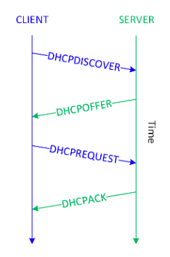
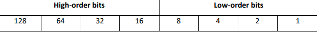
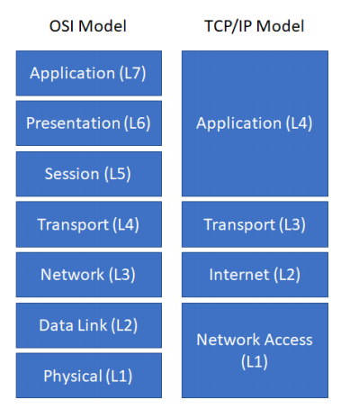
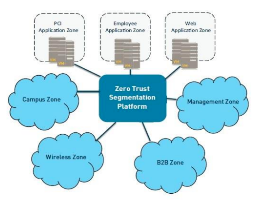
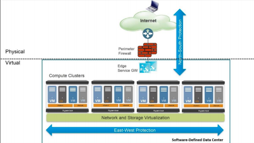
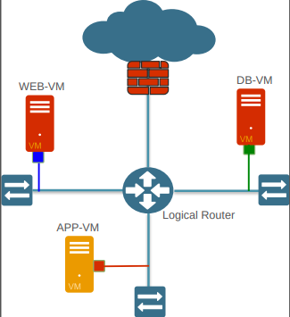

# Module 2 – Cybersecurity Gateway

### 2.1 The Connected Globe

With more than four billion internet users worldwide in 2018, which represents well over half the world’s population, the internet connects businesses, governments, and people across the globe.

##### 2.1.1 The NET: How things connect

In the 1960s, the U.S. Defense Advanced Research Project Agency (DARPA) created ARPANET, the precursor to the modern internet. ARPANET was the first packet switching network. A packet switching network breaks data into small blocks (packets), transmits each individual packet from node to node toward its destination, then reassembles the individual packets in the correct order at the destination.

##### 2.1.2 Introduction to networking devices

*Routers* are physical or virtual devices that send data packets to destination networks along a network path using logical addresses. Routers use various routing protocols to determine the best path to a destination, based on variables such as bandwidth, cost, delay, and distance.

An *AP* is a network device that connects to a router or wired network
and transmits a Wi-Fi signal so that wireless devices can connect to a wireless (or Wi-Fi) network. A *wireless repeater* rebroadcasts the wireless signal from a wireless router or AP to extend the range of a Wi-Fi network.

A *hub* (or *concentrator*) is a network device that connects multiple devices – such as desktop computers, laptop docking stations, and printers – on a local-area network (LAN). Network traffic that is sent to a hub is broadcast out of all ports on the hub, which can create network congestion and introduces potential security risks (broadcast data can be intercepted).

A *switch* is essentially an intelligent hub that uses physical addresses to forward data packets to devices on a network. Unlike a hub, a switch is designed to forward data packets only to the port that corresponds to the destination device.

> TL;DR
+ A *router* is a network device that sends data packets to a destination network along a network path.
+ A *wireless repeater* rebroadcasts the wireless signal from a wireless router or AP to extend the range of a Wi-Fi network.
+ A *hub* (or concentrator) is a device used to connect multiple networked devices on a local-area network (LAN).
+ A *switch* is an intelligent hub that forwards data packets only to the port associated with the destination device on a network.
+ A *virtual LAN (VLAN)* is a logical network that is created within a physical LAN.
+ A *broadcast domain* is the portion of a network that receives broadcast packets sent from a node in the domain.
+ A *collision domain* is a network segment on which data packets may collide with each other during transmission.

##### 2.1.3 Routed and routing protocols

Routed protocols, such as the *Internet Protocol (IP)*, address packets with routing information that enables those packets to be transported across networks using routing protocols.

Routing protocols are defined at the Network layer of the OSI model and specify how routers communicate with one another on a network. Routing protocols can either be *static* or *dynamic*.

A *static routing protocol* requires that routes be created and updated manually on a router or other network device. If a static route is down, traffic can’t be automatically rerouted unless an alternate route has been configured.

A *dynamic routing protocol* can automatically learn new (or alternate) routes and determine the best route to a destination. The routing table is updated periodically with current routing information. Dynamic routing protocols are further classified as:
+ **Distance-vector** - A distance-vector protocol makes routing decisions based on two factors: the distance (hop count or other metric) and vector (the egress router interface).
+ **Link-state** - A link-state protocol requires every router to calculate and maintain a complete map, or routing table, of the entire network. Routers that use a link-state protocol periodically transmit updates that contain information about adjacent connections, or link states, to all other routers in the network. Link-state protocols are compute-intensive, but they can calculate the most efficient route to a destination.
+ **Path-vector** - A path-vector protocol is similar to a distance-vector protocol, but without the scalability issues associated with limited hop counts in distance-vector protocols. Each routing table entry in a path-vector protocol contains path information that gets dynamically updated.

____________________
*Convergence*, the time required for all routers in a network to update their routing
tables with the most current information (such as link status changes), can be a
significant problem for distance-vector protocols.

*Routing Information Protocol (RIP)* is an example of a distance-vector routing protocol that uses hop count as its routing metric. To prevent routing loops, the following 4 mechanisms are also used:
+ **Split horizon** - Prevents a router from advertising a route back out through the same interface from which the route was learned.
+ **Triggered updates** - When a change is detected the update gets sent immediately instead of waiting 30 seconds to send a RIP update.
+ **Route poisoning** - Sets the hop count on a bad route to 16, which effectively advertises the route as unreachable.
+ **Holddown timers** -  Causes a router to start a timer when the router first receives information that a destination is unreachable. Subsequent updates about that destination will not be accepted until the timer expires.

*Open Shortest Path First (OSPF)* is an example of a link-state routing protocol that is often used in large enterprise networks. OSPF routes network traffic within a single autonomous system (AS).

*Border Gateway Protocol (BGP)* is an example of a path-vector protocol used between separate autonomous systems. BGP is the core protocol used by Internet Service Providers (ISPs), network service providers (NSPs), and on very large private IP networks.

##### 2.1.4 Area networks and topologies

Most computer networks are broadly classified as either *local-area networks (LANs)* or *widearea networks (WANs)*.

A ***local-area network (LAN)*** is a computer network that connects laptop and desktop computers, servers, printers, and other devices so that applications, databases, files and file storage, and other networked resources can be shared across a relatively small geographic area, such as a floor, a building, or a group of buildings.

> Additional:
+ A *bridge* is a wired or wireless network device that extends a network or joins separate network segments.
+ A *repeater* is a network device that boosts or re-transmits a signal to physically extend the range of a wired or wireless network.

Two basic network topologies (and many variations) are commonly used in LANs:
+ **Star** - . Each node on the network is directly connected to a switch, hub, or concentrator, and all data communications must pass through the switch, hub, or concentrator.
+ **Mesh** - All nodes are interconnected to provide multiple paths to all other resources

A *wide-area network (WAN)* is a computer network that connects multiple LANs or other WANs across a relatively large geographic area, such as a small city, a region or country, a global enterprise network, or the entire planet (for example, the internet).

A WAN connects networks using telecommunications circuits and technologies such as *broadband cable*, *digital subscriber line (DSL)*, *fiber optic*, *optical carrier*, and *T-carrier*, at various speeds typically ranging from 256Kbps to several hundred megabits per second.

The hierarchical internetworking model is a best practice network design, originally proposed by Cisco, that comprises three layers:
+ **Access** - User endpoints and servers connect to the network at this layer, typically via network switches
+ **Distribution** - This layer performs any compute-intensive routing and switching functions on the network such as complex routing, filtering, and *Quality of Service (QoS)*.
+ **Core** - This layer is responsible for high-speed routing and switching.

In addition to LANs and WANs, many other types of area networks are used for different purposes:
+ *Campus area networks (CANs)* and *wireless campus area networks (WCANs)* connect multiple buildings in a high-speed network.
+ *Metropolitan area networks (MANs)* and *wireless metropolitan area networks (WMANs)* extend networks across a relatively large area, such as a city.
+ *Personal area networks (PANs)* and *wireless personal area networks (WPANs)* connect an individual’s electronic devices – such as laptop computers, smartphones, tablets, IoT and others.
+ *Storage area networks (SANs)* connect servers to a separate physical storage device.
+ *Value-added networks (VANs)* are a type of extranet that allows businesses within an industry to share information or integrate shared business processes.
+ *Virtual local-area networks (VLANs)* segment broadcast domains in a LAN, typically into logical groups.
+ *Wireless local-area networks (WLANs)*, also known as Wi-Fi networks, use wireless access points (APs) to connect wireless-enabled devices to a wired LAN.
+ *Wireless wide-area networks (WWANs)* extend wireless network coverage over a large area, such as a region or country, typically using mobile cellular technology.

##### 2.1.5 Domain Name System (DNS)

+ *The Domain Name System (DNS)* is a hierarchical distributed database that maps the fully qualified domain name (FQDN) for computers, services, or any resource connected to the Internet or a private network to an IP address.
+ *A fully qualified domain name (FQDN)* is the complete domain name for a specific computer, service, or resource connected to the internet or a private network.
+ *A domain name registrar* is an organization that is accredited by a *top-level domain (TLD)* registry to manage domain name registrations.
+ *A root name server* is the *authoritative* name server for a DNS root zone.
+ *An Intranet* is a private network that provides information and resources.
+ *A recursive DNS query* is performed (if the DNS server allows recursive queries) when a DNS server is not authoritative for a destination domain. The nonauthoritative DNS server obtains the IP address of the authoritative DNS server for the destination domain and sends the original DNS request to that server to be resolved.
+ *Hypertext Transfer Protocol (HTTP)* is an application protocol used to transfer data between web servers and web browsers.
+ *Hypertext Transfer Protocol Secure (HTTPS)* is a secure version of HTTP that uses *Secure Sockets Layer (SSL)* or *Transport Layer Security (TLS)* encryption.

The basic DNS record types are:
+ **An (IPv4) or AAAA (IPv6)** (Address)
+ **CNAME** (Canonical Name)
+ **MX** (Mail Exchanger)
+ **PTR** (Pointer)
+ **SOA** (Start of Authority)
+ **NS** (Name Server)
+ **TXT** (Text)

### 2.2 Physical, Logical, and Virtual Addressing

Physical, logical, and virtual addressing in computer networks requires a basic understanding of **decimal (base10)**, **binary (base2)**, and **hexadecimal (base16)** numbering.

| Decimal   | Hexadecimal   | Binary   |
| :-------: | :-----------: | :------: |
|     0     |       0       |   0000   |
|     1     |       1       |   0001   |
|     2     |       2       |   0010   |
|     3     |       3       |   0011   |
|     4     |       4       |   0100   |
|     5     |       5       |   0101   |
|     6     |       6       |   0110   |
|     7     |       7       |   0111   |
|     8     |       8       |   1000   |
|    10     |       A       |   1010   |
|    11     |       B       |   1011   |
|    12     |       C       |   1100   |
|    13     |       D       |   1101   |
|    14     |       E       |   1110   |
|    15     |       F       |   1111   |
|    16     |      10       |  10000   |

+ The decimal (base10) numbering system is, of course, what we all are taught in school.
+ A binary (base2) numbering system comprises only two digits – 1 ("on") and 0 ("off"). Binary numbering is used in computers and networking because they use electrical transistors to count.
+ A hexadecimal (base16) numbering system comprises 16 digits (0 through 9, and A through F). Hexadecimal numbering is used because it is more convenient to represent a byte of data as 2 digits in hexadecimal, rather than 8 digits in binary.

The physical address of a network device, known as a *media access control (MAC)* address is used to forward traffic on a local network segment. It's a  unique 48-bit identifier assigned to the *network interface controller (NIC)* of a device. An example of a 48- bit MAC address is: ___00:40:96:9d:68:16___

The logical address of a network device, such as an IP address, is used to route traffic from one network to another. An IP address is a unique 32-bit (IPv4) or 128-bit (IPv6). If a device has multiple NICs, each NIC may be assigned a unique IP address or multiple NICs may be assigned a virtual IP address. An example
of an IPv4 address is: ___192.168.0.1___

An example of an IPv6 address is: ___2001:0db8:0000:0000:0008:0800:200c:417a___

The *Address Resolution Protocol (ARP)* translates a logical address, such as an IP address, to a physical MAC address. The *Reverse Address Resolution Protocol (RARP)* translates a physical MAC address to a logical address.

The *Dynamic Host Configuration Protocol (DHCP)* is a network management protocol used to dynamically assign IP addresses to devices that do not have a statically assigned IP address on a TCP/IP network. BOOTP is a similar network management protocol that is commonly used on UNIX and Linux TCP/IP networks.

+ When a network-connected device that does not have a statically assigned IP address is powered on, the DHCP client software on the device broadcasts a ___DHCPDISCOVER___ message on ***UDP port 67***.
+ When a DHCP server on the same subnet as the client receives the DHCPDISCOVER message, it reserves an IP address for the client and sends a ***DHCPOFFER*** message to the client on ***UDP port 68***. The DHCPOFFER message contains the ***MAC address of the client, the IP address that is being offered, the subnet mask, the lease duration,*** and ***the IP address of the DHCP server that made the offer***.
+ When the client receives the DHCPOFFER, it broadcasts a ***DHCPREQUEST*** message on ***UDP port 67***, requesting the IP address that was offered.  A client may receive DHCPOFFER messages from multiple DHCP servers on a subnet, but can only accept one offer.
+ When the correct DHCP server receives the DHCPREQUEST message, it sends a ***DHCPACK***.

***Network address translation (NAT)*** virtualizes IP addresses by mapping private, non-routable IP addresses that are assigned to internal network devices to public IP addresses when communication across the internet is required.

##### 2.2.1 IP addressing basics

Data packets are routed over a *Transmission Control Protocol/Internet Protocol (TCP/IP)* network using IP addressing information. IPv4, which is the most widely deployed version of IP.

+ The first four bits in a 32-bit IPv4 address octet are referred to as the *high-order bits*.
+ The last four bits in a 32-bit IPv4 address octet are referred to as the *low-order bits*.
+ The first bit in a 32-bit IPv4 address octet is referred to as the *most significant bit*.
+ The last bit in a 32-bit IPv4 address octet is referred to as the *least significant bit*.

Each octet contains an 8-bit number with a value of 0 to 255, e.g:

| Decimal  | Binary      |
| :------: | :---------: |
|   255    |  1111 1111  |
|   254    |  1111 1110  |
|   253    |  1111 1101  |
|   252    |  1111 1100  |
|   251    |  1111 1011  |
|   250    |  1111 1010  |
|   249    |  1111 1000  |
|   224    |  1110 0000  |

The five different IPv4 address classes:

| Class | Purpose                          | HO-Bits | Address Range | Max # of hosts |
| :---: | :------------------------------: | :-----: | :-----------: | :------------: |
| A     | Large networks                   | 0       | 1 to 126      | 16,777,214     |
| B     | Medium-sized networks            | 10      | 128 to 191    | 65,534         |
| C     | Small networks                   | 110     | 192 to 223    | 254            |
| D     | Multicast                        | 1110    | 224 to 239    | -------------- |
| E     | Experimental                     | 1111    | 240 to 254    | -------------- |

The address range ***127.0.0.1 to 127.255.255.255*** is a loopback network used for testing and troubleshooting. Packets sent to a loopback address – such as ***127.0.0.1*** – are immediately routed back to the source device.

A *subnet mask* is a number that hides the network portion of an IPv4 address, leaving only the host portion of the IP address. The network portion of a subnet mask is represented by contiguous **on, or 1** bits beginning with the most significant bit.

The default (or standard) subnet masks for Class A, B, and C networks are:
+ Class A: 255.0.0.0
+ Class B: 255.255.0.0
+ Class C: 255.255.255.0

Several IPv4 address ranges are reserved for use in private networks and are not routable on the internet, including:
+ 10.0.0.0–10.255.255.255 (Class A)
+ 172.16.0.0–172.31.255.255 (Class B)
+ 192.168.0.0–192.168.255.255 (Class C)

As of 2018, the pool of available IPv4 addresses that can be assigned to organizations has officially been depleted. IPv6
addresses, which use a 128-bit hexadecimal address space providing about 3.4 x 1038 unique IP addresses, was created to replace IPv4 when the IPv4 address space was exhausted.

*IPv6 addresses consist of 32 hexadecimal numbers grouped into eight hextets of four hexadecimal digits, separated by a colon (:). Each IPv6 address consists of 128 bits.*

An IPv6 address is further divided into two 64-bit segments: The first 64 bits represent the network part of the address, and the last 64 bits represent the node or interface part of the address.

The network part is further subdivided into a 48-bit global network address and a 16-bit subnet. The node or interface part of the address is based on the MAC address of the node or interface.

The IETF has defined several rules to simplify an IPv6 address.
Taking an IPv6 address (such as *2001:0db8:0000:0000:0008:0800:200c:417a*), we can simplify it as:
+ *Leading zeroes in an individual hextet* can be omitted, but each hextet must have at least one hexadecimal digit, except as noted in the next rule. (Applying this rule to the previous example yields this result: **2001:db8:0:0:8:800:200c:417a**.)
+ *Two colons (::)* can be used to represent one or more groups of 16 bits of zeros, and leading or trailing zeroes in an address; the :: can appear only once in an IPv6 address. (Applying this rule to the previous example yields this result: **2001:db8::8:800:200c:417a**.)
+ In *mixed IPv4 and IPv6 environments*, the form `x:x:x:x:x;x:d.d.d.d` can be used, in which ***x*** represents the six high-order 16-bit hextets of the address and ***d*** represents the four low-order 8-bit octets (in standard IPv4 notation) of the address. (For example, *0db8:0:0:0:0:FFFF:129.144.52.38* is a valid IPv6 address. Application of the previous two rules to this example yields this result: **db8::ffff:129.144.52.38**.)

##### 2.2.2 Introduction to subnetting

*Subnetting* is a technique used to divide a large network into smaller, multiple subnetworks by segmenting an IP address into two parts: the network and the host.

For a Class C IPv4 address, there are _254_ possible node (or host) addresses (28 - 2: one reserved for the base network address and another for the broadcast address). A typical Class C network uses a default 24-bit subnet mask (*255.255.255.0* or */24*). For a Class C IPv4 address with the default subnet mask, the last octet is where the node-specific values of the IPv4 address are assigned.

Unlike subnetting, which divides an IPv4 address along an arbitrary (default) classful 8-bit boundary (8 bits for a Class A network, 16 bits for a Class B network, 24 bits for a Class C network), *classless inter-domain routing (CIDR)* allocates address space on boundary. For example, using CIDR, a Class A network could be assigned a 24-bit mask  (255.255.255.0, instead of the default 8-bit 255.0.0.0 mask) to limit the subnet to only 254 addresses, or a 23-bit mask (255.255.254.0) to limit the subnet to 512 addresses.

255.255.255.0 - CIDR notation
/24 - *netbit*

### 2.3 Packet Encapsulation and Lifecycle

+ In a *circuit-switched network*, a dedicated physical circuit path is established, maintained, and terminated between the sender and receiver across a network for each communications session.
+ In a *packet-switched network*, devices share bandwidth on communications links to transport packets between a sender and receiver across a network.

1. An application that needs to send data across the network, for example, from a server to a client computer first creates a block of data and sends it to the TCP stack on the server.
1. The TCP stack places the block of data into an output buffer on the server and determines the *Maximum Segment Size (MSS)* of individual TCP blocks permitted by the server OS.
1. The TCP stack then divides the data blocks into appropriately sized segments, adds a TCP header, and sends the segment to the IP stack on the server.
1. The IP stack adds source (sender) and destination (receiver) IP addresses to the TCP segment and notifies the server operating system that it has an outgoing message that is ready to be sent across the network.
1. When the server operating system is ready, the IP packet is sent to the NIC, which converts the IP packet to bits and sends the message across the network.

##### 2.3.1 The OSI and TCP/IP models

The *Open Systems Interconnection (OSI)* and *Transmission Control Protocol/Internet Protocol (TCP/IP)* models define standard protocols for network communication and interoperability. The OSI and TCP/IP models:
+ Clarify the general functions of communications processes
+ Reduce complex networking processes into simpler sublayers and components
+ Promote interoperability through standard interfaces
+ Enable vendors to change individual features at a single layer rather than rebuilding the entire protocol stack
+ Facilitate logical troubleshooting

OSI model consists of 7 layers (& protocols that function on those layers):
+ **Application (L7)** -  establishes availability of communication partners, determines resource availability, and synchronizes communication
  - **File Transfer Protocol (FTP)**
  - **HyperText Transfer Protocol (HTTP)**
  - **HyperText Transfer Protocol Secure (HTTPS)**
  - **HyperText Transfer Protocol (HTTP)**
  - **Internet Message Access Protocol (IMAP).**
  - **Post Office Protocol Version 3 (POP3).**
  - **Simple Mail Transfer Protocol (SMTP)**
  - **Simple Network Management Protocol (SNMP).**
  - **Telnet**
+ **Presentation (L6)** - provides coding and conversion functions  to ensure that data sent from L7 of one system is compatible with L7 of the receiving system
  - **American Standard Code for Information Interchange (ASCII)**
  - **Extended Binary-Coded Decimal Interchange Code (EBCDIC)**
  - **Graphics Interchange Format (GIF)**
  - **Joint Photographic Experts Group (JPEG)**
  - **Motion Picture Experts Group (MPEG)**
+ **Session (L5)** - manages communication sessions between networked systems, including connection establishment, data transfer, and connection release
  - **Network File System (NFS)**
  - **Remote Procedure Call (RPC)**
  - **Secure Shell (SSH)**
  - **Session Initiation Protocol (SIP)**
+ **Transport (L4)** - provides transparent, reliable data transport and end-to-end transmission control
  - **Flow control**
  - **Multiplexing**
  - **Virtual circuit management**
  - **Error checking and recovery**
  - **TCP and UDP port numbers assigned to applications and services are defined**
  - **Stream Control Transmission Protocol (SCTP)**
+ **Network (L3)** -  provides routing and related functions that enable data to be transported between systems on the same network or on interconnected networks
+ **Data Link (L2)** - ensures that messages are delivered to the proper device across a physical network link; also defines the networking protocol used to send and receive data between individual devices
  - **Logical Link Control (LLC)**
  - **Media access control (MAC)**
+ **Physical (L1)** - sends and receives bits across the network medium (cabling or wireless links) from one device to another

The TCP/IP model consists of 4 layers:
+ **Application (L4)** -  consists of network applications and processes, and it loosely corresponds to Layers 5 through 7 of the OSI model
+ **Transport (L3)** - provides end-to-end delivery and it corresponds to Layer 4 of the OSI model
+ **Internet (L2)** -  defines the IP datagram and routing, and it corresponds to Layer 3 of the OSI model
+ **Network Access (L1)** - contains routines for accessing physical networks and it corresponds to Layers 1 and 2 of the OSI model

##### 2.3.2 Data encapsulation

*Data encapsulation (or data hiding)* wraps protocol information from the (OSI or TCP/IP) layer immediately above in the data section of the layer below.

### 2.4 Network Security Models

##### 2.4.1 Perimeter-based network security strategy

Perimeter-based network security models date back to the early mainframe era when large mainframe computers were located in physically secure "machine rooms" that could be accessed by only a relatively limited number of remote job entry (RJE) "dumb" terminals that were directly connected to the mainframe and also located in physically secure areas.

Today, perimeter-based physical security is no longer sufficient for several obvious, but important reasons:
+ Mainframe computers predate the both the Internet and ARPANET
+ Data centers today are remotely accessed by millions of remote endpoint devices from anywhere and at any time.
+ The primary value of the mainframe computer was its processing power. Today, data is the target.

The primary issue with a perimeter-based network security strategy  is that it relies on the assumption that everything on the internal network can be trusted. However, this assumption is no longer safe to make, because:
+ Remote employees, mobile users, and cloud computing solutions blur the distinction between "internal" and "external"
+ Wireless technologies, the proliferation of partner connections, and the need to support guest users introduce countless additional pathways into the network branch offices that may be located in untrusted countries or regions.
+ Insiders may present a very real security threat.

Perimeter-based approach strategies fail to account for:
+ The potential for sophisticated cyberthreats to penetrate perimeter defenses
+ Scenarios where malicious users can gain access to the internal network and sensitive resources by using the stolen credentials of trusted users
+ Users' data in internal networks has varying levels of trust/sensitivity.

Another contributing factor is that traditional security devices and technologies commonly used to build network perimeters let too much traffic through. Typical shortcomings include the inability to:
+ Definitively distinguish good applications from bad ones
+ Adequately account for encrypted application traffic
+ Accurately identify and control users
+ Filter allowed traffic not only for known application-borne threats but also for unknown ones

##### 2.4.2 Zero Trust security

Zero Trust security model addresses some of the limitations of perimeter-based network security strategies by removing the assumption of trust from the equation. Verification that authorized entities are always doing only what they’re allowed to do also is no longer optional in a Zero Trust model; __it’s now mandatory__.

The implications for these two changes are, respectively:
+ The need to establish trust boundaries that effectively compartmentalize different segments of the internal computing environment.
+ The need for trust boundaries to do more than just initial authorization and access control enforcement. To “always verify” also requires ongoing monitoring and inspection of associated communications traffic for subversive activities.

Benefits of implementing a Zero Trust network include:
+ Clearly improved effectiveness in mitigating data loss with visibility and safe enablement of applications, and detection and prevention of cyberthreats
+ Greater efficiency for achieving and maintaining compliance with security and privacy mandates, using trust boundaries to segment sensitive applications, systems, and data
+ Improved ability to securely enable transformative IT initiatives, such as user mobility, BYOD/BYOA, infrastructure virtualization, and cloud computing
+ Lower total cost of ownership (TCO) with a consolidated and fully integrated security operating platform, rather than a disparate array of siloed, purpose-built security point products.

***2.4.2.1 Core Zero Trust design principles***

The core Zero Trust principles include:
+ **Ensure that all resources are accessed securely, regardless of location.**
+ **Adopt a least privilege strategy and strictly enforce access control**
+ **Inspect and log all traffic**

***2.4.2.2 Zero Trust conceptual architecture***

The main components of a Zero Trust conceptual architecture include:
+ **Zero Trust Segmentation Platform** - provides the majority of the security functionality needed to deliver on the Zero Trust operational objectives, as are:
  - *Enable secure network access*
  - *Granularly control traffic flow to and from resources*
  - *Continuously monitor allowed sessions for any threat activity*

+ **Trust zones** - distinct pockets of infrastructure where the member resources not only operate at the same trust level but also share similar functionality
+ **Management infrastructure** - centralized management capabilities crucial to enabling efficient administration and ongoing monitoring, particularly for implementations involving multiple distributed Zero Trust Segmentation Platforms

***2.4.2.3 Key Zero Trust criteria and capabilities***

Key criteria and capabilities to consider when selecting a Zero Trust Segmentation Platform, include:
+ **Secure access**
+ **Inspection of all traffic**
+ **Least privileges access control**
+ **Cyberthreat protection**
+ **Coverage for all security domains**

***2.4.2.4 Implementing a Zero Trust design***

A Zero Trust design architecture can be implemented in a way that requires only incremental modifications to the existing network and is completely transparent to your users.

Once you have a detailed understanding of the network traffic flows in the environment, the next step is to define trust zones and incrementally establish corresponding trust boundaries based on relative risk and/or sensitivity of the data involved:
+ Deploy devices in appropriate locations to establish internal trust boundaries for defined trust zones
+ Configure the appropriate enforcement and inspection policies to effectively put each trust boundary online

Examples where secure trust zones can be established are:
+ IT management systems and networks
+ Partner resources and connections
+ High-profile, customer-facing resources and connections
+ Branch offices in risky countries or regions, followed by all other branch offices
+ Guest access networks
+ Campus networks

### 2.5 Cloud and Data Center Security

Data centers are rapidly evolving from a traditional, closed environment with static, hardwarebased computing resources to one in which traditional and cloud computing technologies are mixed.

The benefit of moving toward a cloud computing model – private, public, or hybrid – is that it:
+ **Optimizes existing hardware resources**
+ **Reduces data center costs**
+ **Increases operational flexibility**
+ **Maximizes efficiency of data center resources**

##### 2.5.1 Cloud computing depends on virtualization

Cloud computing is not a location, but rather a pool of resources that can be rapidly provisioned in an automated, on-demand manner.

The value of cloud computing is the ability to pool resources to achieve economies of scale and agility.

The move toward cloud computing not only brings cost and operational benefits but also technology benefits; Data and applications are easily accessed by users no matter where they reside, projects can scale easily, and consumption can be tracked effectively.

##### 2.5.2 Cloud computing security considerations and requirements

With the use of cloud computing technologies, your data center environment can evolve from a fixed environment toward an environment that is dynamic and automated.

Many of the principles that make cloud computing attractive are counter to network security best practices:
+ **Cloud computing doesn’t mitigate existing network security risks**
+ **Security requires isolation and segmentation; the cloud relies on shared resources**
+ **Security deployments are process-oriented; cloud computing environments are dynamic.**
+ **Multi-tenancy is a key characteristic of the public cloud – and a key risk**

Key requirements for securing the cloud include:
+ **Consistent security in physical and virtualized form factors**
+ **Segment your business applications using Zero Trust principles**
+ **Centrally manage security deployments; streamline policy updates**

##### 2.5.3 Traditional data security solution weaknesses

Traditional data center security solutions make their initial positive control network access decisions based on port  using stateful inspection, then they make a series of sequential, negative control decisions using bolted-on feature sets. There are several
problems with this approach:
+ **"Ports first" limits visibility and control.**
+ **They lack any concept of unknown traffic**
+ **Multiple policies, no policy reconciliation tools**
+ **Cumbersome security policy update process**

##### 2.5.4 East-west traffic protection

In a virtualized data center, there are two different types of traffic, each of which is secured in a different manner:
+ **North-South** - refers to data packets that move in and out of the virtualized environment from the host network or a corresponding traditional data center; it's secured by one or more physical form factor perimeter edge firewalls
+ **East-West** - t refers to data packets moving between virtual workloads entirely within the private cloud; it's protected by a local, virtualized firewall instantiated on each hypervisor.

The compute cluster is the building block for hosting the application infrastructure and provides the necessary resources in terms of compute, storage, networking, and security. Organizations usually implement security to protect traffic flowing north-south, but this approach is insufficient for protecting east-west traffic within a private cloud.

One common practice in a private cloud is to isolate VMs into different tiers. Isolation provides clear delineation of application functions and allows a security team to easily implement security policies.

An attacker has multiple options to steal data from the DB-VM:
+ SQL injection that targets an application vulnerability
+ compromise the WEB-VM using vulnerability exploits and move laterally to retrieve the SQL admin password

Once the DB-VM is compromised, the attacker can hide sensitive data extraction using techniques such as DNS tunneling, or by moving data across the network with NetBIOS, and then off the network via FTP. In fact, they can do anything they want, and there's no telling, what might come to his mind.

East-west protection provides the following benefits:
+ Authorizes only allowed applications to flow inside the data center, between VMs
+ Reduces lateral threat movement when a front-end workload has been compromised
+ Stops known and unknown threats that are sourced internally within the data center.
+ Protects against data theft by leveraging data and file filtering capability and blocking anti-spyware communications to the external world

##### 2.5.5 Implementing security in virtualized data centers

This approach consists of four phases:
+ **Consolidating servers within trust levels**
+ **Consolidating servers across trust levels**
+ **Selective network security virtualization**
+ **Dynamic computing fabric**

### 2.6 Network Security Technologies

##### 2.6.1 Firewalls

Firewall is a hardware and/or software platform that controls the flow of traffic between a trusted network and an untrusted network.

***2.6.1.1 Packet filtering firewalls***

First-generation *packet filtering* firewalls have the following characteristics:
+ Operate up to L4 of the OSI model and inspect individual packet headers to determine source and destination IP address, protocol, and port number.
+ Match source and destination IP address, protocol, and port number information contained within each packet header to a corresponding rule on the firewall that designates whether the packet should be allowed, blocked, or dropped
+ Inspect and handle each packet individually, with no information about context or session

***2.6.1.2 Stateful packet inspection (SPI) firewalls***
Second-generation *stateful packet inspection* firewalls have the following characteristics:
+ Operate up to L4 of the OSI model and maintain state information about the different communication sessions that have been established between hosts on the trusted and untrusted networks
+ Inspect individual packet headers to determine source and destination IP address, protocol, and port number, during session establishment only, to determine if the session should be allowed, blocked, or dropped based on configured firewall rules
+ Once a permitted connection is established between two hosts, the firewall creates and deletes firewall rules for individual connections, as needed, thus effectively creating a tunnel that allows traffic to flow between the two hosts without further inspection of individual packets during the session.
+ This type of firewall is very fast, but it is port-based and is highly dependent on the trustworthiness of the two hosts because individual packets aren’t inspected after the connection is established.

***2.6.1.3 Application firewalls***
Third-generation *application* firewalls have the following characteristics:
+ Operate up to L7 of the OSI model and control access to specific applications and services on the network
+ Proxy network traffic rather than permit direct communication between hosts.
+ Inspect Application layer traffic and thus can identify and block specified content, malware, exploits, websites, and applications or services using hiding techniques such as encryption and non-standard ports

##### 2.6.2 Intrusion detection and prevention systems

Unlike traditional packet filtering and stateful packet inspection firewalls that examine only packet header information, IDS/IPS examines both the packet header and payload of network traffic. An IDS/IPS is typically deployed to detect and block exploits of software vulnerabilities on target networks.

The primary difference between IDS and IPS is that IDS is considered to be a *passive* system, whereas IPS is an *active* system.

However, IPS has some disadvantages, including:
+ Must be placed inline along a network boundary and is thus directly susceptible to attack itself.
+ False alarms must be properly identified and filtered to avoid inadvertently blocking authorized users and applications.
+ May be used to deploy a DoS attack by flooding the IPS, thus causing it to block connections until no connection or bandwidth is available.

IDS and IPS can also be classified as knowledge-based (or signature-based) or behavior-based systems:
+ A knowledge-based system uses a database of known vulnerabilities and attack profiles to identify intrusion attempts.
+ A behavior-based system uses a baseline of normal network activity to identify unusual patterns or levels of network activity that may be indicative of an intrusion attempt.

##### 2.6.3 Web content filters

Web content filters are used to restrict the internet activity of users on a network. Web content filters match a URL against a database of websites, typically maintained by security vendors that sell the web content filters. Typical website categories include:
+ Gambling and online gaming
+ Hacking
+ Hate crimes and violence
+ Pornographic
+ Social media
+ Web-based email

These sites lower individual productivity but also may be prime targets for malware that users may unwittingly become victims of, via drive-by-downloads.

Organizations may elect to implement these solutions in a variety of modes to either block content, warn users before they access restricted sites, or log all activity.

##### 2.6.4 Virtual private networks

A virtual private network (VPN) creates a secure, encrypted connection (or tunnel) across the internet back to an organization’s network.

***2.6.4.1 Point-to-point tunneling protocol***

*PPTP* is a basic VPN protocol that uses TCP port 1723 to establish communication with the VPN peer, and then creates a Generic Routing Encapsulation (GRE) tunnel that transports encapsulated point-to-point protocol (PPP) packets between the VPN peers.

It is commonly used with either the *Password Authentication Protocol (PAP)*, *Challenge-Handshake Authentication Protocol (CHAP)*, or *Microsoft Challenge-Handshake Authentication Protocol versions 1 and 2 (MS-CHAP v1/v2)*, all of which have well-known security vulnerabilities, to authenticate tunneled PPP traffic.

***2.6.4.2 Layer 2 tunneling protocol***

*L2TP* is supported by most operating systems (including mobile devices). Although it provides no encryption by itself, it is considered secure when used together with `IPsec`.

***2.6.4.3 Secure socket tunneling protocol***

*SSTP* is a VPN tunnel created by Microsoft to transport PPP or L2TP traffic through an SSL 3.0 channel. SSTP is primarily used for secure remote client VPN access, rather than for site-to-site VPN tunnels.

***2.6.4.4 Microsoft Point-to-Point Encryption***

*MPPE* encrypts data in PPP-based dial-up connections or PPTP VPN connections. MPPE uses the RSA RC4 encryption algorithm to provide data confidentiality and supports 40-bit and 128-bit session keys.

***2.6.4.5 OpenVPN***

*OVPN*  is a highly secure, open source VPN implementation that uses SSL/TLS encryption for key exchange. OpenVPN uses up to 256-bit encryption and can run over TCP or UDP.

***2.6.4.6 Internet Protocol Security***

*IPsec* is a secure communications protocol that authenticates and encrypts IP packets in a communication session. An IPsec VPN requires compatible VPN client software to be installed on the endpoint device.

A *security association* (SA) in IPsec defines how two or more entities will securely communicate over the network using IPsec. A single *Internet Key Exchange* (IKE) SA is established between communicating entities to initiate the IPsec VPN tunnel. Separate IPsec SAs are then established for each communication direction in a VPN session.

An IPsec VPN can be configured to force all of the user’s internet traffic back through an organization’s firewall, thus providing optimal protection with enterprise-grade security, but with some performance loss.

***2.6.4.7 Secure Sockets Layer (SSL)***

*SSL* is an asymmetric encryption protocol used to secure communication sessions. SSL has been superseded by *Transport Layer Security (TLS)*, although SSL is still the more commonly used terminology.

##### 2.6.5 Data loss prevention

Network *data loss prevention (DLP)* solutions inspect data that is leaving or egressing a network and prevent certain sensitive data – based on defined policies – from leaving the network. Sensitive data may include:
+ Personally Identifiable Information (PII) such as names, addresses, birthdates, Social Security numbers, health records and financial data
+ Classified materials
+ Intellectual property, trade secrets, and other confidential or proprietary company information

A robust DLP solution can detect the presence of certain data patterns even if the data is encrypted. However, these solutions introduce a potential new vulnerability in the network because they have visibility into – and the ability to decrypt – all data on the network.

DLP solutions often require many moving parts to effectively route traffic to and from inspection engines, which can add to the complexity of troubleshooting network issues.

##### 2.6.6 Unified Threat Management

*Unified Threat Management (UTM)* devices combine numerous security functions into a single appliance, including:
+ Anti-malware
+ Anti-spam
+ Content filtering
+ DLP
+ Firewall (stateful inspection)
+ IDS/IPS
+ VPN

Typical disadvantages of UTM include:
+ In some cases, they lack the rich feature sets to make them more affordable.
+ All security functions use the same processor and memory resources. Enabling all UTM functions can result in up to a 97 percent drop in throughput and performance, as compared to top-end throughput without security features enabled.
+ The individual engines operate in silos with little or no integration or cooperation between them.

##### 2.6.7 Security information and event management

*Security information and event management (SIEM)* software tools and managed services provide real-time monitoring, event correlation, analysis, and notification of security alerts generated by various network devices and applications.

### 2.7 Endpoint security

Traditional endpoint security encompasses numerous security tools, such as anti-malware software, anti-spyware software, personal firewalls, Host-Based Intrusion Prevention Systems (HIPS), and mobile device management (MDM) software. There are no best practices.

##### 2.7.1 Anti-malware

Malware prevention – more specifically, antivirus software – has been one of the first and most basic tenets of information security since the early 1980s.

Traditional anti-malware software uses various approaches to detect and respond to malware threats, including signature-based, container-based, application whitelisting, and anomaly-based techniques.

***2.7.1.1 Signature-based***

This approach requires security vendors to continuously collect malware samples, create matching signature files for those samples, and distribute those signature files as updates for their endpoint security products to all of their customers.

Deployment of signature-based antivirus software requires installing an engine that typically has kernel-level access to an endpoint’s system resources.

If a known malware signature is detected, the software performs a predefined action, such as:
+ Quarantine. Isolates the infected file so that it cannot infect the endpoint or other files
+ Delete. Removes the infected file
+ Alert. Notifies the user (and/or system administrator) that malware has been detected

Updated signatures must be regularly and frequently downloaded from the security vendor and installed on the organization’s endpoints. This process means that some users and networks will be successfully breached by new malware until a new detection signature is created, downloaded, and installed. Additionally, downloading and processing signature files in this manner can cause noticeable performance degradations on the networks and endpoints on which they are running.

***2.7.1.2 Container-based***

Container-based endpoint protection wraps a protective virtual barrier around vulnerable processes while they’re running. If a process is malicious, the container detects it and shuts it down, preventing it from damaging other legitimate processes or files on the endpoint. However, the container-based approach typically requires a significant amount of computing resource overhead, and attacks have been demonstrated that circumvent or disable container-based protection.

***2.7.1.3 Application whitelisting***

Application whitelisting is another endpoint protection technique that is commonly used to prevent end users from running unauthorized applications – including malware – on their endpoints.

This approach is based on the premise that if you create a list of applications that are specifically allowed and then prevent any other file from executing, you can protect the endpoint. Although this basic functionality can be useful to reduce the attack surface, it is not a comprehensive approach to endpoint security.

Modern trends make application whitelisting extremely difficult to enforce in the enterprise. Also, once an application is whitelisted, it is permitted to run – even if the application has a vulnerability that can be exploited.

***2.7.1.4 Anomaly detection***

Endpoint security approaches that use mathematical algorithms to detect unusual activity on an endpoint are known as heuristics-based, behavior-based, or anomaly-detection solutions. This approach relies on first establishing an accurate baseline of what is considered "normal" activity.

##### 2.7.2 Anti-spyware

Anti-spyware software is very similar to traditional antivirus software because it uses signatures to look for other forms of malware beyond viruses, such as adware, malicious web application components, and other malicious tools, which share user behaviors without their permission.

##### 2.7.3 Personal firewalls

Network firewalls protect an enterprise network against threats from an external network, such as the internet. However, most traditional port-based network firewalls do little to protect endpoints inside the enterprise network from threats that originate from within.

Personal firewalls typically operate as Layer 7 (Application layer) firewalls that allow or block traffic based on an individual (or group) security policy.

A personal firewall only protects the endpoint device that it is installed on, but provides an extra layer of protection inside the network.

***2.7.4 Host-based Intrusion Prevention Systems (HIPS)***

HIPS can be either signature-based or anomaly-based, and is therefore susceptible to the same issues as other signature and anomaly-based endpoint protection approaches. HIPS software often causes significant performance degradation on endpoints.

***2.7.5 Mobile device management***

Mobile device management (MDM) software provides endpoint security for mobile devices such as smartphones and tablets.

Centralized management capabilities for mobile devices
provided by MDM include:
+ *Data loss prevention (DLP)*: Restrict what type of data can be stored on or transmitted from the device
+ *Policy enforcement*: Require passcodes, enable encryption, lockdown security settings, and prevent jailbreaking or rooting
+ *Malware protection*: Detect and prevent mobile malware
+ *Software distribution*: Remotely install software, including patches and updates over a cellular or Wi-Fi network
+ *Remote erase/wipe*: Securely and remotely delete the complete contents of a lost or stolen device.
+ *Geo-fencing and location services*: Restrict specific functionality in the device based on its physical location

### 2.8 Cloud, Virtualization, and Storage Security

Cloud computing and virtualization are two important modern computing trends. As data continues to grow exponentially, local and remote storage capacity has become an ever-present challenge, and organizations are increasingly relying on cloud-based storage service offerings.

##### 2.8.1 Cloud computing

NIST defines three distinct cloud computing service models:

+ **Software as a service (SaaS)** - Customers are provided access to an application running on a cloud infrastructure. The application is accessible from various client devices and interfaces, but the customer has no knowledge of, and does not manage or control, the underlying cloud infrastructure. Security of the customer data is still the responsibility of the customer.
+ **Platform as a service (PaaS)** - Customers can deploy supported applications onto the provider’s cloud infrastructure, but the customer has no knowledge of, and does not manage or control, the underlying cloud infrastructure. The company owns the deployed applications and data, and it is therefore responsible for the security of those applications and data.
+ **Infrastructure as a service (IaaS)** - ). Customers can provision processing, storage, networks, and other computing resources and deploy and run operating systems and applications.

NIST also defines these four cloud computing deployment models:
+ **Public** - A cloud infrastructure that is open to use by the general public.
**Community** - A cloud infrastructure that is used exclusively by a specific group of organizations.
+ **Private** A cloud infrastructure that is used exclusively by a single organization.
+ **Hybrid** - A cloud infrastructure that comprise two or more of the aforementioned deployment models, bound by standardized or proprietary technology that enables data and application portability.

##### 2.8.2 Virtualization

Virtualization technology emulates real — or physical — computing resources, such as servers, storage, networking, and applications.

A *hypervisor* allows multiple, virtual operating systems to run concurrently on a single physical host computer. The hypervisor functions between the computer operating system and
the hardware kernel.

There are two types of hypervisors:
+ **Type 1** *(native or bare metal)* - runs directly on the host computer’s hardware
+ **Type 2** *(hosted)* - runs within an operating system environment

Virtualization is a key technology used in data centers and cloud computing to optimize resources.

Important security considerations associated with virtualization include:
+ **Dormant virtual machines (VMs)** - In many data center and cloud environments, inactive VMs are shut down when they are not in use. VMs that are shut down may miss security patches.
+ **Hypervisor vulnerabilities** - The hypervisor itself may be vulnerable, which can expose hosted resources to attack.
+ **Intra-VM communications** - Network traffic between virtual hosts, particularly on a single physical server, may not traverse a physical switch. This lack of visibility increases troubleshooting complexity and can increase security risks.
+ **VM sprawl** - Virtual environments can grow quickly, leading to a breakdown in change management processes and exacerbating security issues such as dormant VMs, hypervisor vulnerabilities, and intra-VM communications.

##### 2.8.3 Local and remote storage

Three basic storage technologies commonly are used in local and remote storage:
+ **Block** - Devices access block-based storage through various interfaces. Before you can use block-based storage, you must create a volume, install an operating system, and mount (or attach to) the storage device.
+ **File** - File-based storage systems typically run their own OS and manage access control and permissions using inodes. File-based storage systems are accessed using protocols such as Common Internet File System (CIFS), Network File System (NFS), and Server Message Block (SMB). File-based storage typically requires mapping a drive letter or network path to the storage device.
+ **Object** - Object-based storage systems use variable-sized data containers, which are organized into a flat address space rather than a hierarchical file system. Users typically access object-based storage using a web browser or an application that uses an HTTP interface to interact with the storage device (JSON APIs).

### 2.9 Networking Concepts

##### 2.9.1 Server and system administration

Server and system administrators perform a variety of important tasks in a network environment. Typical server and system administration tasks include:
+ Account provisioning and de-provisioning
+ Managing account permissions
+ Installing and maintaining server software
+ Maintaining and optimizing servers, applications, databases, and network devices and security devices
+ Installing security patches
+ Managing system and data backup and recovery
+ Monitoring network communication and server logs
+ Troubleshooting and resolving server and system issues

***2.9.1.1 Patch management***

New software vulnerabilities and exploits are discovered each year, requiring diligent software patch management by system and security administrators in every organization. However, patch management only protects an organization’s endpoints after a vulnerability has been discovered and the patch installed.
Configuration management is the formal process used by organizations to define and maintain
standard configurations for applications, devices, and systems throughout their lifecycle.
***2.9.1.2 Configuration management***

Configuration management is the formal process used by organizations to define and maintain standard configurations for applications, devices, and systems throughout their lifecycConfiguration management is the formal process used by organizations to define and maintain standard configurations for applications, devices, and systems throughout their lifecycle.

##### 2.9.2 Directory services

A directory service is a database that contains information about users, resources, and services in a network.

Directory services include:
+ **Active Directory** - A centralized directory service for Windows that provides authentication and authorization of users and network resources.
+ **lightweight directory access protocol (LDAP)** - An IP-based client-server protocol that provides access and manages directory information in TCP/IP networks.

##### 2.9.3 Structured host and network troubleshooting

> The troubleshooting process performed by a network administrator to resolve network problems quickly and efficiently is a highly sought skill in IT.

Two of the most important troubleshooting tasks a network administrator performs occur long before a network problem occurs: baselining and documenting the network.

A **baseline** provides quantifiable metrics that are periodically measured with various *network performance monitoring tools, protocol analyzers, and packet sniffers*. Important metrics might include *application response times, server memory and processor utilization, average and peak network throughput, and storage input/output operations per second*.

**Network documentation** should include *logical and physical diagrams, application data flows, change management logs, user and administration manuals, and warranty and support information*.

Generally speaking, troubleshooting consists of these steps:
1. **Discover the problem**
1. **Evaluate system configuration against the baseline**
1. **Track possible solutions**
1. **Execute a plan**
1. **Check results**
1. **Verify solution** (If unsuccessful, go back to Step 2; if successful, proceed to Step 7)
1. **Deploy positive solution**

Problems with local hosts are typically much easier to assess and remedy than problems that affect a network segment or service.

OSI logical troubleshooting model:
1. **L1** - Before you begin inspecting service architectures, you should start with the basics: confirm physical connectivity.
1. **L2** - Verify data link architectures (& different compatibilities); look for interference (firewalls, accidentally reset routers, etc.)
1. **L3** - Proper network names and addresses: devices may have improperly assigned IP addresses that are causing routing issues or IP address conflicts on the network; DNS issues (`ping`, `traceroute | tracert`)
1. **L4** - latency and network congestion (extend time-to-live values, or *TTLs* during peak network traffic hours);
1. **L5** - expired session tokens; failover communications or ”handshake” negotiations - sessions may have to be restarted
1. **L6** -  related to changes in encryption keys or updates to service architectures that are not supported by different devices
1. **L7** - many apps conflict with other apps; caching or corrupted files; require persistent connections to updater services -  uninstalling and reinstalling, or updating to a newer version

Other troubleshooting steps may include *searching log files for anomalies and significant events, verifying that certificates or proper authentication protocols are installed and available, verifying encryption settings, clearing application caches, updating applications, and, for endpoints, removing and reinstalling an application*.

##### 2.9.4 ITIL fundamentals
ITIL (formerly known as the Information Technology Infrastructure Library) is a five-volume set of IT service management best practices:
+ **Service Strategy** - Addresses IT services strategy management, service portfolio management, IT services financial management, demand management, and business relationship management
+ **Service Design** - Addresses design coordination, service catalog management, service level management, availability management, capacity management, IT service continuity management, information security management system, and supplier management
+ **Service Transition** - Addresses transition planning and support, change management, service asset and configuration management, release and deployment management, service validation and testing, change evaluation, and knowledge management Service Operation. Addresses event management, incident management, service request fulfillment, problem management, and access management
+ **Continual Service Improvement** - Defines a seven-step process for improvement initiatives, including identifying the strategy, defining what will be measured, gathering the data, processing the data, analyzing the information and data, presenting and using the information, and implementing the improvement

##### 2.9.5 Help desk and technical support

The help desk is the IT department’s liaison to an organization’s users.

Help desks are commonly organized in multiple tiers, for example, User Support (tier 1), Desktop Support (tier 2), Network Support (tier 3). User issues that cannot be resolved at tier 1 are escalated to the appropriate tier.
