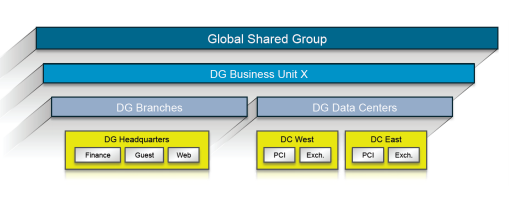
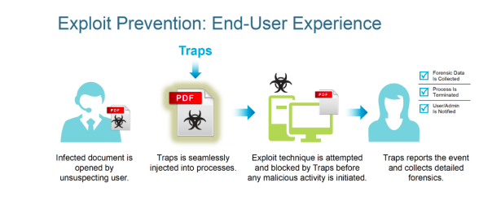

# Cybersecurity Essentials

### 3.1 Security Operating Platform

The Palo Alto Networks Security Operating Platform is a purpose-built, fully integrated cybersecurity approach that helps organizations get control of their networks and protect critical assets.

The Security Operating Platform makes prevention, action, and control integral and central to enterprise security strategy. The Security Operating Platform provides visualization, protection, and control capabilities for all network traffic, applications, users, and endpoints.

### 3.2 Network Security

##### 3.2.1 Next-generation firewalls

Fundamental shifts in application usage, user behavior, and complex network infrastructure have created a threat landscape that exposes weaknesses in traditional port-based network firewalls. End users want access to an ever-increasing number of applications, operating across a wide range of device types, often with little regard for the business or security risks.

Palo Alto Networks NGFWs are the core of the Security Operating Platform. The NGFW inspects all traffic – including applications, threats, and content – and associates it with the user, regardless of location or device type.

NGFWs classify network traffic based on the application’s identity to enable visibility and control of all types of applications running on enterprise networks.

The essential functional requirements for an effective NGFW include:

+ **Application identification** - Accurately identify applications regardless of port, protocol, evasive techniques, or encryption.
+ **User identification** - Accurately identify users and subsequently use identity information as an attribute for policy control.
+ **Content identification** - Content identification controls traffic based on complete analysis of all allowed traffic, using multiple threat prevention and data loss prevention techniques in a single pass architecture that fully integrates all security functions.

Palo Alto Networks NGFWs are built on a single-pass architecture, which is a unique integration of software and hardware that simplifies management, streamlines processing, and maximizes performance. The single-pass architecture integrates multiple threat prevention disciplines into a single stream-based engine with a uniform signature format. This architecture allows traffic to be fully analyzed in a single pass without the performance degradation seen in multifunction gateways.

Two key benefits are realized:
+ A stream-based engine scans traffic in real-time, only reassembling packets as needed and only in very small amounts.
+ All traffic can be scanned with a single engine.

***3.2.1.1 Application identification***

The strict adherence to port-based classification and control methodology is the primary policy element; it is hard-coded into the foundation and cannot be turned off.

As a result, many of today’s applications cannot be identified much less controlled by the firewall.

Establishing port and protocol information is a first step in application identification, but it is insufficient by itself. Robust application identification and inspection in an NGFW enables granular control of the flow of sessions through the firewall.

Application identification technology in a Palo Alto Networks NGFW does not rely on a single element, such as port or protocol. Instead, application identification uses multiple mechanisms to determine what the application is, and the app's identity then becomes the basis for the policy that is applied to the session.

> App-ID traffic classification technology

The first task that a Palo Alto Networks NGFW executes is the identification of the applications traversing the network using App-ID. App-ID uses a multifaceted approach to determine the application, irrespective of port, protocol, encryption (SSL and SSH), or other evasive tactics employed.

The app id techniques include:
+ **Application protocol detection and decryption** - Determines the application protocol and, if SSL is in use, decrypts the traffic so that it can be analyzed further.
+ **Application protocol decoding** - Determines whether the initially detected application protocol is the "real one", or if it is being used as a tunnel to hide the actual application.
+ **Application signatures** - Context-based signatures look for unique properties and transaction characteristics to correctly identify the application regardless of the port and protocol being used.
+ **Heuristics** - For traffic that eludes identification by signature analysis, heuristic analyses are applied, which enable identification of any troublesome applications, such as P2P or VoIP tools that use proprietary encryption.

With App-ID as the foundational element for every Palo Alto Networks NGFW, administrators can regain visibility into, and control over, the applications traversing the network.

> App-ID: Addressing custom or unknown applications

Palo Alto Networks adds an average of five new applications to App-ID each week, yet unknown application traffic is still detected on the network, such as:
+ **Unknown commercial applications** - Administrators can use Application Command Center (ACC) and the log viewer to quickly determine whether an unknown application is a commercial application. Administrators can use the packet capture (pcap) feature on the Palo Alto Networks NGFW, to record the traffic and submit it for App-ID development. The new App-ID is developed, tested with the organization, then added to the global database for all users.
+ **Internal or custom applications** - Administrators can use ACC and the log viewer to quickly determine whether an unknown application is an internal or custom application. You can develop a custom App-ID for the application, using the exposed protocol decoders. The protocol decoders that have been exposed include:
  - FTP
  - HTTP
  - IMAP
  - RTSP
  - Telnet
  - unknown-TCP, unknown-UDP, and file body

After the custom App-ID is developed, traffic identified by it is treated in the same manner as the previously classified traffic; it can be enabled via policy, inspected for threats, shaped using QoS... Alternatively, an application override can be created and applied, which effectively renames the application.

Palo Alto Networks NGFWs use a positive enforcement model, which means that all traffic can be denied except those applications that are expressly allowed via policy

> App-ID in action: Identifying WebEx

When a user initiates a WebEx session, the initial connection is an SSL-based communication. With App-ID, the device sees the traffic and determines that it is using SSL. If there is a matching decryption policy rule, then the decryption engine and protocol decoders are initiated to decrypt the SSL and detect that it is HTTP traffic.

> Application identification and policy control

Application identification enables administrators to see the applications on the network, learn how they work, and analyze their behavioral characteristics and relative risk. When application
identification is used in conjunction with user identification, administrators can see exactly who is using the application based on their identity, not just an IP address.

Allow or deny options included are:
+ Allow or deny
+ Allow but scan for exploits, viruses, and other threats
+ Allow based on schedule, users, or groups
+ Decrypt and inspect
+ Apply traffic shaping through QoS
+ Apply policy-based forwarding
+ Allow certain application functions
+ Any combination of the above

> Application Function Control

For many organizations, secure application enablement means striking an appropriate security policy balance by enabling individual application functionality while blocking other functions within the same application, e.g:
+ Allowing SharePoint Documents, but blocking the use of SharePoint Administration
+ Blocking Facebook mail, chat, posting, and applications, but allowing Facebook itself, effectively only allowing users to browse Facebook
+ Enabling the use of MSN, but disabling the use of MSN-file transfer and only allowing certain file types to be transferred using the file blocking feature

SharePoint as the container application, and the individual functions within:

> Controlling multiple applications: Dynamic filters and groups

In some cases, organizations may want to control applications in bulk, as opposed to controlling them individually. The two mechanisms in the Palo Alto Networks NGFW that address this need are application groups and dynamic filters:
+ **Application groups** - a static list of applications that can be used to allow their use for certain users, while blocking their use for others
+ **Dynamic filters** - s a set of applications that is created based on any combination of the filter criteria: category, subcategory, behavioral characteristic, underlying technology, or risk factor

***3.2.1.2 User Identification***

> User-ID: Integrating user information and security policies

Creating and managing security policies on an NGFW, based on the application and the identity of the user regardless of device or location, is a more effective means of protecting the network than relying solely on port and IP address information in legacy, port-based firewalls.

Palo Alto Networks User-ID enables organizations to leverage user information stored in a wide range of repositories for the following purposes:
+ **Visibility**: Improved visibility into application usage based on user and group information can help organizations maintain a more accurate picture of network activity
+ **Policy control**: Binding user information to the security policy to safely enable applications or specific application functions while reducing the administrative effort associated with employee moves, adds, and changes
+ **Logging and reporting**: If a security incident occurs, forensics analysis and reporting can include user information, which provides a more complete picture of the incident.

> User-ID in action

User-ID seamlessly integrates Palo Alto Networks NGFWs with a wide range of user repositories and terminal services environments. Multiple techniques can be configured to accurately map the user identity to an IP address.

User-ID tools and techniques include
+ **Authentication events** - Monitoring of the authentication events on a network allows User-ID to associate a user with the IP address of the device from which the user logs in to enforce policy on the firewall. User-ID can be configured to monitor authentication events for:
  - **Microsoft Active Directory**
  - **Microsoft Exchange Server**
  - **Novell eDirectory**
+ **User authentication** - This technique allows organizations to configure a challengeresponse authentication sequence to collect user and IP address information, using the following tools:
  - **Captive Portal**
  - **GlobalProtect**
+ **Client probing and terminal services** - This technique allows organizations to configure User-ID to monitor Windows clients or hosts to collect the identity and map it to the IP address. The following techniques are available:
  - **Client probing**
  - **Host probing**
  - **Terminal services**
+ **XML API** - In some cases, organizations may already have a user repository or an application that is used to store information about users and their current IP address. Use of the XML API to collect user and IP address information includes:
  - **Wireless environments**
  - **Proxies**
  - **Network access control (NAC)**
+ **Syslog listener** - The agent runs a syslog listener on a designated port that can parse the syslog messages and convert the information into appropriate User-ID mappings.

> Visibility into a user’s activity

Visibility into the application activity at a user level, not just an IP address level, allows organizations to more effectively enable the applications traversing the network.

> User-based policy control

User-based policy controls can be created based on the application, category and subcategory, underlying technology, or application characteristics. Policies can be used to safely enable applications based on users or groups, in either an outbound or an inbound direction.
+ Enable only the IT department to use tools such as SSH, telnet, and FTP on their standard ports
+ Allow the Help Desk Services group to use Yahoo Messenger
+ Allow Facebook for all users, yet allow only the Marketing group to use Facebookposting, and block the use of Facebook applications for all users

***3.2.1.3 Content identification***

> Threat prevention

Enterprise networks are facing a rapidly evolving threat landscape full of modern applications, exploits, malware, and attack strategies that can avoid traditional methods of detection. Threats are delivered via applications that dynamically hop ports, use non-standard ports, tunnel within other applications or hide within proxies, SSL, or other types of encryption.

Palo Alto Networks Content-ID addresses these challenges with unique threat prevention capabilities not found in traditional security solutions. Networks ensures that visibility through the identification and control of all traffic, using the following tools and techniques:
+ **Application decoders**
+ **Uniform threat signature format**
+ **Vulnerability attack protection (IPS)**
+ **Cloud-based intelligence**
+ **SSL decryption**
+ **Control of circumventing technologies**

> Stream-based malware scanning

Prevention of known malware is performed through the use of stream-based scanning, a technique that begins scanning as soon as the first packets of the file are received as opposed to waiting until the entire file is loaded into memory to begin scanning.

> Intrusion prevention

Content-ID protects networks from all types of vulnerability exploits, buffer overflows, DoS attacks, and port scans that lead to the compromise of confidential and sensitive enterprise information. IPS mechanisms in Content-ID include:
+ Protocol decoders and anomaly detection
+ Stateful pattern matching
+ Statistical anomaly detection
+ Heuristic-based analysis
+ Invalid or malformed packet detection
+ IP defragmentation and TCP reassembly
+ Custom vulnerability and spyware phone-home signatures

> URL filtering

To complement the threat prevention and application control capabilities, a fully integrated, on-box URL filtering database enables security teams to not only control end-user web surfing activities, but also to combine URL context with application and user rules.

The on-box URL database can be augmented to suit the traffic patterns of the local user community with a custom URL database. URLs that are not categorized by the local URL database can be pulled into cache from a hosted URL database.

URL filtering visibility and policy controls can be bound to specific users through transparent integration with enterprise directory services with additional insight provided through customizable reporting and logging.

> File and data filtering

File and data filtering takes advantage of in-depth application inspection and enables enforcement of policies that reduce the risk of unauthorized information transfer or malware propagation. File and data filtering capabilities in Content-ID include:
+ **File blocking by type**: Control the flow of a wide range of file types by looking deep within the payload to identify the file type
+ **Data filtering**: Control the transfer of sensitive data patterns such as credit card numbers and Social Security numbers in application content or attachments
+ **File transfer function control**: Control the file transfer functionality within an individual application, which allows application use while preventing undesired inbound or outbound file transfer.

***3.2.1.4 Log correlation and reporting***

Powerful log filtering enables administrators to quickly investigate security incidents by correlating threats with applications and user identity. The Application Command Center (ACC) provides a comprehensive view of current and historical data – including network activity, application usage, users, and threats.

<u>Images: pg *156* - *161*</u>

The Automated Correlation Engine in the ACC is an analytics tool that surfaces critical threats that may be hidden in the network, which reduces manual data mining and enables faster response times. It scrutinizes isolated events automatically across multiple logs, queries the data for specific patterns, and correlates network events to identify compromised hosts.

Correlation objects trigger correlation events when they match on traffic patterns and network artifacts that indicate a compromised host on your network.

A log is an automatically generated, timestamped file that provides an audit trail for system events on the firewall or network traffic events that the firewall monitors. Log entries contain artifacts, which are properties, activities, or behaviors associated with the logged event, such as the application type or the IP address of an attacker.

The following logs can be viewed from the Monitor tab on Palo Alto Networks NGFWs:
+ **Traffic logs**
+ **Threat logs**
+ **URL Filtering logs**
+ **WildFire Submission logs**
+ **Data Filtering logs**
+ **Correlation logs**
+ **Config logs**
+ **System logs**
+ **HIP Match logs**
+ **Alarms logs**
+ **Unified logs**

The following report types are available:
+ **Predefined reports**
+ **User or Group Activity reports**
+ **Custom reports**
+ **PDF Summary reports**
+ **Botnet reports**
+ **Report Groups**

Reports can be generated on demand or on a recurring schedule, and they can be scheduled for email delivery.

##### 3.2.2 Palo Alto Networks Expedition (Migration Tool)

The migration to a Palo Alto Networks NGFW is a critical step toward the prevention and detection of cyberattacks.

Expedition enables organizations to analyze their existing environment, convert existing security policies to Palo Alto Networks NGFWs, and assist with the transition from proof-ofconcept to production.

Primary functions of Expedition include:
+ **Third-party libraries** - transfers the various firewall rules, addresses, and service objects to a PAN-OS XML config file that can be imported into a Palo Alto Networks NGFW
  - Cisco ASA/PIX/FWSM
  - Check Point
  - Fortinet
  - McAfee Sidewinder
  - Juniper SRX/NETSCREEN
+ **Adoption of App-ID** - enables organizations to get the most value from their NGFW, while reducing the attack surface and regaining visibility and control over the organization through App-ID
+ **Optimization** - keeps NGFWs operating at peak performance with services that include:
  - Architecture review
  - System health check
  - Configuration audit
  - Optional product tuning and configuration change implementation
+ **Consolidation of legacy firewalls to Palo Alto** - enables organizations to customize administration, networking, and security policies for the network traffic that is associated with specific departments or customers.
+ **Centralized management with Panorama** - enables organizations to centrally manage the process of configuring devices, deploying security policies, performing forensic analysis, and generating reports across the entire network of Palo Alto.
+ **Auto-zoning** - adapts security policies from vendors that currently do not use zones and zones-based rules.
+ **Customized response pages** - can be loaded by administrators to notify end users of policy violations.

##### 3.2.3 Network security management (Panorama)

A data security breach often occurs not because of a lack of information about a cyberattack, but rather because of a lack of appropriately prioritized, actionable information. Possession of actionable, well-organized information about network traffic and threats is more crucial today than ever before.

Several operational gaps exist between:
+ **Alert and action** - Network and security teams are often overwhelmed by the volume of data in security logs and are unable to easily determine which alerts are minor and which alerts are critical
+ **Known and unknown** - Discovery of these threats quickly is crucial, but after they are discovered, security professionals must be able to quickly differentiate between the critical and the non-critical.
+ **Idea and implementation** - Many orgs have huge numbers of policies, many of them outdated, because the complexity of provisioning and managing a secure network has become too overwhelming.

Closing of these operational gaps requires reducing security management complexity and improving incident response to enable rapid discovery of threats and quickly surface actionable intelligence.

Palo Alto Networks Panorama network security management reduces security management complexity with consolidated policy creation and centralized management features.

Panorama simplifies network security management with a single security rulebase for firewall, threat prevention, URL filtering, application awareness, user identification, sandboxing, file blocking, and data filtering, to safely enable applications in the enterprise.

Panorama centrally manages common device and network configurations through templates that can be used to push configuration changes to all managed firewalls.

Panorama uses the same set of powerful monitoring and reporting tools available at the local device management level.

Logging and reporting capabilities in Panorama include:
+ **Log viewer**
+ **Custom reporting**
+ **User activity reports**
+ **Log forwarding**

Misc:
+ **Panorama manager**
+ **Panorama Log Collector**

### Endpoint protection

##### 3.3.1 Advanced endpoint protection (Traps)

Rather than a reactive “detect and respond”
approach as with traditional anti-malware software, advanced endpoint protection employs a
proactive prevention strategy. Advanced endpoint protection must do the following:
+ Prevent all exploits, including those using unknown zero-day vulnerabilities
+ Block all malware, without requiring any prior knowledge of specific malware signatures
+ Provide detailed forensics against prevented attacks to strengthen all areas of the organization by pinpointing the targets and techniques used
+ Be highly scalable and lightweight to seamlessly integrate into existing operations with minimal to no disruption
+ Integrate closely with network and cloud security for quick data exchange and crossorganization protection

Traps automatically detects and blocks a core set of techniques that an attacker must link together to execute any type of attack, regardless of its complexity.

The Traps agent injects itself into each process as it’s started and automatically blocks advanced attacks that would otherwise evade detection. Traps immediately blocks that technique, terminates the process, and notifies the user and the security team that an attack was prevented.

Combination of these methods offers unparalleled malware prevention and includes the following:
+ **Policy-based restrictions**
+ **WildFire inspection and analysis**
+ **Malware techniques mitigation**

***3.3.1.1 Malware prevention***

The Traps malware prevention engine uses advanced execution control, WildFire integration, and malware prevention modules (MPMs) to prevent the execution of malware.

When a user or endpoint attempts to open an executable, Traps first verifies that the executable doesn’t violate any policy-based restrictions.

For example, you may want to prevent execution of the following:
+ Files from certain paths (such as the Outlook TMP folder) or network locations where applications don’t reside
+ Child processes created by specific applications
+ Unsigned executables or executables with an invalid certificate

Traps provides static and dynamic execution control. Basic whitelisting and blacklisting of applications can be managed easily from the ESM Console.  Every executable that has ever been run in the organization is listed in the ESM Console along with the WildFire verdict.

Traps Advanced Endpoint Protection is natively integrated with WildFire to provide zero-day protection against new and unknown exploits and malware threats.

If an executable file has never been seen before on the endpoint, Traps can submit the file hash for immediate identification by WildFire. If WildFire identifies the file as malicious, Traps will prevent execution before any damage is done.

If a malicious file is not blocked by advanced execution control or WildFire evaluation and is allowed to execute, malicious activity can still be blocked by Traps malware prevention modules (MPMs).

To allow legitimate processes to run, you can whitelist parent processes that inject into other processes. MPM rules include:
+ **Suspend Guard** - protects against a common malware technique, where the attacker creates processes in a suspended state to inject and run code before the process starts
+ **Thread Injection** - another common entry point for malicious code is through the creation of remote threads and processes

Administrators can use periodic scanning to identify dormant threats, comply with regulatory requirements, and accelerate incident response with endpoint context.
+ **WildFire threat intelligence**
  - Traps queries WildFire with the hash of any executable file, DLL, or Office file before the file runs to assess its standing within the global threat community. WildFire returns a verdict on whether the file is malicious or benign.
  - If the file is deemed malicious, Traps automatically terminates the process and optionally quarantines it.
+ **Local Analysis via machine learning**
  - **Static analysis via machine learning**
  - **Dynamic analysis**
  - **Bare metal analysis**

If WildFire determines a file to be a threat, it automatically creates and shares a new prevention control with Traps and other components of the Palo Alto.

Additional prevention capabilities include:
+ **Granular child process protection** - Traps prevents script-based and fileless attacks with controls over the launching of legitimate applications, such as script engines and command shells.
+ **Behavior-based ransomware protection** - Upon detection, it immediately blocks attacks and prevents encryption of customer data.
+ **Scanning** - scan endpoints for dormant malware, with an option to automatically quarantine it for remediation when found.
+ **Admin override policies** - enables definition of policies based on the hash of an executable file to control what is or isn’t allowed to run in their environments
+ **Malware quarantine**
+ **Grayware classification** - enables identification of non-malicious but otherwise undesirable software, such as adware, and prevent it from running in their environments
+ **Execution restrictions** - enables easy definition of policies to restrict specific execution scenarios to reduce the attack surface of any environment

***3.3.1.2 Exploit prevention***

Traps focuses on the core techniques used by all exploits to render those techniques ineffective, which means the application is no longer vulnerable.

By default, Traps policy is configured to protect over 100 processes — each one with dozens of proprietary EPMs. Processes that have been run on the endpoint automatically show up in the ESM Console, which means that those processes can be easily protected with the click of a button.

If an application conflicts with one of the EPMs, security administrators can simply disable that EPM for the specific application and endpoint - the application is still protected by dozens of other EPMs.

Attacks that the EPMs can prevent include:
+ DLL hijacking — replacing a legitimate DLL with a malicious one of the same name
+ Hijacking program control flow
+ Inserting malicious code as an exception handler

Rather than relying on signatures or behavior-based detection to identify exploit-based attacks, Traps takes the unique approach of targeting the limited number of techniques any exploit-based attack must use to manipulate a software vulnerability.

Traps delivers exploit prevention using multiple methods:
+ **Pre-exploit protection** - Traps prevents the vulnerability-profiling techniques exploit kits use prior to launching attacks.
+ **Technique-based exploit prevention** - Traps prevents known, zero-day, and unpatched vulnerabilities by blocking the exploitation techniques that attackers use to manipulate applications.
+ **Kernel exploit prevention** - Traps prevents exploits that leverage vulnerabilities in the operating system kernel to create processes with escalated privileges.

By blocking the techniques common to all exploit-based attacks, Traps provides three important benefits:
+ **Protects applications that cannot be patched and shadow IT applications**
+ **Eliminates the urgency to patch applications as soon as possible**
+ **Prevents zero-day exploits from succeeding**

***3.3.1.3 Traps deployment architecture***

The Traps agent installer can be deployed using your software deployment tool of choice. Subsequent updates to the agent can be deployed via the ESM. The agent consumes less than 25MB on disk and less than 40MB while running in memory.

The lightweight structure allows for the Traps environment to scale horizontally and support large deployments of up to 50,000 agents per ESM, while still maintaining a centralized configuration and database for policies.

***3.3.1.4 Traps in action***

To understand how Traps prevents an attack from succeeding, look at an actual cyber-attack example in which a PDF file with an embedded exploit is sent to an unsuspecting user.

The user opens the PDF file, which does the following:
+ Exploits Adobe Reader
+ Causes Adobe Reader to create an Internet Explorer (IE) child process
+ Causes IE to download an executable (EXE) file from a malicious website
+ Executes the new EXE file, which then performs malicious activities on the endpoint, including thread injection into IE

The key to stopping an attack is to break this chain of events at the earliest possible stage of the attack.

To prevent an attack from succeeding, Traps provides prevention capabilities and multiple layers of protection to block the attacker’s ability to access the network and move laterally within the enterprise.

<u>List: pg *183 - 184*</u>

##### 3.3.2 Mobile security and VPN management (GlobalProtect)

Mobile computing is revolutionizing how and where employees work, and the tools that they use to perform their jobs. As enterprise mobile strategies mature, mobile capabilities become more advanced with new applications and greater access to data, introducing new
opportunities — and new risks.

Unfortunately, many traditional mobile security tools tend to focus on very basic use cases and may be as limited in their security capabilities as the use cases themselves. The path to
unlocking the full value of the mobile device depends on security, which provides the means to extend applications safely.

To fully realize all of mobility’s benefits and safely enable mobile devices, enterprises must:
+ **Manage the device** - ensure that mobile devices are safely enabled by configuring the device with proper security settings
+ **Protect the device** - protect the mobile device from exploits and malware
+ ** Control the data** - establish policies that define who can access sensitive applications, and the particular devices that can be used

GlobalProtect has three primary components:
+ **GlobalProtect gateway** - Delivers mobile threat prevention and policy enforcement based on apps, users, content, device, and device state. Two types:
  - **External**
  - **Internal**
+ **GlobalProtect Client** - Enables device management, provides device state information, and establishes secure connectivity. Two types:
  - **GlobalProtect Agent**
  - **GlobalProtect App**
+ **GlobalProtect Portal** - Directs all client traffic to the appropriate gateway and is accessed first by the client device.

GlobalProtect also provides a complete infrastructure for managing secure access to enterprise resources from remote sites. The GlobalProtect Large Scale VPN (LSVPN) feature on Palo Alto Networks NGFWs simplifies the deployment of traditional hub-and-spoke VPNs.

The LSVPN infrastructure consists of the following components:
+ **GlobalProtect Portal** - Provides the management functions for the GlobalProtect LSVPN infrastructure.
+ **GlobalProtect gateways** - Provides the tunnel endpoint for satellite connections
+ **GlobalProtect satellite** - at a remote site; establishes IPsec tunnels with the gateway(s) at the corporate office(s) for secure access to centralized resources.
+ **GlobalProtect cloud service** -  cloud-based security infrastructure service that simplifies the process of scaling Palo Alto

With GlobalProtect cloud service, Palo Alto Networks deploys and manages the security infrastructure globally to secure your remote networks and mobile users. GlobalProtect cloud service comprises five components:
+ **Cloud services plugin** - Panorama plugin that enables GlobalProtect cloud service and the Logging Service.
+ **Service infrastructure** - GlobalProtect cloud service uses the IP addresses within this subnet (which is supplied before the infrastructure is created) to establish a network infrastructure between remote networks.
+ **Service connections** - A GlobalProtect cloud service license includes the option to establish IPsec tunnels to up to three of your headquarters or data center sites.
+ **Remote networks** - GlobalProtect cloud service for remote networks automatically deploys NGFWs in the regions you specify in the cloud services plugin during the onboarding steps.
+ **Mobile users** - GlobalProtect cloud service for mobile users automatically deploys GlobalProtect portals and gateways in the cloud. Mobile users then connect to GlobalProtect cloud service for mobile users to receive their VPN configuration, which routes them to the closest GlobalProtect cloud service gateway for policy enforcement.

Also, the cloud firewalls, gateways, and portals that are deployed as part of the GlobalProtect cloud service infrastructure must forward all logs to the Logging Service.

All of the GlobalProtect cloud service firewalls deployed for your organization are fault tolerant.

### 3.4 Cloud Security

##### 3.4.1 Cloud monitoring and compliance (Evident)

Evident was developed specifically to help modern IT, DevOps, and security and compliance teams implement and maintain security within the cloud shared responsibility model.

Evident provides continuous monitoring of public clouds, which enables organizations to deploy applications confidently, knowing the cloud environment is securely configured. Data stored within cloud storage services is classified and checked for data exposure and malware.

The capabilities and benefits of Evident include:
+ **Continuous visibility and monitoring**
+ **Compliance validation**
+ **Securing cloud storage services**
+ **Automated remediation**

##### 3.4.2 SaaS security (Aperture)

To safely enable SaaS usage in your organization, start by clearly defining the SaaS applications that should be used and which behaviors within those applications are allowed. This step requires a clear definition of which applications are:
+ Sanctioned - such apps provide business benefits and are fast to deploy, require minimal cost, and are infinitely scalable
+ Tolerated - such apps fulfill a legitimate business need, but certain usage restrictions may be necessary to reduce risk
+ Unsanctioned - such apps either clearly provide no business benefits, or the security risks of the application outweigh the business benefits.

To control sanctioned SaaS usage, an enterprise security solution must provide the following:
+ **Threat prevention** - to address SaaS-based malware threats, a security solution must be able to prevent known and unknown malware from residing in sanctioned SaaS applications
+ **Visibility and data exposure control** - visibility of data stored and used in SaaS applications is critical to ensuring a deep understanding of users, the data they have shared, and how they have shared it.
+ **Prevent risk, don’t just respond** - self-explanatory

Aperture builds on the existing SaaS visibility and granular control capabilities of the Palo Alto provided through App-ID with detailed SaaS-based reporting and granular control of SaaS usage.

Aperture is a completely cloud-based, end-to-end security solution that provides visibility and control within SaaS applications, without the need for any proxies, agents, software, additional hardware, or network changes.

***3.4.2.1 SaaS threat prevention***

WildFire threat cloud integration with Aperture provides cyberthreat prevention to block known malware and identify and block unknown malware

***3.4.2.2 Data exposure visibility***

Aperture provides complete visibility across all user, folder, and file activity, which provides detailed analysis that helps you transition from a position of speculation to one of knowing exactly what is occurring in the SaaS environment at any given point in time.

***3.4.2.3 Contextual data exposure control***

Aperture enables you to define granular, context-aware policy control that provides you with the ability to drive enforcement and the quarantine of users and data as soon as a violation occurs.

***3.4.2.4 Advanced document classification***

Aperture inspects documents for common sensitive data strings such as credit card numbers, SSH keys, and Social Security numbers, and flags them as risks if they are improperly shared.

***3.4.2.5 Retroactive policy***

Aperture retroactively applies security policies to all users and data from the beginning of the SaaS account’s creation, rather than the policy creation, to identify any potential vulnerabilities or policy violations.

Policies are context-driven to allow for granular definitions of data exposure risks. This granularity is necessary to enable SaaS use by users while still preventing accidental data exposure.

Risks are calculated by user type, document type, sensitive data contained, how they are shared, and whether malware is present.

### 3.5 Application Framework and Logging Service

##### 3.5.1 Behavioral analytics (Magnifier)

Palo Alto Networks Magnifier behavioral analytics helps security analysts quickly find and stop the stealthiest network threats. Magnifier analyzes rich network, endpoint, and cloud data with machine learning, and accurately identifies targeted attacks, malicious insiders, and compromised endpoints.

Magnifier automatically pinpoints active attacks, which allows security analysts to focus on the threats that matter. Magnifier starts by analyzing rich data stored in the Logging Service by Palo Alto Networks NGFWs, including information about users, devices, and applications

Magnifier uses the following machine learning techniques to analyze logs:
+ **Unsupervised machine learning**
+ **Supervised machine learning**

Magnifier leverages a pre-compute detection framework to maximize speed, efficiency, and accuracy.

To reduce investigation time, Magnifier produces a small number of accurate, actionable alerts, and information about the user, application, and device obtained through User-ID and App-ID technology.

Magnifier behavioral analytics identifies behavioral anomalies to expose hard-to-detect threats, such as:
+ **Targeted attacks**
+ **Malicious insiders**
+ **Risky behaviour**
+ **Compromised endpoints**

As a cloud-based application for the Palo Alto Networks Application Framework, Magnifierovercomes the scaling challenges of on-premises analytics and allows Palo Alto Networks researchers to deploy security innovations more quickly.

##### 3.5.2 Log management (Logging Service)

Network security log analysis is an important cybersecurity practice that organizations perform to correlate potential threats and prevent breaches, but managing logs from various security tools and services takes effort and resources. To convert these logs into actionable information, organizations need an affordable way to store, process, and analyze as much log data as possible.

The Palo Alto Networks Logging Service is a cloud-based offering for context-rich enhanced network logs generated by Palo Alto Networks security products, including NGFWs, GlobalProtect cloud service, and Traps advanced endpoint protection.

The Logging Service is the cornerstone of the Palo Alto Networks Application Framework: a scalable set of security applications that can apply advanced analytics in concert with Palo Alto Networks enforcement points to prevent the most advanced attacks.

Logging Service capabilities include:
+ **Central repository for NGFW and cloud services logs**
+ **Logging infrastructure that scales with changing business needs**
+ **Insight into network, application, and user behavior**
+ **Integration with other security infrastructure**

##### 3.5.3 Threat intelligence (AutoFocus)

AutoFocus enables a proactive, prevention-based approach to network security that puts automation to work for security professionals. Threat intelligence from the service is made directly accessible in the Palo Alto Networks platform, including PAN-OS software and Panorama.

The service correlates and gains intelligence from:
+ WildFire
+ URL filtering with PAN-DB service
+ Palo Alto Networks global passive DNS network
+ Palo Alto Networks Unit 42 threat intelligence and research team
+ Third-party feeds, including closed and open-source intelligence

AutoFocus makes over a billion samples and sessions, including billions of artifacts, immediately actionable for security analysis and response efforts.

***3.5.3.1 Priority alerts and tags***

AutoFocus enables you to distinguish the most important threats from everyday commodity attacks, contextualizing events on your network with tags. When a tag matches an event on your network, a priority alert is sent via email, within the AutoFocus dashboard, or via HTTP post, with the full tag context included.

With AutoFocus and the Security Operating Platform, security teams can:
+ Determine how targeted or unique a threat seen on their network is
+ Investigate related malicious samples
+ Identify suspicious DNS queries with domain resolution history

***3.5.3.2 Threat correlation***

AutoFocus uses an innovative statistical analysis engine to correlate billions of artifacts across a global data set and bring forward unique IoCs likely associated with targeted attacks.

AutoFocus allows you to build sophisticated multi-layer searches at the host and network-based artifact levels, and target your search within industry, time period, and other filters. When further analysis is required, security teams can switch between AutoFocus and PAN-OS software or Panorama.

***3.5.3.3 Actionable intelligence***

AutoFocus enables you to create new protections for the Security Operating Platform by exporting high-value IoCs from the service into PAN-OS software External Dynamic Lists to instantly block malicious URLs, domains, or IP addresses.

AutoFocus can dramatically reduce the time required to investigate by enriching third-party services through:
+ **Open API support**
+ **Remote sweeping capability**
+ **Support for STIX data format**

##### 3.5.4 Threat indicator sharing (MineMeld)

MineMeld is an open-source application that streamlines the aggregation, enforcement, and sharing of threat intelligence. MineMeld is available directly on GitHub and on pre-built VMs for easy deployment.

MineMeld supports a variety of use cases, with more being added each day by the community, including:
+ Aggregating and correlating threat intelligence feeds
+ Enforcing new prevention controls, including IP blacklists
+ Evaluating the value of a specific threat intelligence feed for your environment
+ Extracting indicators from Palo Alto Networks device logs and sharing them with other security tools
+ Sharing indicators with trusted peers
+ Identifying incoming sessions from Tor exit nodes for blocking or strict inspection
+ Tracking Office365 URLs and IPs

MineMeld allows you to aggregate threat intelligence across public, private, and commercial intelligence sources, including between government and commercial organizations.

MineMeld simplifies the collection and correlation of intelligence across:
+ Commercial threat intelligence feeds
+ Open Source Intelligence providers
+ Threat intelligence platforms
+ Information sharing and analysis centers
+ Computer emergency response teams
+ Other MineMeld users

After indicators are collected, MineMeld can filter, deduplicate, and consolidate metadata across all sources, which allows security teams to analyze a more actionable set of data, enriched from multiple sources, for easier enforcement.

##### 3.5.5 Malware analysis (WildFire)

WildFire cloud-based malware analysis environment is a cyberthreat prevention service that identifies unknown malware, zero-day exploits, and advanced persistent threats through static and dynamic analysis in a scalable, virtual environment. WildFire automatically disseminates updated protections in near real-time to immediately prevent threats from spreading – without manual intervention.

The result is a closed-loop, automated approach to preventing cyberthreats that includes:
+ Positive security controls to reduce the attack surface
+ Inspection of all traffic, ports, and protocols to block all known threats
+ Rapid detection of unknown threats by observing the actions of malware in a cloudbased execution environment
+ Automatic deployment of new protections back to the frontline to ensure threats are known to all and blocked across the attack lifecycle

***3.5.5.1 Behavior-based cyberthreat discovery***

To find unknown malware and exploits, WildFire executes suspicious content in the Windows, Android, and Mac OS X operating systems, with full visibility into common file types, including:
+ Executables (EXEs), dynamic-link libraries (DLLs), compressed files (ZIP), and portable document format (PDF)
+ Microsoft Office documents, spreadsheets, and presentations
+ Java files
+ Android application packages (APKs)
+ Adobe Flash applets and webpages (including high-risk embedded content, such as Java and Adobe Flash files/images)

WildFire identifies hundreds of potentially malicious behaviors to uncover the true nature of malicious files based on their actions, including:
+ **Changes made to host**
+ **Suspicious network traffic**
+ **Anti-analysis detection**

WildFire is natively integrated with the Security Operating Platform, which can classify all traffic across hundreds of applications.

***3.5.5.2 Threat prevention with global intelligence sharing***

WildFire protects organizations from malicious and exploitive files and links, and also looks deep into malicious outbound communication and disrupts C&C activity with anti-C&C signatures and DNS-based callback signatures. The information is also used for URL Filtering with PAN-DB, where newly discovered malicious URLs are automatically blocked.

***3.5.5.3 Integrated logging, reporting, and forensics***

WildFire provides access to integrated logs, analysis, and visibility into WildFire events, through the management interface, the WildFire portal, AutoFocus, and Panorama.

To aid security and incident response teams in discovering infected hosts, WildFire also provides:
+ Detailed analysis of every malicious file sent to WildFire across multiple operating system environments, including host-based and network-based activity
+ Session data associated with the delivery of the malicious file, including source, destination, application, User-ID, and URL
+ Access to the original malware sample for reverse-engineering and full packet captures (pcaps) of dynamic analysis sessions
+ An open application programming interface (API) for integration with best-in-class SIEM tools, such as the Palo Alto Networks application for Splunk, and leading endpoint agents. This analysis provides a numerous IoCs that can be applied across the attack lifecycle
+ Native integration with Traps advanced endpoint protection  and Aperture advanced SaaS protection
+ Access to the actionable intelligence and global context provided by AutoFocus threat intelligence
+ Natively integrated with the correlation engine in Palo Alto Networks NGFWs (discussed 
