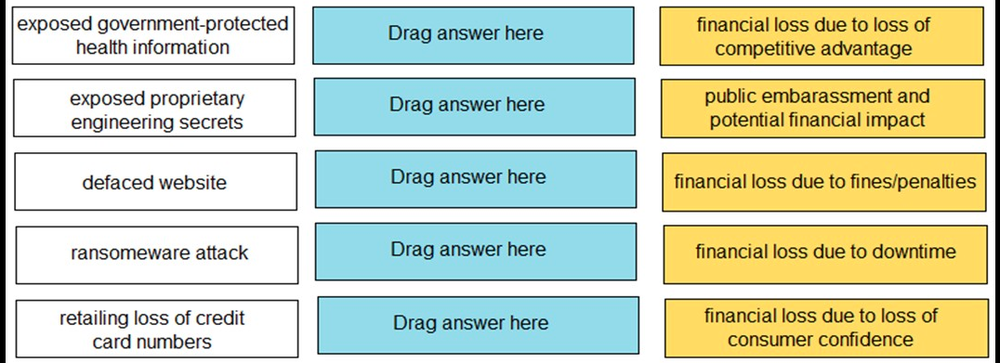
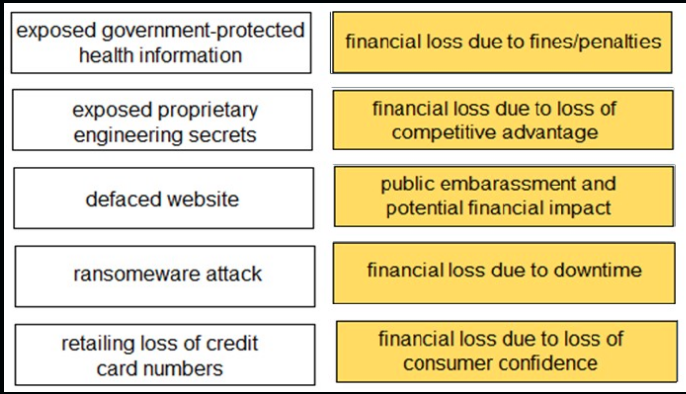
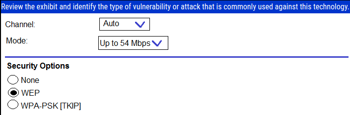
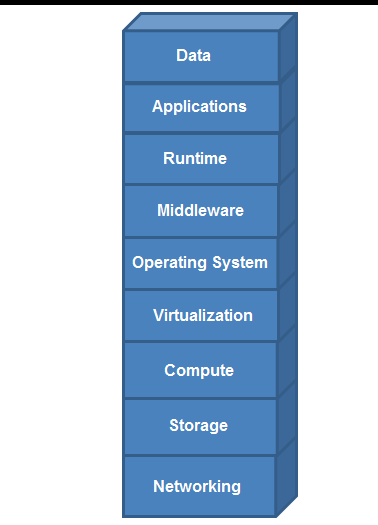

# **Bolded** answers are correct

1. Which type of adversary would commit cybercrimes with the authorization of their country's government?
+.** state-sponsored**
+ hacktivist
+ gray hat
+ white hat

2. When a company chooses to deploy a branch location with antivirus software, which risk model are they using to manage risk?
+ **limiting**
+ assuming
+ trasnferring
+ avoiding

3. Which option describes a characteristic of a distributed denial-of-service attack?
+ uses multiple types of malware to corrupt system services
+ uses a single remote host to delete data from multiple target servers
+ uses a single remote host to flood a target network with traffic
+ **uses a botnet to flood traffic to a target network**

4. What is a component of a public key infrastructure?
+ Key Distribution Center
+ KDC ticket
+ SSH key
+ **certificate authority**

5. From which resource can a Palo Alto Networks firewall get URL category information for URLs whose categories cannot be found on the firewall?
+ App-ID database
+ WildFire
+ PDF file
+ **PAN-DB database**

6. What does a hypervisor enable?
+ high-speed searching of already aggregated security log files
+ high-speed aggregation and viewing of security log files
+ multiple physical machines to be configured into a high-performance cluster
+ **multiple guest operating systems to run on a single physical machine**

7. ***PASS***: DRAG DROP

8. Identify a weakness of a perimeter-based network security strategy to protect an organization's endpoint systems.
+ It cannot identify command-and-control traffic.
+ It cannot monitor all potential network ports.
+ It assumes that all internal devices are untrusted.
+ **It assumes that every internal endpoint can be trusted.**

9. ***PASS***: DRAG DROP

10. Which type of security device uses a single-pass, parallel processor hardware architecture to accelerate content inspection?
+ unified threat management
+ stateless firewalls
+ **next-generation firewall**
+ PoS-based firewall

11. Which well-known port is associated with the Simple Mail Transfer Protocol?
+ 143
+ **25**
+ 997
+ 40

12. ***PASS***: DRAG DROP

13. To which type of organization does the PCI DSS apply?
+ **any organization that accepts, transmits, or stores any cardholder data**
+ organizations that only accept cardholder data regardless of size or number of transactions
+ only organization larger than 100 employees that accept, transmit, or store any cardholder data
+ organization that only transmit data regardless of size or number of transactions

14. ***PASS***: DRAG DROP

15. Which mobile device management feature prevents jailbreaking or rooting?
+ software distribution
+ malware protection
+ **policy enforcement**
+ data loss prevention

16. ***PASS***: DRAG DROP

17. Which device would an Evil Twin attack use to lure the victim to connect to the attack surface network?
+ switch
+ firewall
+ router
+ **access point**

18. What are two methods to securely transmit personally identifiable information? (Choose two.)
+ data checksumming
+ data fragmentation
+ **data encryption**
+ **encrypted tunnels**

19. What is the primary purpose of using encryption as part of your network data security architecture?
+ authorization
+ **confidentiality**
+ integrity
+ authentication

20. Which security component should be used to prevent a malware attack delivered by USB drive?
+ endpoint security
+ password security
+ **physical security**
+ firewall security

21. Match each type of breach to its consequence.

Q: 

A: 

22. A firewall located on an organization's network perimeter can be used to protect against which type of attack?
+ a malicious SaaS application file accessed from an unmanaged mobile phone
+ ransomware installed from an infected USB drive
+ malware installed on the laptop by a disgruntled employee
+ **a malicious PDF file located on an internet website**

23. Which Palo Alto Networks tool is used to prevent endpoint systems from running malware executables such as viruses, trojans and rootkits?
+ AutoFocus
+ **Traps**
+ Expedition
+ App-ID

24. Which protocol converts voice into a digital signal?
+ IVO
+ **VoIP**
+ SNMP
+ IGMP

25. Which security component should you configure to block viruses not seen and blocked by the perimeter firewall?
+ strong endpoint passwords
+ endpoint disk encryption
+ endpoint antivirus software
+ endpoint NIC ACLs

26. Which Palo Alto Networks product or feature includes machine learning to enhance security?
+ Panorama
+ MineMeld
+ **Magnifier**
+ User-ID

27. Which type of attack floods a target with ICMP requests?
+ route table poisoning
+ reconnaissance
+ IP spoofing
+ **denial-of-service**

28. Which type of attack floods a target with TCP SYN requests?
+ route table poisoning
+ reconaissance
+ **denial-of-service**
+ IP spoofing

29. Which two components are part of a next-generation firewall security policy? (Choose two.)
+ role-based access controls
+ **user identification**
+ **content identification**
+ file permissions

30. Which type of malware is self-replicating but must first infect a host program and be executed by a user or process?
+ vulnerability
+ **worm**
+ exploit
+ virus

31. You discover malware has corrupted the BIOS on your laptop. Which type of malware is this?
+ **bootkit**
+ exploit
+ rootkit
+ vulnerability

32. Which data security compliance standard is used to protect card holder data wherever it is processed, stored, or transmitted?
+ Property Card Industry
+ **Payment Card Industry**
+ Personal Card Industry
+ Payment Club Industry

33. What does Palo Alto Networks Traps do first when an endpoint is asked to run an executable?
+ send the executable to WildFire
+ run a static analysis
+ run a dynamic analysis
+ **check its execution policy**

34. What is the function of a hashing protocol?
+ encrypts data with encapsulation
+ establishes an unencrypted tunnel
+ establishes a secure tunnel
+ **provides data integrity**

35. Which two items operate at the network layer in the OSI network model? (Choose two.)
+ **IP address**
+ **router**
+ switch
+ MAC address

36. In which type of cloud computing service does an organization own and control application data, but not the application?
+ platform as a service
+ computing as a service
+ infrastructure as a service
+ **software as a service**

37. You discover an infected email attachment that contains software code that attacks a known vulnerability in a popular social networking application. This type of software code belongs to which type of malware category?
+ social engineering
+ virus
+ pharming
+ **exploit**

38. What is an example of a distance-vector routing protocol?
+ OSPF
+ BGP
+ **RIP**
+ IGRP

39. Which type of firewall monitors traffic streams from beginning to end?
+ circuit-level gateway
+ stateless
+ **stateful**
+ packet filter

40. Which option lists the correct sequence of a TCP three-way handshake?
+ SYN, ACK, SYN
+ **SYN, SYN+ACK, ACK**
+ SYN, ACK, FIN
+ SYN, SYN+ACK, FIN

41. Which two types of SaaS applications are allowed by an IT department? (Choose two.)
+ **tolerated**
+ certified
+ **sanctioned**
+ unsanctioned

42. Which network method securely connects two sites across a public network?
+ **VPN**
+ VLAN
+ switch
+ router

43. Review the exhibit and identify the type of vulnerability or attack that is commonly used against this technology.

+ phishing
+ denial-of-service
+ code-injection
+ **password cracking**

44. When accessing an intranet website, a certificate error is received. What can be done to move past the certificate error and ensure that the error is not received the next time the website is accessed?
+ **install the website certificate into the web browser**
+ request trusted access from the web developer
+ enable TLS 2.0 in the advanced options of the web browser
+ trust the web developer for the application

45. Assume that it is your responsibility to secure the software functioning at all layers in the exhibit. Which cloud service model type is represented?

+ software as a service
+ platform as a service
+ infrastructure as a service
+ **on-premises**

46. Which security principle describes the practice of giving users the minimum rights to access the resources necessary to do their jobs?
+ known privilege
+ **least privilege**
+ user privilege
+ lowest privilege

47. An attacker emails a malicious URL links to 50,000 email addresses. The email states that users can click the link to view the latest celebrity news, but the link also secretly infects the user's laptop. This scenario describes which type of attack?
+ whailing
+ **phishing**
+ drive-by download
+ pharming

48. Company policy allows employees to access the internet. While searching for office supplies on the internet, a corporate user mistypes a URL, connects to a malicious website, and unknowingly downloads malware. Which action should have been taken to prevent the malware download but still allow user access to the Internet?
+ **deploy a firewall with content filtering capabilities on the corporate perimeter**
+ allow only encrypted HTTPS access to the internet
+ configure digital certificates for all users to authenticate internet downloads
+ permit web connections only to TCP port 443

49. What method can be used to guarantee that a document originates from you and no one else?
+ **public key encryption, encrypting the document with the private key and making the public key available to others**
+ symmetric encryption, ecnrypting the document with the secret key and making a different secret key available to others
+ symmetric encryption, ecnrypting the document with the secret key and making the same secret kay available to others
+ public key encryption, encrypting the document with the private key and making the private key available to others

50. Which type of cloud computing deployment makes resources exclusively available to members of a single organization?
+ local
+ **private**
+ hybrid
+ public
