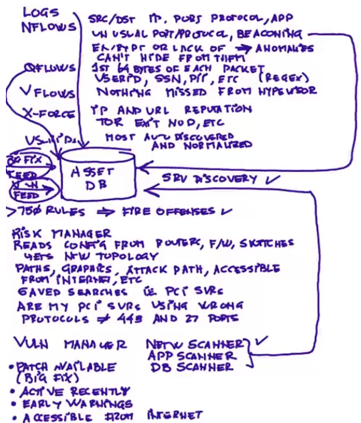
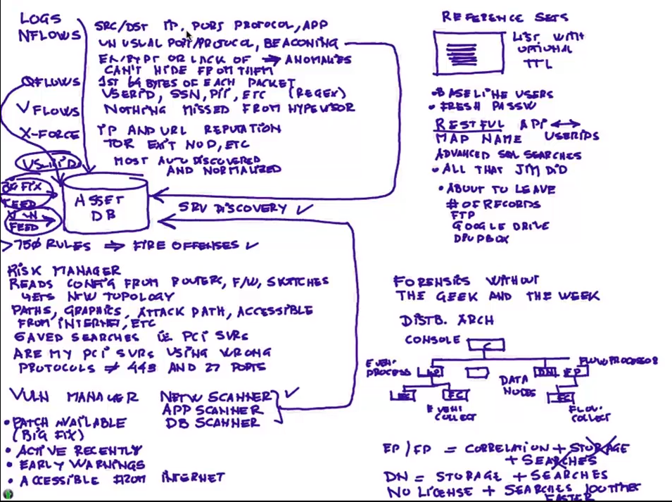
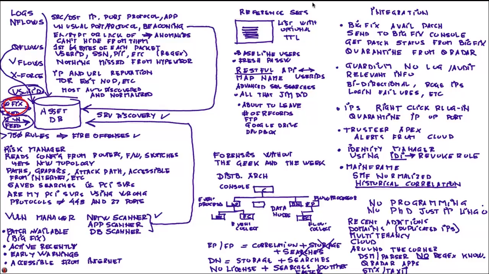
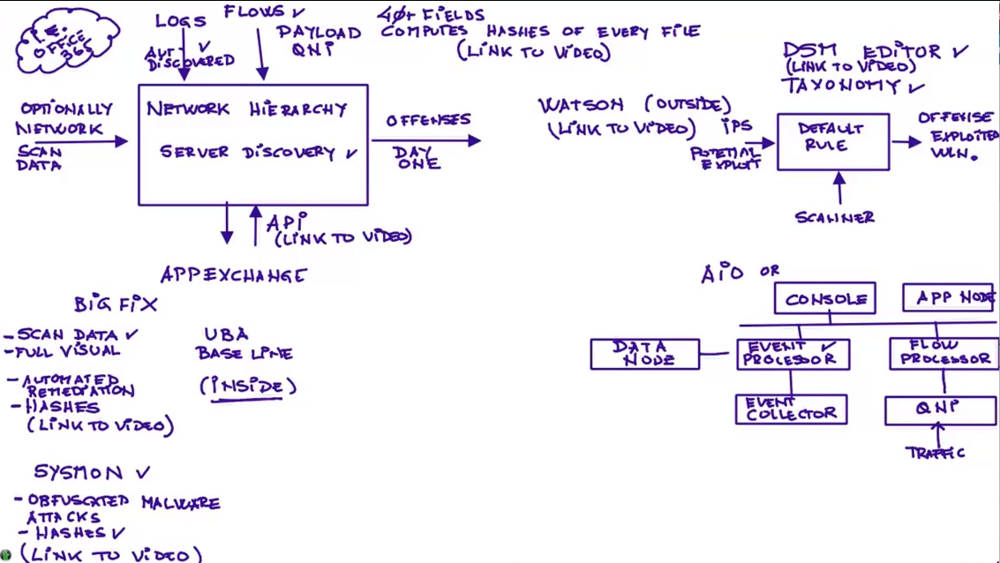
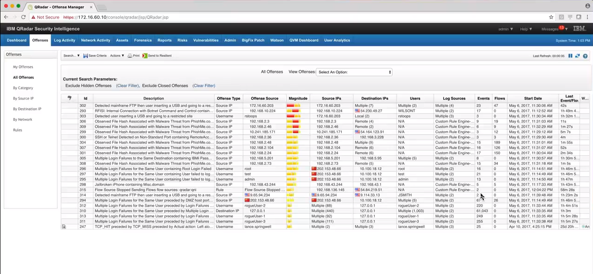
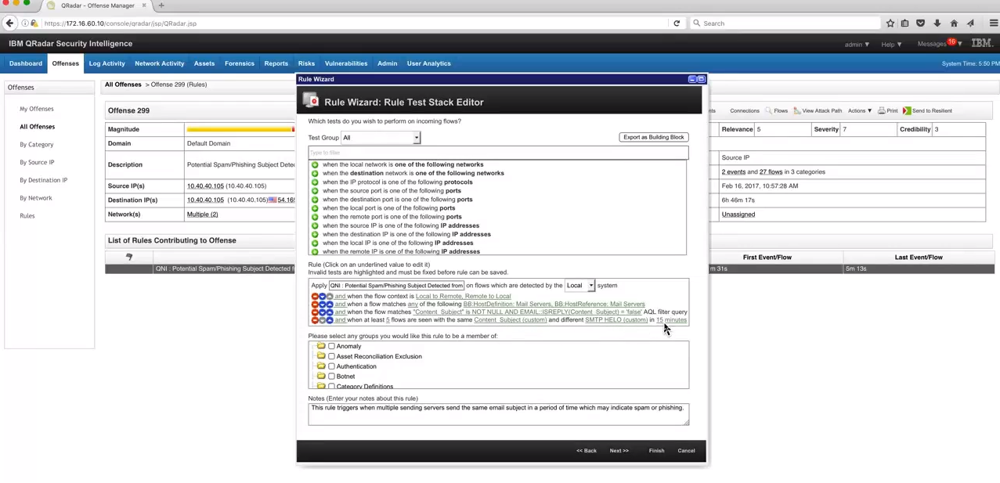

# Why QRadar SIEM?

### What Makes QRadar So Special - Part One

***Q-Radar*** collects logs.

Logs are kept in an *asset database*.

Logs don't convey much about the network, but *flows*.

Flows tell about:
+ Source IP
+ Destination IP
+ Port used

### What Makes QRadar So Special - Part Two

### What Makes QRadar So Special - Part Three

### What Makes QRadar So Special - Part Four - 2018 updates

### What Makes QRadar So Special - Part Five - Network Flows

### What Makes QRadar So Special - Part Six - Beyond Network Flows with QNI

