# QRadar functional architecture and deployment models

### Init

+ Functional requirements of Q-Radar
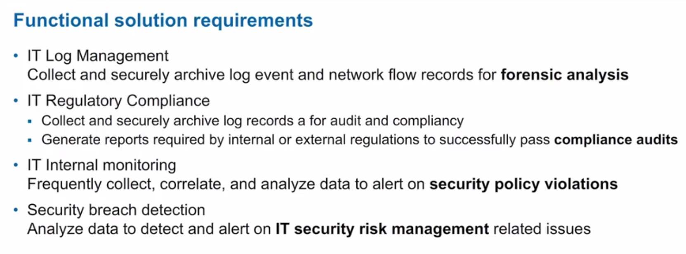

+ SIOS - the top row describes all the apps that can be or are intergrated into Q-Radar

The benefits of *Security Intelligence Operative Systems* are:
+ Convergence
+ Simplicity
+ Scalability
_________________________________________________________________________________________________

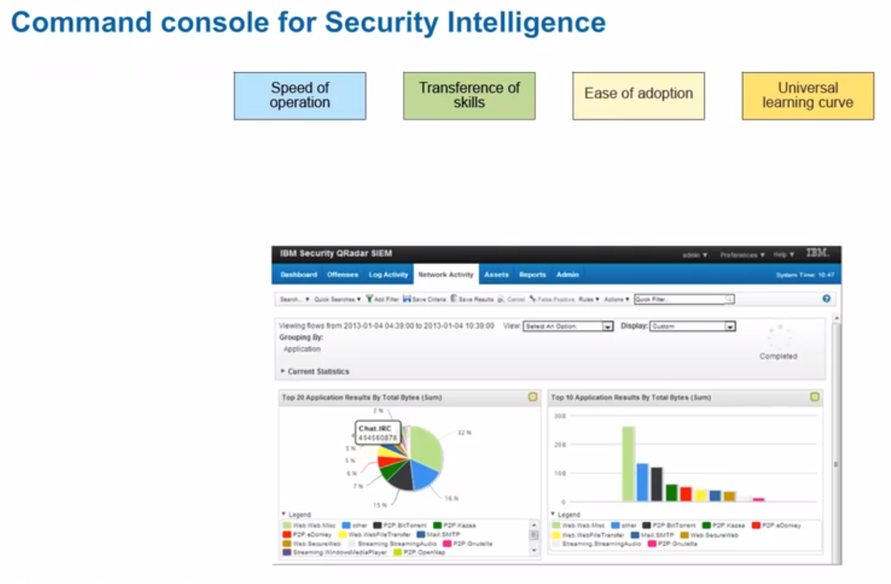

Amongst the benefits you'll learn later on:

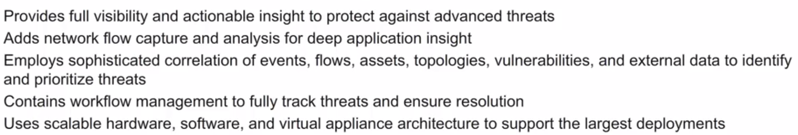

The Q-Radar console is the central interface for all analyst-related tasks. It's completely configurable.

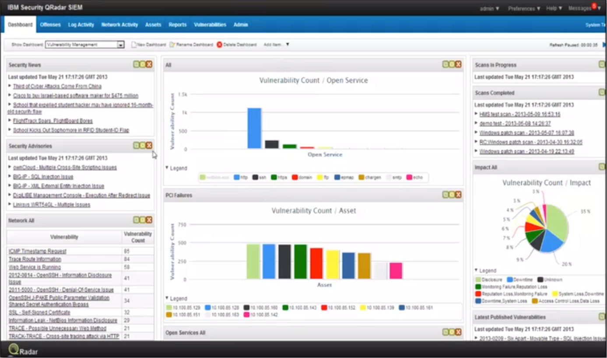

The tabs of Q-Radar are used in the following manner:
+ *Offenses*: view all the offenses that occur in the IT environment. You can investigate:
  - offenses
  - source and destination IP addresses
  - network behaviours
  - anomalies
+ *Log activity* - view event information as records from a log source. You can investigate:
  - event data
  - monitor log activity
+ *Network activity* - view event information of network communication. You can investigate:
  - flows sent in real time
  - monitor network activity
+ *Assets* - view assets in the IT environment. They also:
  - discover and create asset profiles, by using *passive flow data* and *vulnerability data*
  - store information about assets (including *running services* and *vulnerability information*). This:
    + helps reduce false positives
    + gives more details for investigations
+ *Reports* - create, distribute and manage reports. There are a few kinds of reports:
  - Compliance
  - Device
  - Executive
  - Network
  - Custom
+ *Vulnerability* - create and manage scan policies and profiles. They allow for:
  - vulnerability scan execution
  - creation and distribution of vulnerability reports
+ *Admin* - tools that help with Q-Radar deployment management and maintenance
+ **If 3rd party Q-Radar additions are installed, they will show up next to these existing tabs**
_______________________________________________________________________________________________________

Q-Radar SIEM can analyze large amounts of data and use context to transform it into a useful format.

The following image is what a security analyst sees when investigating an offense record that was triggered by a correlation rule.

The *who* (username), *what* (description) and *where* (location) can immediately be seen in order to determine whether it's a legitimate threat or a false positive.

Q-Radar continuously monitors data sources across the IT infrastructure, leveraging the context in which systems are operating.

That context includes:
+ network device logs
+ vulnerabilities
+ configuration data
+ network traffic telemetry
+ application events and activities
+ user identities
+ asset information
+ geolocation
+ application content

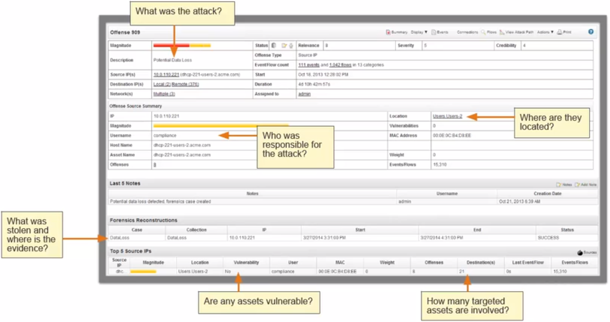
___________________

To enable security analysts to perform investigations, Q-Radar SIEM correlates information such as:
+ Point in time
+ Offending users
+ Origins
+ Targets
+ Asset information
+ Vulnerabilities
+ Known threats
+ Behavioural analytics
+ Cognitive analytics
______________________

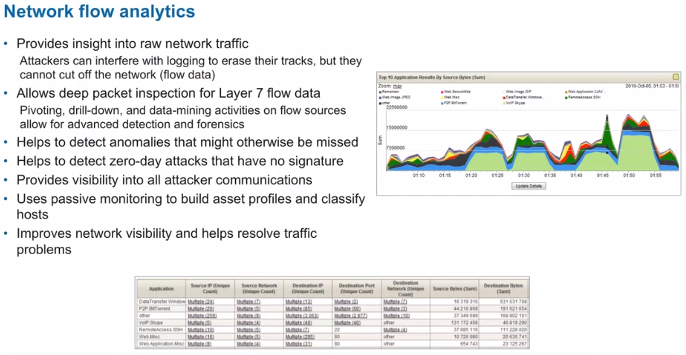

Q-Radar has an extensible architecture.

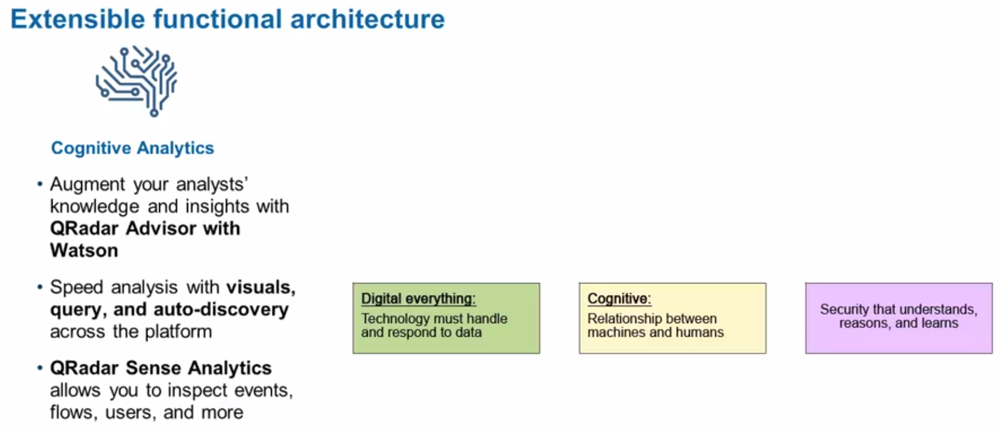

_________________________________________

_________________________________________

### Architecture

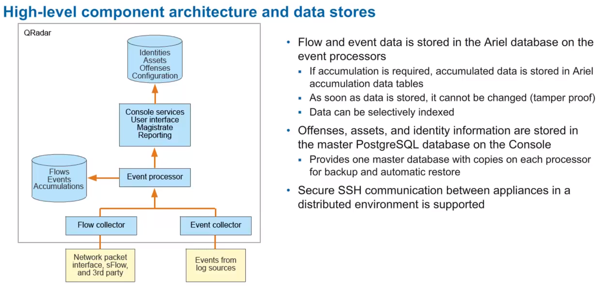

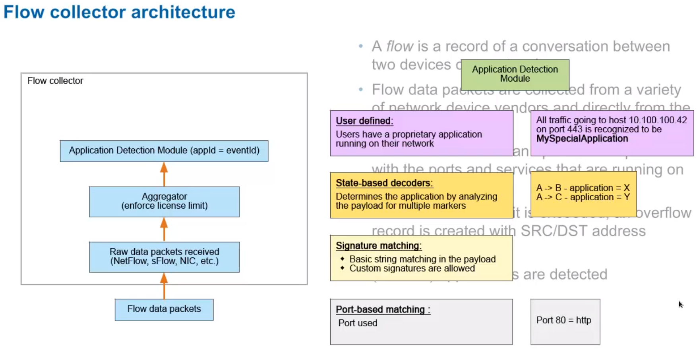
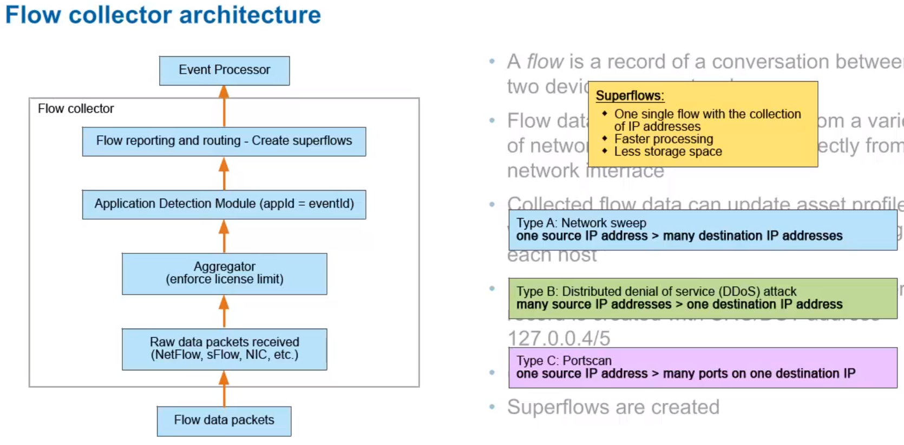

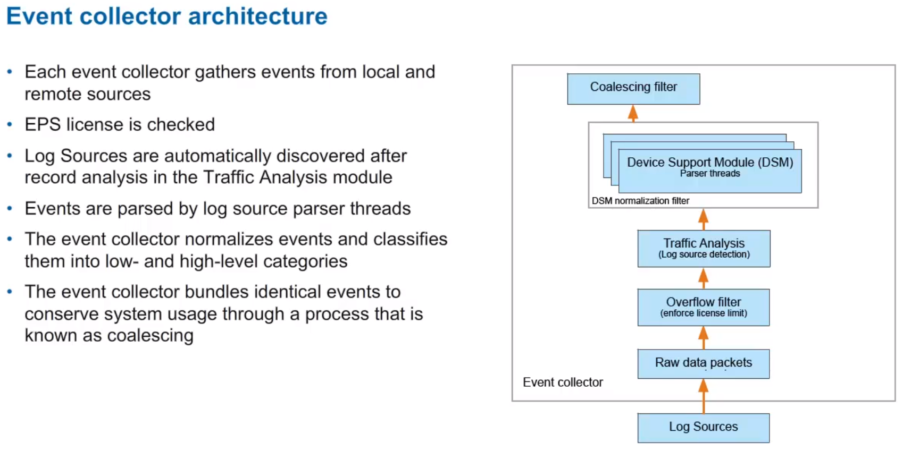

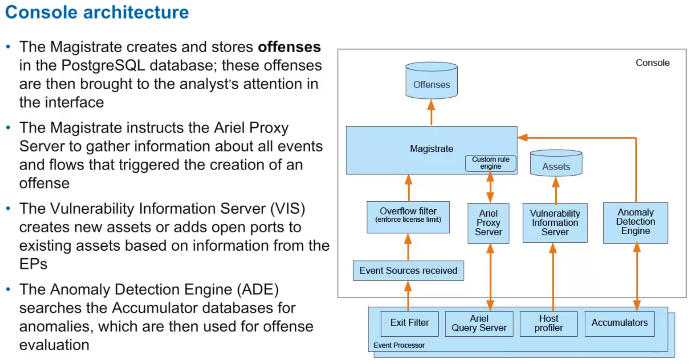

There are 3 types of Anomaly Detection Rule types (image below):

_________________________________________

### Dissecting the flow if a captured event

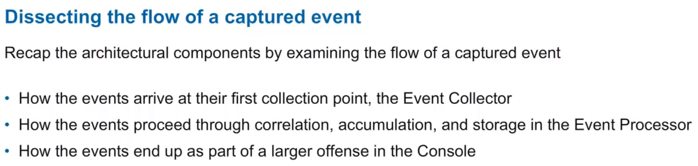

Follow a set of Checkpoint Firewall deny events through a stack of Q-Radar components.

+ FW denies a large amount of communication requests from individual src IP.
+ These FW deny events arrive at the Q-Radar Event Collector. Inside there:
  - the overflow filter counts all the incoming raw events (so the limit is not exceeded)
  - if it is, events are buffer overflowed and fed back into stream when input is below limit
+ The events are passed into Traffic Analysis module: autodiscovery of log sources is performed
  - if the log source is known, the records are handed over to the appropriate DSM module
  - if the log source is not known, but recognized, Q-Radar generates a new log source (+ previous step)
  - if neither is true, the event is stored as unknown and listed as such in the console
+ Parsing in the DSM: event ID is extracted and a QID is assigned to the event (from the event data)
+ Events are then parsed through a coalescing filter (duplicate events are merged)

*The following image refers to event collection*

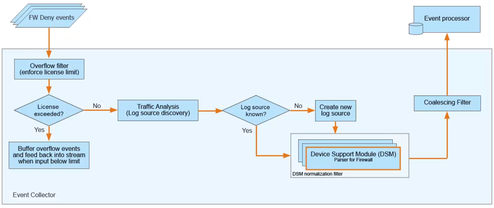

+ The Event Collector now sends the normalized FW deny events to an Event Processor (can be more than 1 collectors)
+ After reaching the event processor, the overflow filter counts the incoming normalized events (*limit!*)
+ The Custom Rule Engine evaluates every single event against every active rule
+ If no rules match the event, it is dropped from further processing - if 1 or more rules fire, it's marked for further processing and passed to the console
+ A new offense will be created or the event will be added to any number of existing offenses
+ Additionally, the CRE can stream every incoming event to the *Log Activity* tab, if configured
+ The Event Storage component stores all events (& flows) in the Ariel DB
+ The filter then passes data to the Accumulator
+ The Accumulator manages all the defined searches (Reports, Dashboards, etc) that have been set up on the console
+ Based on the search params, the Acc stores data in the Acc Ariel DB
+ These data are later used by the console to display results through the UI/by creating reports
+ Host Profiler receives evt data & searches for any new host, port or service evts
  - if detected, they're sent to the Console's Vulnerability Information Server

*The following image refers to event processing*

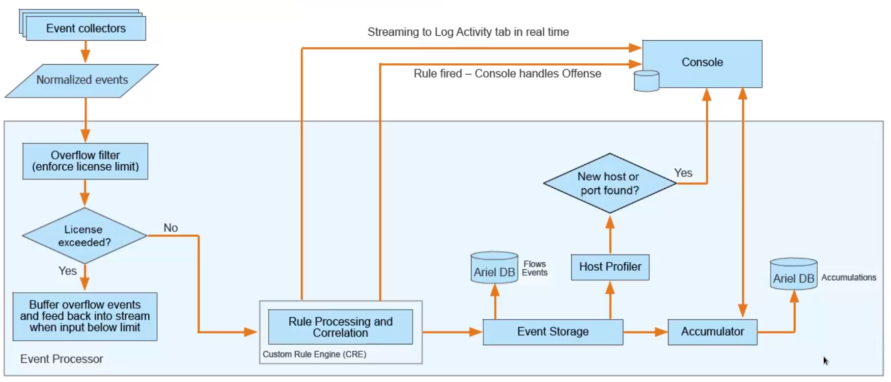

+ The EP sends processed evts to the console for final processing (can come from multiple EPs)
+ Overflow filter does its thing (limit and stuff)
+ Magistrate processes the events from EP
+ Based on Index Property and Index Property Value, these evts need to be raised as an offense
+ The CRE checks if the evts are to be assigned to a new offense or an already existing offense
+ If Magistrate needs additional evt and flow records, it utilizes the Ariel Proxy to query the db
+ The Anomaly Detection Engine examines rules based on a threshold number, anomaly and behaviour
+ The VIS receives information about new hosts or ports that are not yet contained in its Asset db
  - new assets are added to the PostgreSQL Asset db

*The following image refers to the console processes*

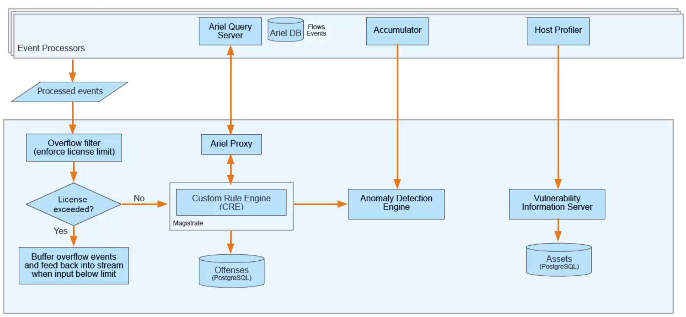

##### Summary

