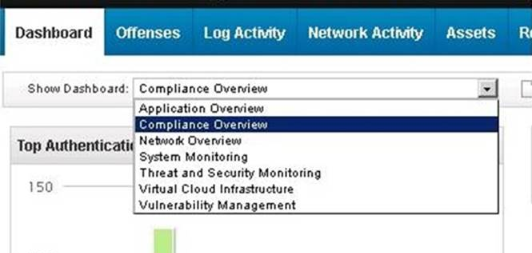

1. Which type of search uses a structured query language to retrieve specific fields from the events, flows, and simarc tables?

+ Add filter
+ Asset Search
+ Quick Search
+ **Advanced Search - ✔**

2. What is indicated by an event on an existing log in QRadar that has a Low Level Category of “Unknown”?

+ That event could not be parsed
+ That event arrived out of order from the original device
+ That event was from a device that is not supported by QRadar
+ **That the event was parsed, but not mapped to an existing QRadar category - ✔**

3. A Security Analyst found multiple connection attempts from suspicious remote IP addresses to a local host on the DMZ over port 80. After checking related events no successful exploits were detected. Upon checking international documentation, this activity was part of an expected penetration test which requires no immediate investigation. How can the Security Analyst ensure results of the penetration test are retained?

+ Hide the offense and add a note with a reference to the penetration test findings
+ **Protect the offense to not allow it to delete automatically after the offense retention period has elapsed - ✔**
+ Close the offense and mark the source IP for Follow-Up to check if there are future events from the host
+ Email the Offense Summary to the penetration team so they have the offense id, add a note, and close the Offense

4. Which list is only Rule Actions?

+ **Modify Credibility; Send SNMP trap; Drop the Detected Event; Dispatch New Event. - ✔**
+ Modify Credibility; Annotate Event; Send to Forwarding Destinations; Dispatch New Event.
+ Modify Severity; Annotate Event; Drop the Detected Event; Ensure the detected event is part of an offense.
+ Modify Severity; Send to Forwarding Destinations; Drop the Detected Event; Ensure the detected event is part of an offense.

5. What are the two available formats for exporting event and flow data for external analysis? (Choose two.)

+ **XML B. DOC - ✔**
+ PDF
+ **CSV - ✔**
+ HTML

6. Which type of tests are recommended to be placed first in a rule to increase efficiency?

+ Custom property tests
+ **Normalized property tests - ✔**
+ Reference set lookup tests
+ Payload contains regex tests

7. When reviewing Network Activity, a flow shows a communication between a local server on port 443, and a random, remote port. The bytes from the local destination host are 2 GB, and the bytes from the remote, source host address are 40KB. What is the flow bias of this session?

+ Mostly in
+ Near-same
+ **Mostly out  - ✔**
+ Other

8. Which pair of options are available in the left column on the Reports Tab?

+ Reports and Owner
+ **Reports and Branding - ✔**
+ Reports and Report Grouping
+ Reports and Scheduled Reports

9. Which QRadar rule could detect a possible potential data loss?

+ Apply “Potential data loss” on event of flows which are detected by the local system and when any IP is part of any of the following XForce premium Premium_Malware
+ Apply “Potential data loss” on flows which are detected by the local system and when at least 1000 flows are seen with the same Destination IP and different Source IP in 2 minutes
+ Apply “Potential data loss” on events which are detected by the local system and when the event category for the event is one of the following Authentication and when any of Username are contained in any of Terminated_User
+ **Apply “Potential data loss” on flows which are detected by the local system and when the source bytes is greater than 200000 and when at least 5 flows are seen with the same Source IP, Destination IP, Destination Port in 12 minutes  - ✔**

10. What is a Device Support Module (DSM) function within QRadar?

+ Unites data received from logs
+ Provides Vendor specific configuration information
+ Scans log information based on a set of rules to output offenses
+ **Parses event information for SIEM products received from external sources  - ✔**

11. Which file type is available for a report format?

+ TXT
+ DOC
+ **PDF - ✔**
+ PowerPoint

12. What is the default reason for closing an Offense within QRadar?

+ Actioned
+ **Non-Issue  - ✔**
+ Blocked Traffic
+ Acceptable Traffic

13. How does flow data contribute to the Asset Database?

+ Correlated Flows are used to populate the Asset Database.
+ It provides administrators visibility on how systems are communicating on the network.
+ **Flows are used to enrich the Asset Database except for the assets that were discovered by scanners. - ✔**
+ It delivers vulnerability and ports information collected from scanners responsible for evaluating network assets.

14. Which saved searches can be included on the Dashboard?

+ **Event and Flow saved searches - ✔**
+ Asset and Network saved searches
+ User and Vulnerability saved searches
+ Network Activity and Risk saved searches

15. What is the key difference between Rules and Building Blocks in QRadar?

+ **Rules have Actions and Responses; Building Blocks do not. - ✔**
+ The Response Limiter is available on Building Blocks but not on Rules.
+ Building Blocks are built-in to the product; Rules are customized for each deployment.
+ Building Blocks are Rules which are evaluated on both Flows and Events; Rules are evaluated on Offenses of Flows or Events.

16. Which Anomaly Detection Rule type can test events or flows for volume changes that occur in regular patterns to detect outliers?

+ Outlier Rule
+ Anomaly Rule
+ Threshold Rule
+ **Behavioral Rule - ✔**

17. Given these default options for dashboards on the QRadar Dashboard Tab, which will display a list of offenses?

+ Network Overview
+ System Monitoring
+ Vulnerability Management
+ **Threat and Security Monitoring - ✔**

18. What is an example of the use of a flow data that provides more information than an event data?

+ Represents a single event on the network
+ Automatically identifies and better classifies new assets found on a network
+ Performs near real-time comparisons of application data with logs sent from security devices
+ **Represents network activity by normalizing IP addresses ports, byte and packet counts, as well as other details - ✔**

19. What is a primary goal with the use of building blocks?

+ A method to create reusable rule responses
+ **A reusable test stack that can be used in other rules - ✔**
+ A method to generate reference set updates without using a rule
+ A method to create new events back into the pipeline without using a rule

20. Which two are top level options when right clicking on an IP Address within the Offense Summary page? (Choose two.)

+ WHOIS
+ **Navigate - ✔**
+ DNS Lookup
+ **Information - ✔**
+ Asset Summary Page

21. Which three pages can be accessed from the Navigation menu on the Offenses tab? (Choose three.)

+ **Rules - ✔**
+ **By Category - ✔**
+ **My Offenses - ✔**
+ By Event Name
+ Create Offense
+ Closed Offenses

22. What is a capability of the Network Hierarchy in QRadar?

+ **Determining and identifying local and remote hosts - ✔**
+ Capability to move hosts from local to remote network segments
+ Viewing real-time PCAP traffic between host groups to isolate malware
+ Controlling DHCP pools for segments groups (i.e. marketing, DMZ, VoIP)

23. What is the difference between TCP and UDP?

+ They use different port number ranges
+ **UDP is connectionless, whereas TCP is connection based - ✔**
+ TCP is connectionless, whereas UDP is connection based
+ TCP runs on the application layer and UDP uses the Transport layer

24. Which QRadar component is designed to help increase the search speed in a deployment by allowing more data to remain uncompressed?

+ **QRadar Data Node - ✔**
+ QRadar Flow Processor
+ QRadar Event Collector
+ Qradar Event Processor

25. What is the maximum number of supported dashboards for a single user?

+ 10
+ 25
+ **255 - ✔**
+ 1023

26. Which device uses signatures for traffic analysis when deployed in a network environment to detect, allow, block, or simulated-block traffic?

+ Proxy
+ QRadar
+ Switch
+ **IDS/IPS - ✔**

27. Which Anomaly Detection Rule type is designed to test event and flow traffic for changes in short term events when compared against a longer time frame?

+ Outlier Rule
+ **Anomaly Rule - ✔**
+ Threshold Rule
+ Behavioral Rule (???)

28. Which QRadar component provides the user interface that delivers real-time flow views?

+ QRadar Viewer
+ **QRadar Console - ✔**
+ QRadar Flow Collector
+ QRadar Flow Processor

29. Which log source and protocol combination delivers events to QRadar in real time?

+ Sophos Enterprise console via JDBC
+ McAfee ePolicy Orchestrator via JDBC
+ **McAfee ePolicy Orchestrator via SNMP - ✔**
+ Solaris Basic Security Mode (BSM) via Log File Protocol

30. Which kind of information do log sources provide?

+ **User login actions - ✔**
+ Operating system updates
+ Flows generated by users
+ Router configuration exports.

31. How does a Device Support Module (DSM) function?

+ A DSM is a configuration file that combines received events from multiple log sources and displays them as offenses in QRadar.
+ A DSM is a background service running on the QRadar appliance that reaches out to devices deployed in a network for configuration data.
+ **A DSM is a configuration file that parses received events from multiple log sources and converts them to a standard taxonomy format that can be displayed as outputs - ✔**
+ A DSM is an installed appliance that parses received events from multiple log sources and converts them to a standard taxonomy format that can be displayed as outputs.

32. Which browser is officially supported for QRadar?

+ Safari version 9.0.3
+ Chromium version 33
+ 32-bit Internet Explorer 9
+ **Firefox version 38.0 ESR - ✔**

33. A Security Analyst has noticed that an offense has been marked inactive. How long had the offense been open since it had last been updated with new events or flows?

+ 1 day + 30 minutes
+ **5 days + 30 minutes - ✔**
+ 10 days + 30 minutes
+ 30 days + 30 minutes

34. What is a primary benefit of building blocks?

+ They can notify users of strange behavior.
+ They allow the execution of its test within all rules.
+ **They generate new events into the pipeline before rules fire. - ✔**
+ They allow for report results to be used in custom rules tests.

35. What is the difference between Rule Actions and Rule Responses?

+ Rule Actions are executed when the Rule is Disabled; Rule Responses require the Rule to be Enabled.
+ Rule Actions are only available for Event and Flow Rules; Rule Responses are available for all Rules.
+ **Rule Actions only directly affect the SIEM internals; Rule Responses may send information to external systems. - ✔**
+ Rule Responses are always processed; Rule Actions may be throttled to ensure they are not executed too frequently.

36. What are two benefits of using a netflow flow source? (Choose two.)

+ They can include data payload.
+ **They can include router interface information. - ✔**
+ They can include usernames involved in the flow.
+ **They can include ASN numbers of remote addresses. - ✔**
+ They can include authentication methods used to access the network

37. Which capability is common to both Rules and Building Blocks?

+ Rules and Building Blocks both set the Magnitude of an Event.
+ **Rules and Building Blocks both have the same selection of sets. - ✔**
+ Rules and Building Blocks can both be Enabled/Disabled through the GUI.
+ Rules and Building Blocks both have Actions; Building Blocks do not have Responses.

38. Which two actions can be performed on the Offense tab? (Choose two.)

+ **Adding notes - ✔**
+ Deleting notes
+ **Hiding offenses - ✔**
+ Deleting offenses
+ Creating offenses

39. What ability does marking a custom property as “optimized” provide?

+ **Allows you to use the custom property in a rule test - ✔**
+ Allows you to process events above your license rating
+ Allows offenses to merge both events & flows into the same offense
+ Allows for offenses, events & flows to be compared directly in real time

40. Given the following window, what are the steps to get this window within an offense?

+ **Right click on the IP > Information > DNS Lookup - ✔**
+ Right click on the IP > Information > Reverse DNS
+ Right click on the IP > Information > WHOIS Lookup
+ Right click on the IP > Information > Asset Profile

41. A Security Analyst is looking on the Assets Tab at an asset with offenses associated to it. With a “Right Click” on the IP address, where could the Security Analyst go to obtain all offenses associated with it?

+ **Information > Asset Profile - ✔**
+ Navigate > View by Network
+ Run Vulnerability Scan > Source offenses
+ Navigate > View Source Summary or Destination
+ Summary

42. Which column shows information as icons on the Reports tab?

+ Owner
+ **Formats - ✔**
+ Schedule
+ Report Name

43. Events and Flows both have multiple different timestamps available to them. Which timestamp is available to both events and flows?

+ End Time
+ **Storage Time - ✔**
+ First Activity Time
+ Last Activity Time

44. Which three could be considered a log source type? (Choose three.)

+ Red Hat Network
+ **IBM ISS Proventia - ✔**
+ QRadar Event Processor
+ **Check Point Firewall-1 - ✔**
+ Sourcefire Flow Injector
+ **McAfee ePolicy Orchestrator - ✔**

45. What are two common uses for a SIEM? (Choose two.)

+ **Managing and normalizing log source data - ✔**
+ **Identifying viruses based on payload MD5s - ✔**
+ Blocking network traffic based on rules matched
+ Enforcing governmental compliance auditing and remediation
+ Performing near real-time analysis and observation of a network and its devices
