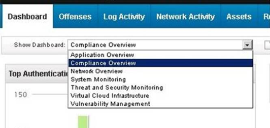

1. Where can a user add a note to an offense in the user interface? - Offenses Tab and Offense Detail Window (*Reference: IBM Security QRadar SIEM Users Guide. Page: 34*)
2. When might a Security Analyst want to review the payload of an event? - When the event is associated with an active offense, the payload may contain information that is not normalized or extracted fields
3. Which key elements does the Report Wizard use to help create a report? - Layout, Container, Content (*Reference: IBM Security QRadar SIEM Users Guide. Page: 201*)
4. How is an event magnitude calculated? - As a weighted mean of the three properties Severity, Credibility and Relevance of the Event
5. What is a benefit of using a span port, mirror port, or network tap as flow sources for QRadar? - These sources include payload for layer 7 application analysis; [Reference here](ttps://www.ibm.com/developerworks/community/forums/html/topic?id=dd3861e0-f630-4a53-94c3­b426a47b6e02)
6. What is the primary goal of data categorization and normalization in QRadar? - It allows data from different kinds of devices to be compared.
7. Which set of information is provided on the asset profile page on the assets tab in addition to ID? - IP Address, Operating System, MAC Address, Services; [Reference here](https://www.ibm.com/support/knowledgecenter/SS42VS_7.2.1/com.ibm.qradar.doc_7.2.1/c_qradar_ug_asset_sum.html)
8. Which type of search uses a structured query language to retrieve specified fields from the events, flows, and simarc tables? - Advanced Search; [Reference here](http://www.ibm.com/support/knowledgecenter/en/SS42VS_7.2.7/com.ibm.qradar.doc/c_qradar_ug_search_bar.html)
9. When using the right click event filtering functionality on a Source IP, one can filter by `Source IP is not [\*]`. Which two other filters can be shown using the right click event filtering functionality? (Choose two.) - Filter on Source IP is [\*] and Filter on Source or Destination IP is [\*]
10. What is indicated by an event on an existing log in QRadar that has a Low Level Category of `Unknown`? - That the event was parsed, but not mapped to an existing QRadar category
11. A Security Analyst found multiple connection attempts from suspicious remote IP addresses to a local host on the DMZ over port 80. After checking related events no successful exploits were detected. Upon checking international documentation, this activity was part of an expected penetration test which requires no immediate investigation. How can the Security Analyst ensure results of the penetration test are retained? - Email the Offense Summary to the penetration team so they have the offense id, add a note, and close the Offense; [Reference here](http://www.ibm.com/support/knowledgecenter/SSKMKU/com.ibm.qradar.doc/c_qradar_Off_Retention.html)
12. Which list is only Rule Actions? - Modify Credibility; Send SNMP trap; Drop the Detected Event; Dispatch New Event; [Reference here](http://www.ibm.com/support/knowledgecenter/SSKMKU/com.ibm.qradar.doc/t_qradar_create_cust_rul.html)
13. What are the two available formats for exporting event and flow data for external analysis? (Choose two.) - XML and CSV
14. Which information can be found under the Network Activity tab? - Flows
15. Which type of tests are recommended to be placed first in a rule to increase efficiency? - Normalized property tests
16. When reviewing Network Activity, a flow shows a communication between a local server on port 443, and a random, remote port. The bytes from the local destination host are 2 GB, and the bytes from the remote, source host address are 40KB. - Mostly out
17. Which pair of options are available in the left column on the Reports Tab? - Reports and Branding
18. Which QRadar rule could detect a possible potential data loss? - Apply “Potential data loss” on flows which are detected by the local system and when the source bytes is greater than 200000 and when at least 5 flows are seen with the same Source IP, Destination IP, Destination Port in 12 minutes
19. What is the default view when a user first logs in to QRadar? - Dashboard tab; [Reference here](http://www.ibm.com/support/knowledgecenter/SSKMKU/com.ibm.qradar.doc/c_qradar_dash_tab.html)
20. What is a Device Support Module (DSM) function within QRadar? - Parses event information for SIEM products received from external sources
21. Which file type is available for a report format? - PDF
22. What is the default reason for closing an Offense within QRadar? - Non-issue; [Reference here](https://www.ibm.com/support/knowledgecenter/SS42VS_7.2.1/com.ibm.qradar.doc_7.2.1/t_qradar_closing_offenses.html?pos=2)
23. How does flow data contribute to the Asset Database? - Flows are used to enrich the Asset Database except for the assets that were discovered by scanners.
24. Where are events related to a specific offense found? - Offenses Tab and Event List window
25. While on the Offense Summary page, a specific Category of Events associated with the Offense can be investigated. Where should a Security Analyst click to view them? - Highlight the Category and click the Events icon (*Reference: IBM Security QRadar SIEM Users Guide. Page: 42*)
26. Which QRadar add-on component can generate a list of the unencrypted protocols that can communicate from a DMZ to an internal network? - QRadar Risk Manager
27. What are the various timestamps related to a flow? - First Packet Time, Storage Time, Last Packet Time
28. What is a common purpose for looking at flow data? - To see how much information was sent from a desktop to a remote website
29. Which saved searches can be included on the Dashboard? - Event and Flow saved searches
30. What is the key difference between Rules and Building Blocks in QRadar? - Rules have Actions and Responses; Building Blocks do not.
31. Which Anomaly Detection Rule type can test events or flows for volume changes that occur in regular patterns to detect outliers? - Behavioral Rule; [Reference here](http://www.ibm.com/support/knowledgecenter/en/SS42VS_7.2.7/com.ibm.qradar.doc/ c_qradar_rul_anomaly_detection.html)
32. Given these default options for dashboards on the QRadar Dashboard Tab: Which will display a list of offenses? - Threat and Security Monitoring; [Reference here](Reference: http://www-01.ibm.com/support/docview.wss?uid=swg21682445)

33. What is an example of the use of a flow data that provides more information than an event data?
34. What is a primary goal with the use of building blocks? - A reusable test stack that can be used in other rules
35. Which two are top level options when right clicking on an IP Address within the Offense Summary page? (Choose two.) - Navigate and Information options
36. Which three log sources are supported by QRadar? (Choose three.) - Oracle Database Listener, Sourcefire Defense Center, Java Database Connectivity (JDBC)
37. Which three pages can be accessed from the Navigation menu on the Offenses tab? (Choose three.) - Rules, By Category and My Offenses
38. What is a capability of the Network Hierarchy in QRadar? - Determining and identifying local and remote hosts; [Reference here](http://www.ibm.com/support/knowledgecenter/SS42VS_7.2.7/com.ibm.qradar.doc/c_qradar_gs_ntwrk_hrchy.html)
39. An event is happening regularly and frequently; each event indicates the same target username. There is a rule configured to test for this event which has a rule action to create an offense indexed on the username. What will QRadar do with the triggered rule assuming no offenses exist for the username and no offenses are closed during this time? - Events will be tagged with the rule name as long as the Rule Response limiter is satisfied. Only one offense will be created.
40. What is the difference between TCP and UDP? - UDP is connectionless, whereas TCP is connection based
41. Which QRadar component is designed to help increase the search speed in a deployment by allowing more data to remain uncompressed? - QRadar Data Node
42. What is the maximum number of supported dashboards for a single user? - 255; [Reference here](http://www.ibm.com/support/knowledgecenter/SS42VS_7.2.7/com.ibm.qradar.doc/c_qradar_custom_dboard.html)
