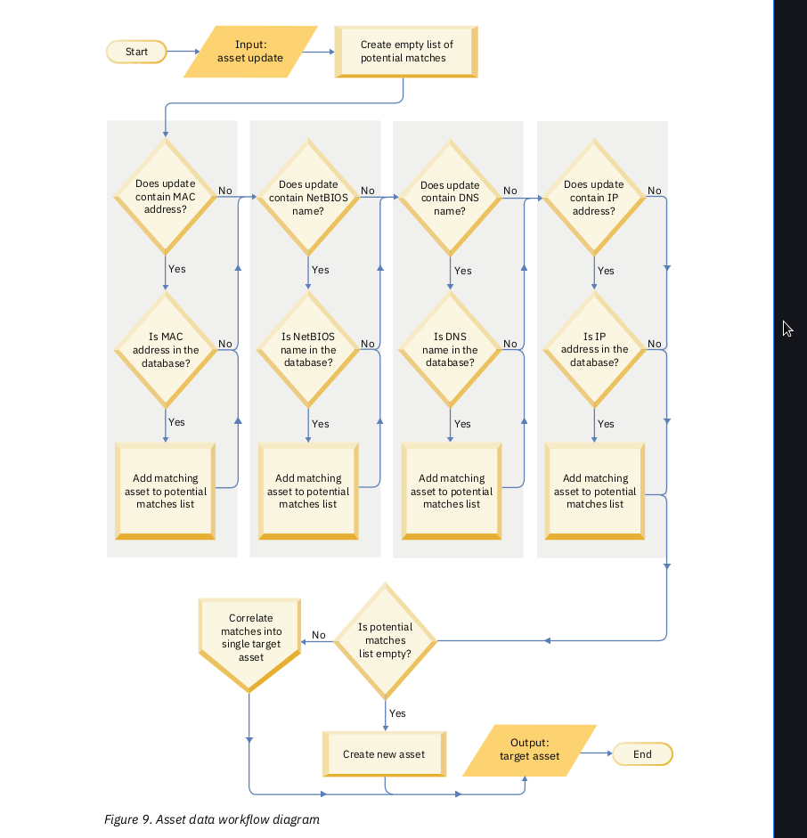

> The **Dashboard** tab supports multiple dashboards where you can display your views of network security,
activity, or data that QRadar collects. Five default dashboards are available. Each dashboard contains
items that provide summary and detailed information about offenses that occur on your network.
___
> From the **Offenses** tab, you can investigate an offense to determine the root cause of an issue, and then
work to resolve it.
___
> Investigate event logs that are sent to QRadar in real-time, perform powerful searches, and view log
activity by using configurable time-series charts.

> Use the **Log Activity** tab to perform in-depth investigations on event data.
___

> Use the **Network Activity** tab to investigate flows that are sent in real-time, perform powerful searches, and view network activity by using configurable time-series charts. A *flow* is a communication session between two hosts.
___

> QRadar automatically discovers assets, servers, and hosts that are operating on your network.
Automatic discovery is based on passive flow data and vulnerability data, allowing QRadar to build an
asset profile.
___

> Asset profiles provide information about each known asset in your network, including identity
information, if available, and what services are running on each asset. This profile data is used for
correlation purposes to help reduce false positives. Using the Assets tab, you can view the learned assets or search for specific assets to view their profiles.
___

> Use the Reports tab to create, distribute, and manage reports for any data within QRadar.
___

> IBM QRadar Risk Manager is a separately installed appliance for monitoring device configurations,
simulating changes to your network environment, and prioritizing risks and vulnerabilities in your
network.
___

*Viewing notifications*

> The Notifications menu provides access to a window in which you can read and manage your system notifications.

> For system notifications to show on the Notifications window, the administrator must create a rule that is
based on each notification message type and select the Notify check box in the Custom Rules Wizard.

> The Messages menu indicates how many unread system notifications you have in your system. This
indicator increments the number until you close system notifications. For each system notification, the Messages window provides a summary and the date stamp for when the system notification was created.
You can hover over a notification to view more details. You can use the functions on the Messages
window to manage the system notifications. If you close a system notification from the Messages window, the system notification is removed from all system notification displays.
___

> The Dashboard tab automatically refreshes every 60 seconds.
___

> The Log Activity and Network Activity tabs automatically refresh every 60 seconds if you are viewing the tab in Last Interval (auto refresh) mode. When you view the Log Activity or Network Activity tab in Real Time (streaming) or Last Minute (auto refresh) mode, you can use the Pause icon to pause the current display.
___

> The Offenses tab must be refreshed manually. The timer indicates the amount of time since the data was last refreshed. The timer flashes red when the timer is paused.

***The IP right-click tab***

| Tab         | Name                      |
| :---------- | :------------------------ |
| Navigate    | View by Network           |
| Navigate    | View Source Summary       |
| Navigate    | View Destination Summary  |
| Information | DNS lookup                |
| Information | WHOIS lookup              |
| Information | Port Scan                 |
| Information | Asset profile             |
| Information | Search Events             |
| Information | Search Flows              |
| Information | Search Connections        |
| Information | Switch port lookup        |
| Information | View Topology             |
| N/A         | Run vulnerability scan    |
___

> The upper right of the QRadar console displays the system time, which is the local time on the console. In a distributed deployment, the console might be in a different time zone from your desktop computer.
___

> QRadar user passwords are stored as a salted SHA-256 string.
___

> The Dashboard tab is the default view when you log in.

> The content that is displayed on the Dashboard tab is user-specific. Changes that are made within a session affect only your system.
___

> The Dashboard tab provides five default dashboards that are focused on security, network activity, application activity, system monitoring, and compliance.
___

*Application Overview*
+ Inbound Traffic by Country (Total Bytes)
+ Outbound Traffic by Country (Total Bytes)
+ Top Applications (Total Bytes)
+ Top Applications Inbound from Internet (Total
Bytes)
+ Top Applications Outbound to the Internet (Total
Bytes)
+ Top Services Denied through Firewalls (Event
Count)
+ DSCP - Precedence (Total Bytes)
___

*Compliance Overview*
+ Top Authentications by User (Time Series)
+ Top Authentication Failures by User (Event
Count)
+ Login Failures by User (real-time)
+ Compliance: Username Involved in Compliance
Rules (time series)
+ Compliance: Source IPs Involved in Compliance
Rules (time series)
+ Most Recent Reports
___

*Network Overview*
+ Top Talkers (real time)
+ ICMP Type/Code (Total Packets)
+ Top Networks by Traffic Volume (Total Bytes)
+ Firewall Deny by DST Port (Event Count)
+ Firewall Deny by DST IP (Event Count)
+ Firewall Deny by SRC IP (Event Count)
+ Top Applications (Total Bytes)
+ Link Utilization (real-time)
+ DSCP - Precedence (Total Bytes)
___

*System Monitoring*
+ Top Log Sources (Event Count)
+ Link Utilization (real-time)
+ System Notifications
+ Event Processor Distribution (Event Count)
+ Event Rate (Events per Second Coalesced -
Average 1 Min)
+ Flow Rate (Flows per Second - Peak 1 Min)
___

*Threat and Security Monitoring*
+ Default-IDS/IPS-All: Top Alarm Signatures (real-
time)
+ Top Systems Attacked (Event Count)
+ Top Systems Sourcing Attacks (Event Count)
+ My Offenses
+ Most Severe Offenses
+ Most Recent Offenses
+ Top Services Denied through Firewalls (Event
Count)
+ Internet Threat Information Center
+ Flow Bias (Total Bytes)
+ Top Category Types
+ Top Sources
+ Top Local Destinations
___

> 255 dashboards per user is the maximum

> To create custom items, you can create saved searches on the Network Activity or Log Activity tabs and choose how you want the results that are represented in your dashboard.

> Time series graphs on the dashboard refresh every 5 minutes.

> Flow search items are listed in the **Add Item > Network Activity > Flow Searches** menu.

> On a flow search dashboard item, search results display real-time last-minute data on a chart. The supported chart types are ***time series, table, pie, and bar***.

> **Note:** Hidden or closed offenses are not included in the values that are displayed in the **Dashboard** tab.

*Offense items*:
+ Most Recent Offenses
+ Most Severe Offenses
+ Most Severe Offenses
+ Top Sources
+ Top Local Destinations
+ Categories
___

*Log Activity items*

> The **Log Activity** dashboard items will allow you to monitor and investigate events in real time.

> **Note:** Hidden or closed events are not included in the values that are displayed in the **Dashboard** tab.

+ Event Searches
+ Events By Severity
+ Top Log Sources
___

> The **System Summary** dashboard item provides a high-level summary of activity within the past 24 hours.
___

> You use the **Risk Monitoring** dashboard to monitor policy risk and policy risk change for assets, policies and policy groups.

> The Risk Monitoring dashboard items do not display any results unless IBM QRadar Risk Manager is licensed.

> To view the default **Risk Monitoring** dashboard, select **Show Dashboard > Risk Monitoring** on the
**Dashboard** tab.
___

> Create a dashboard item that shows policy compliance pass rates and policy risk score for selected assets, policies, and policies groups.
___

> Vulnerability Management dashboard items are only displayed when IBM QRadar Vulnerability Manager is purchased and licensed.
___

> The Systems Notification dashboard item displays event notifications that are received by your system.

*On the System Notifications dashboard item, you can view the following information:*
+ Flag - Displays a symbol to indicate severity level of the notification. Point to the symbol to view more
detail about the severity level.
  – Health icon
  – Information icon (?)
  – Error icon (X)
– Warning icon (!)
+ Created - Displays the amount of time elapsed since the notification was created.
+ Description - Displays information about the notification.
+ Dismiss icon (x) - Will allow you to close a system notification.

*You can point your mouse over a notification to view more details:*
+ Host IP - Displays the host IP address of the host that originated the notification.
+ Severity - Displays the severity level of the incident that created this notification.
+ Low Level Category - Displays the low-level category that is associated with the incident that
generated this notification. For example: Service Disruption.
+ Payload - Displays the payload content that is associated with the incident that generated this
notification.
+ Created - Displays the amount of time elapsed since the notification was created.

> When you add the **System Notifications** dashboard item, system notifications can also display as pop-up notifications in the QRadar user interface. These pop-up notifications are displayed in the lower right corner of the user interface, regardless of the selected tab.

> Pop-up notifications are only available for users with administrative permissions and are enabled by default. To disable pop-up notifications, select **User Preferences** and clear the **Enable Pop-up
Notifications** check box.

The **system notification** pop-up window provides the following options:
+ Next icon (>) - Displays the next notification message. For example, if the current notification message is 3 of 6, click the icon to view 4 of 6.
+ Close icon (X) - Closes this notification pop-up window.
+ (details) - Displays more information about this system notification.
___

> To view a summary of the advisory, click the **Arrow** icon next to the advisory. To investigate the full advisory, click the associated link.
___

Create a custom **Dashboard**:
1. Click the Dashboard tab.
2. Click the New Dashboard icon.
3. In the Name field, type a unique name for the dashboard. The maximum length is 65 characters.
4. In the Description field, type a description of the dashboard. The maximum length is 255 characters. This description is displayed in the tooltip for the dashboard name in the Show Dashboard list box.
5. Click OK.
___

> Search-based dashboard items provide a link to the Log Activity or Network Activity tabs, allowing you to further investigate log or network activity.
___

> The chart types that are displayed on the **Log Activity** or **Network Activity** tab depend on which chart is configured in the dashboard item:
___

> Your custom chart configurations are retained, so that they are displayed as configured each time that you access the **Dashboard** tab.
___

> When you remove an item from the dashboard, the item is not removed completely.
___

> To add an event and flow search dashboard item to the Add Item menu on the Dashboard tab, you must access the Log Activity or Network Activity tab to create search criteria that specifies that the search results can be displayed on the Dashboard tab. The search criteria must also specify that the results are grouped on a parameter.
___

The magnitude rating of an offense is calculated based on relevance, severity, and credibility.
+ *Relevance* determines the impact of the offense on your network. For example, if a port is open, the relevance is high.
+ *Credibility* indicates the integrity of the offense as determined by the credibility rating that is configured in the log source. Credibility increases as multiple sources report the same event.
+ *Severity* indicates the level of threat that a source poses in relation to how prepared the destination is for the attack.

The following information is considered when the offense magnitude is calculated:
+ the number of events and flows that are associated with the offense
+ the number of log sources
+ the age of the offense
+ the weight of the assets associated with the offense
+ the categories, severity, relevance, and credibility of the events and flows that contribute to the offense
+ the vulnerabilities and threat assessment of the hosts that are involved in the offense
___

> IBM QRadar chains offenses together to reduce the number of offenses that you need to review.

> Offense chaining is based on the offense index field that is specified on the rule.
___

> Offense indexing provides the capability to group events or flows from different rules indexed on the same property together in a single offense.

> If the field that you want to index on is not included in the normalized fields, create a custom event or a custom flow property to extract the data from the payload and use it as the offense indexing field in your rule. The custom property that you index on can be based on a regular expression, a calculation, or an AQL-based expression.
___

***Rule action and response***

> When the indexed property value is null, an offense is not created, even when you select the **Ensure the detected event is part of an offense** check box in the rule action.

> When the response limiter uses a custom property, and the custom property value is null, the limit is applied to the null value.

> An event rule accepts custom event properties in the rule index and response limiter fields, while a flow rule accepts only custom flow properties.
___

> The offense retention period determines how long inactive and closed offenses are kept before they are removed from the QRadar console,

*Active offenses*
> When new events are evaluated, the offense clock is reset to keep the offense active for another 30 minutes.

*Dormant offenses*
> An offense becomes dormant if new events or flows are not added to the offense within 30 minutes, or if QRadar did not process any events within 4 hours. An offense remains in a dormant state for 5 days. If an event is added while an offense is dormant, the five-day counter is reset.

*Inactive offenses*
> An offense becomes inactive after 5 days in a dormant state. In the inactive state, new events that trigger the offense rule test do not contribute to the inactive offense. They are added to a new offense. Inactive offenses are removed after the offense retention period elapses.

*Closed offenses*
> The default offense retention period is 30 days. You can protect an offense to prevent it from being removed when the retention period expires.
___

> You can protect offenses to prevent them from being removed from QRadar after the retention period has elapsed.
___

> IBM QRadar uses rules to monitor the events and flows in your network to detect security threats. When the events and flows meet the test criteria that is defined in the rules, an offense is created to show that a security attack or policy breach is suspected.

> All users who have access to the network can view all offenses regardless of which log source or flow source is associated with the offense
___

> The Offenses tab shows the suspected security attacks and policy breaches that are occurring on your network. Offenses are listed with the highest magnitude first.

> To view offenses grouped on the high-level category, click **By Category**.

> To view low-level category groups for a particular high-level category, click the arrow icon next to
the high-level category name.

> The bottom of the Offense Summary page groups information about top contributors to the offense.

> **Status:** QRadar does not display a status icon when an offense is active.

Review the information in the top portion of the **Offense Summary** window to learn more about the type of attack and the time frame when it occurred.

> **Offense Type:** The offense type is determined by the rule that created the offense. The offense type determines what type of information is displayed in the **Offense Source Summary** pane.

> **Event/Flow count:** To see the list of events and flows that contributed to the offense, click the **Event** or **Flow** links.

> **Source IP:** Specifies the device that attempts to breach the security of a component on your network. The device can have an IPv4 or IPv6 address.

> **Destination IP:** Specifies the network device that the source IP address attempted to access. The network device can have an IPv4 or IPv6 address.

> **Start:** Specifies the date and time when the first event or flow occurred for the offense.

> **Duration:** Specifies the amount of time that elapsed since the first event or flow associated with the offense was created.

> **Network(s):** Specifies the local networks of the local destination IP addresses that were targeted. The system does not associate remote networks to an offense, even if they are specified as a remote network or a remote service on the **Admin** tab.

The information that is shown in the **Offense Source Summary** window depends on the **Offense Type** field.

> **Chained:** Specifies whether the destination IP address is chained. A chained IP address is associated with other offenses.

> **Destination IP(s):** Specifies the network device that the source IP address attempted to access.

> **Source IP(s):** Specifies the device that attempted to breach the security of a component on your network.

> **Username:** Specifies the user name that is associated with the event or flow that created the offense.

> **Vulnerabilities:** Specifies the number of identified vulnerabilities that are associated with the source or destination IP address. This value also includes the number of active and passive vulnerabilities.

When you view the summary information for historical offenses, the Last Known data fields are not populated.

In the bottom portion of the **Offense Summary** window, review additional information about the offense top contributors, including notes and annotations that are collected about the offense.
___

> An event is a record from a log source, such as a firewall or router device, that describes an action on a network or host.

| Field           | Description                                                      |
| :-------------- | :--------------------------------------------------------------- |
| Start Time      | The time that QRadar received the raw event from the log source. |
| Storage Time    | The time that QRadar stored the normalized event.                |
| Log Source Time | The time that is recorded in the raw event from the log source.  |
___

> QRadar adds an icon to the Flag column when you assign an offense to a user, protect or hide an offense, add notes, or mark the offense for follow-up.
___

> If you have the **Manage Offense Closing** permission, you can add custom closing reasons.
___

> You can export offenses in Extensible Markup Language (XML) or comma-separated values (CSV) format. The resulting XML or CSV file includes the parameters that are specified in the Column Definition pane of the search parameters.
___

> By default, all new offenses are unassigned. You can assign an offense to an IBM QRadar user for investigation. **You must have the Assign Offenses to Users permission to assign offenses to users.**

> You can assign offenses to users from either the **Offenses** tab or **Offense Summary** pages.

> The **Assign To User** list displays only those users who have privileges to view the Offenses tab. The security profile settings for the user are followed as well.

***Sending email notifications***

*Share the offense summary information with another person by sending an email.*

*The body of the email message includes the following information, if available:*
+ Source IP address
+ Source user name, host name, or asset name
+ **Total number of sources**
+ **Top five sources by magnitude**
+ Source networks
+ Destination IP address
+ Destination user name, host name, or asset name
+ **Total number of destinations**
+ Top five destinations by magnitude
+ Destination networks
+ Total number of events
+ Rules that caused the offense or event rule to fire
+ Full description of the offense or event rule
+ Offense ID
+ **Top five categories**
+ Start time of the offense or the time the event was generated
+ Top five annotations
+ Link to the offense user interface
+ Contributing CRE rules

| Option          | Description                                                                                       |
| :-------------- | :------------------------------------------------------------------------------------------------ |
| Parameter       | Description                                                                                       |
| To              | Type the email address of the user you want to notify when a change occurs to theselected offense |
| From            | Type the originating email address. The default is root@localhost.com.                            |
| E-mail Subject  | Type the subject for the email. The default is Offense ID.                                        |
| Email Message   | TEmail Message Type the standard message that you want to accompany the notification email.       |
___

> Mark an offense for follow-up when you want to flag it for further investigation.
___

***An event is a record from a log source***

The **Log Activity** tab specifies which events are associated with offenses.

*Rules*
+ A threshold rule tests event traffic for activity that exceeds a configured threshold.
+ A behavioral rule tests event traffic for abnormal activity, such as the existence of new or unknown traffic
+ An anomaly rule tests event traffic for abnormal activity, such as the existence of new or unknown traffic

*Actions*
+ Show All
+ Print
+ Export to XML > Visible Columns
+ Export to XML > Full Export (All Columns)
+ Export to CSV >Visible Columns
+ Export to CSV > Full Export (All Columns)
+ Delete
+ Notify

**Quick Filter**

> Select Quick Filter from the list box to search payloads by using simple words or phrases.

The default view on the **Log Activity** tab is a stream of real-time events.

**Status bar**

> When streaming events, the status bar displays the average number of results that are received per second.

> This is the number of results the Console successfully received from the Event processors. If this number is greater than 40 results per second, only 40 results are displayed. The remainder is accumulated in the result buffer. To view more status information, move your mouse pointer over the status bar.

> When events are not being streamed, the status bar displays the number of search results that are currently displayed on the tab and the amount of time that is required to process the search results.
___

> Streaming mode will enable you to view event data that enters your system. This mode provides you with a real-time view of your current event activity by displaying the last 50 events. Streaming mode does not support searches that include grouped events. If you enable streaming mode on grouped events or grouped search criteria, the **Log Activity** tab displays the normalized events.

> When the streaming is paused, the last 1,000 events are displayed.
___

> Events are collected in raw format, and then normalized for display on the **Log Activity** tab.

*Current Statistics*
+ **Total Results** - Specifies the total number of results that matched your search criteria.
+ **Data Files Searched** - Specifies the total number of data files searched during the specified time span.
+ **Compressed Data Files Searched** - Specifies the total number of compressed data files searched within the specified time span.
+ **Index File Count** - Specifies the total number of index files searched during the specified time span.
+ **Duration** - Specifies the duration of the search.
___

+ *You can view raw event data, which is the unparsed event data from the log source.*
+ *You can view a list of events in various modes, including streaming mode or in event groups.*
+ *If an event matches a rule, an offense can be generated on the Offenses tab.*
+ *You can manually map a normalized or raw event to a high-level and low-level category (or QID).*
+ **Note:** *The Map Event icon is disabled for events when the high-level category is SIM Audit or the log source type is Simple Object Access Protocol (SOAP).*
___

**Before beginning**: You can tune false positive events from the **event list** or **event details** page.

You can tune false positive events from the **event list** or **event details** page.
___

You can export events in Extensible Markup Language (XML) or Comma-Separated Values (CSV) format.

*Actions list box*:
+ **Export to XML > Visible Columns**
+ **Export to XML > Full Export (All Columns)**
+ **Export to CSV > Visible Columns**
+ **Export to CSV > Full Export (All Columns)**
___________________________________________________

You can use the Network Activity tab to monitor and investigate network activity (flows) in real time or conduct advanced searches.

Tab toolbar options:
1. Search
  + New search
  + Edit search
  + Manage search results
1. Quick searches
1. Add filter
1. Save criteria
1. Save results
1. Cancel
1. False positive
1. Rules
  + Note: The anomaly detection rule options are visible only if you have the Network Activity > Maintain Custom Rules permission.
  + Add threshold rule
  + Add anomaly rule
1. Actions
  + Show all
  + Print
  + Export to XML
  + Export to CSV
  + Delete
  + Notify
1. Search toolbar
  + Advanced search
  + Quick filter
1. View

Right click:
1. Filter on
1. False positive
1. More options
1. Quick filter
___________________________________________________

Viewing normalized flows parameters:
1. Current filters
1. View
1. Current statistics
1. Charts
1. Offense icon
1. Flow type
1. First packet time
1. Storage time
1. Destination IP
1. Destination port
1. Source bytes
1. Destination bytes
1. Total bytes
1. Source packets
1. Destination packets
1. Total packets
1. Protocol
1. Application
1. ICMP type/code - (If the flow has ICMP type and code information in a known format, this field displays as Type <A>. Code <B>, where <A> and <B> are the numeric values of the type and code.)
1. Source flags - TCP/IP flags if applicable
1. Destination flags - same as the previous parameter
1. Source QoS
  + Best effort
  + Differentiated service
  + Guaranteed service
1. Destination QoS
1. Flow source
1. Flow Interface
1. Source IF Index - (InterFace Index)
1. Destination IF Index - (Same as previous)
1. Source ASN - autonomous system number
1. Destination ASN - same as previous

Extra parameters for IPv6:
1. Source IPv6
1. Destination IPv6
___________________________________________________

Grouped flow options:
1. Source/Destination IP
1. Source IP
1. Destination IP
1. Source port
1. Destination port
1. Source network
1. Destination network
1. Application
1. Geographic
1. Protocol
1. Flow bias
1. ICMP type
___________________________________________________

Grouped flow parameters:
1. Grouping by
1. Current filters
1. View
1. Current statistics
  + Total results
  + Data files searched
  + Compressed data files searched
  + Index file count
  + Duration
1. Charts
1. Source IP (Unique count)
1. Destination IP (Unique count)
1. Source port (Unique count)
1. Destination port (Unique count)
1. Source network (Unique count)
1. Destination network (Unique count)
1. Application (Unique count)
1. Source bytes (Sum)
1. Destination bytes (Sum)
1. Source packets (Sum)
1. Destination packets (Sum)
1. Total packets (Sum)
1. Count
___________________________________________________

The flow details page provides the following information:
1. **Flow information**
  + Protocol
  + Application
  + Magnitude
  + Relevance
  + Severity
  + Credibility
  + First packet time
  + Last packet time
  + Storage time
  + Event name
  + Low level category
  + Event description
1. **Source and destination information**
  + Source IP
  + Destination IP
  + Source asset name
  + Destination asset name
  + IPv6 source
  + IPv6 destination
  + Source port
  + Destination port
  + Source QoS
  + Destination QoS
  1. Source ASN
  + Destination ASN
  + Source If Index
  + Destination If Index
  + Source payload
  + Destination payload
1. **Payload information**
  + Source payload (w/ 3 formats):
    - Universal Transformation Format (UTF)
    - Hexadecimal (HEX)
    - Base64 (Base64)
  + Destination payload (same formats apply)
1. ***Additional information***
  + *Flow type* - they are all *unidirectional* and include:
    - ***Type A*** - Single to many
    - ***Type B*** - Many to single
    - ***Type C*** - Single to single
  + *Flow direction* - they include:
    - ***L2L*** - internal local-to-local traffic
    - ***L2R*** - internal local-to-remote traffic
    - ***R2L*** - internal remote-to-local traffic
  + Custom rules
  + Custom rules partially matched
  + Flow source/interface
  + Annotations

Flow details toolbar:
1. Return to results
1. Extract property
1. False positive
1. Previous
1. Next
1. Print
1. Offense
___________________________________________________

***Exporting flows***:
1. Click network activity tab
1. If in streaming mode, click pause to stop streaming temporarily
1. Select the desired option from actions:
  + *Export to XML > Visible columns*
  + *Export to XML > Full export (All columns)*
  + *Export to CSV > Visible columns*
  + *Export to CSV > Full export (All columns)*
1. To resume activities, click *Notify when done*
___________________________________________________

**Asset data**
> An asset is any network endpoint that sends or receives data across your network infrastructure. Every asset in the asset database is assigned a unique identifier so that it can be distinguished from other asset records.

**Asset profiles**
> An asset profile is a collection of all information that IBM QRadar SIEM collected over time about a specific asset. QRadar SIEM automatically creates asset profiles from identity events and bidirectional flow data or, if they are configured, vulnerability assessment scans. The asset name is derived from the information in the asset update in the following order of precedence:

+ Given name
+ NETBios host name
+ DNS host name
+ IP address

**Collecting asset data**
> Asset profiles are built dynamically from identity information that is passively absorbed from event or flow data, or from data that QRadar actively looks for during a vulnerability scan. You can also import asset data or edit the asset profile manually.
___________________________________________________

Asset data usually comes from one of the following asset data sources:
+ **Events** - This data is immediately provided to the asset database to help determine which asset the asset update applies to. Events are the primary cause for asset growth deviations.
+ **Flows** - Because asset data from flows is paired with an asset based on a single identifier, the IP address, flow data is never the cause of asset growth deviations.
+ **Vulnerability scanners** - It is possible for scanners to introduce asset growth deviations but it is rare.
+ **User interface** - Users who have the Assets role can import or provide asset information directly to the asset database. Asset updates that are provided by users do not introduce asset growth deviations.
+ **Domain-aware asset data** - When an asset data source is configured with domain information, all asset data that comes from that data source is automatically tagged with the same domain. Blank fields exist when the system did not receive this information in an asset update, or the information exceeded the asset retention period. The default retention period is 120 days. An IP address that appears as 0.0.0.0 indicates that the asset does not contain IP address information.



1. QRadar receives the event. The asset profiler examines the event payload for identity information.
2. If the identity information includes a MAC address, a NetBIOS host name, or a DNS host name that are already associated with an asset in the asset database, then that asset is updated with any new information.
3. If the only available identity information is an IP address, the system reconciles the update to the existing asset that has the same IP address.
4. If an asset update has an IP address that matches an existing asset but the other identity information does not match, the system uses other information to rule out a false-positive match before the existing asset is updated.
5. If the identity information does not match an existing asset in the database, then a new asset is created based on the information in the event payload.
___________________________________________________

***Asset reconciliation*** is the process of determining the relationship between asset updates and the related asset in the asset database. Asset reconciliation occurs after QRadar receives the update but before the information is written to the asset database.

**Identity information**

False positive asset matches occur when one physical asset is assigned ownership of an IP address that was previously owned by another asset in the system.

When multiple pieces of identity data are provided, the asset profiler prioritizes the information from the most deterministic to the least in the following order:
+ MAC address
+ NetBIOS host name
+ DNS host name
+ IP address

**Asset reconciliation exclusion rules**

By default, each piece of asset data is tracked over a two-hour period. If any one piece of identity data in the asset update exhibits suspicious behavior two or more times within 2 hours, that piece of data is added to the asset blacklists.

In domain-aware environments, the asset reconciliation exclusion rules track the behavior of asset data
separately for each domain.

**Asset merging**

Asset merging is the process where the information for one asset is combined with the information for another asset under the premise that they are actually the same physical asset.

Asset merging occurs when an asset update contains identity data that matches two different asset profiles.

**Identification of asset growth deviations**

Asset growth deviations occur when the number of asset updates for a single device grows beyond the limit that is set by the retention threshold for a specific type of the identity information.

**Threshold settings**

The Asset Profiler threshold settings specify the conditions under which an asset is blocked from updates.

**System notifications that indicate asset growth deviations**

The following system messages indicate that QRadar identified potential asset growth deviations:
+ `The system detected asset profiles that exceed the normal size threshold`
+ `The asset blacklist rules have added new asset data to the asset blacklists`

**Required user action**

The notification provides a link to a report of all assets that experienced deviating asset growth over the past 24 hours. QRadar administrators can increase the threshold limitsin the Asset Profiler Configuration on the QRadar Admin tab.

**Asset blacklists and whitelists**

+ An asset blacklist is a collection of data that IBM QRadar considers untrustworthy. Data in the asset blacklist is likely to contribute to asset growth deviations and QRadar prevents the data from being added to the asset database.

+ An asset whitelist is a collection of asset data that overrides the asset reconciliation engine logic about which data is added to an asset blacklist. When the system identifies a blacklist match, it checks the whitelist to see whether the value exists. Whitelisted asset data is applied globally for all domains.

**Asset blacklist**

Blacklisted asset data is applied globally for all domains.

*Reference collection names for asset blacklist data*

| Type of identity data | Reference collection name              | Reference collection type       |
| :-------------------- | :------------------------------------- | ------------------------------- |
| IP address (v4)       | Asset Reconciliation IPv4 Blacklist    | Reference Set [Set Type: IP]    |
| DNS host names        | Asset Reconciliation DNS Blacklist     | Reference Set [Set Type: ALNIC] |
| NetBIOS host names    | Asset Reconciliation NetBIOS Blacklist | Reference Set [Set Type: ALNIC] |
| MAC addresses         | Asset Reconciliation MAC Blacklist     | Reference Set [Set Type: ALNIC] |

*ALNIC is an alphanumeric type that can accommodate both host name and MAC address values.*
___________________________________________________

**Types of asset whitelists**

The following table shows the reference collection name and type for each type of identity asset data.

| Type of identity data | Reference collection name              | Reference collection type       |
| :-------------------- | :------------------------------------- | ------------------------------- |
| IP address (v4)       | Asset Reconciliation IPv4 Whitelist    | Reference Set [Set Type: IP]    |
| DNS host names        | Asset Reconciliation DNS Whitelist     | Reference Set [Set Type: ALNIC] |
| NetBIOS host names    | Asset Reconciliation NetBIOS Whitelist | Reference Set [Set Type: ALNIC] |
| MAC addresses         | Asset Reconciliation MAC Whitelist     | Reference Set [Set Type: ALNIC] |

**Asset profiles**

Asset profiles provide information about each known asset in your network, including what services are running on each asset. Asset profiles are automatically discovered if you have flow data or vulnerability assessment (VA) scans configured. For flow data to populate asset profiles, bidirectional flows are required. Asset profiles can also be automatically created from identity events.

**Vulnerabilities**

QRadar Vulnerability Manager is a component that you can purchase separately and enable using a license key. QRadar Vulnerability Manager is a network scanning platform that provides awareness of the vulnerabilities that exist within the applications, systems, or devices on your network.

**Assets tab overview**

Using the Assets tab, you can:
+ View all the discovered assets.
+ Manually add asset profiles.
+ Search for specific assets.
+ View information about discovered assets.
+ Edit asset profiles for manually added or discovered assets.
+ Tune false positive vulnerabilities.
+ Import assets.
+ Print or export asset profiles.
+ Discover assets.
+ Configure and manage third-party vulnerability scanning.
+ Start QRadar Vulnerability Manager scans.

**Viewing an asset profile**

Asset profile information is automatically discovered through Server Discovery or manually configured. You can edit automatically generated asset profile information.

The Asset Profile page toolbar provides the following functions:
1. Return to asset list
1. Display - The Asset Summary and Network Interface Summary panes are always displayed.
1. Edit asset
1. View by network
1. View source summary
1. View destination summary
1. History
1. Applications
1. Search connections - This option is only displayed when IBM QRadar Risk Manager has been purchased and licensed.
1. View topology - This option is only displayed when IBM QRadar Risk Manager has been purchased and licensed.
1. Actions
___________________________________________________

**Searching asset profiles**

The search feature will allow you to search host profiles, assets, and identity information. Identity information provides more detail about log sources on your network, including DNS information, user logins, and MAC addresses.

For example:
You receive a notification that CVE ID: CVE-2010-000 is being actively used in the field. To verify whether any hosts in your deployment are vulnerable to this exploit, you can select **Vulnerability External Reference** from the list of search parameters, select CVE, and then type the:

```
  2010-000
```

**Importing assets**

***The imported file must be a CSV file in the following format:***
```
  ip,name,weight,description
```

Where:
+ IP - Specifies any valid IP address in the dotted decimal format. For example: 192.168.5.34.
+ Name - Specifies the name of this asset up to 255 characters in length. Commas are not valid in this field and invalidate the import process. For example: WebServer01 is correct.
+ Weight - Specifies a number from 0 to 10, which indicates the importance of this asset on your network. A value of 0 denotes low importance and 10 is very high.
+ Description - Specifies a textual description for this asset up to 255 characters in length. This value is optional.

The import process merges the imported asset profiles with the asset profile information you have currently stored in the system.

**Exporting assets**

You can export listed asset profiles to an Extended Markup Language (XML) or Comma-Separated Value (CSV) file.

**Research asset vulnerabilities**

The Vulnerabilities pane on the Asset Profile page displays a list of discovered vulnerabilities for the asset.

The **Research Vulnerability Details** window provides the following details:
1. Vulnerability ID
1. Published date
1. Name
1. Assets
1. Assets, including exceptions
1. CVE - CVE identifiers are provided by the NVDB.
1. xforce
1. OSVDB
1. Plugin details
1. CVSS score base
  + Collateral Damage Potential
  + Confidentiality Requirement
  + Availability Requirement
  + Integrity Requirement
1. Impact
1. CVSS base metrics
  + Access Vector
  + Access complexity
  + Authentication
  + Confidentiality impact
  + Integrity impact
  + Availability impact
1. Description
1. Concern
1. Solution
1. Virtual patching
1. Reference
  + Reference type
  + URL
1. Products
  + Vendor
  + Product
  + Version
___________________________________________________

**Chart management**

Charts do not display while in streaming mode.

Chart types include:
+ Bar Chart - Displays data in a bar chart. This option is only available for grouped events.
+ Pie Chart - Displays data in a pie chart. This option is only available for grouped events.
+ Table - Displays data in a table. This option is only available for grouped events.
+ Time Series - Displays an interactive line chart that represents the records that are matched by a specified time interval. For information about configuring time series search criteria.

After you configure a chart, your chart configurations are retained when you:
+ Change your view by using the **Display** list box.
+ Apply a filter.
+ Save your search criteria.
Your chart configurations are not retained when you:
+ Start a new search.
+ Access a quick search.
+ View grouped results in a branch window.
+ Save your search results.

**Time series chart overview**

Time series charts are graphical representations of your activity over time.

Peaks and valleys that are displayed in the charts depict high and low volume activity. Time series charts are useful for short-term and long term trending of data.

You can magnify and scan a timeline on a time series chart to investigate activity. The following list provides functions that you can use to view time series charts.

1. View data in greater detail
  + Move your mouse pointer over the chart, and then use your mouse wheel to magnify the chart (roll the mouse wheel up).
  + Highlight the area of the chart you want to magnify. When you release your mouse button, the chart displays a smaller time segment. Now you can click and drag the chart to scan the chart.
1. View a larger time span of data
  + Click Zoom Reset at the upper left corner of the chart.
  + Move your mouse pointer over the chart, and then use your mouse wheel to expand the view (roll the mouse wheel down).
1. Scan the chart

**Configuring charts**

You use configuration options to change the chart type, the object type you want to chart, and the number of objects that are represented on the chart. For time series charts, you can also select a time range and enable time series data capture.

Configure the following parameters:
1. Value to graph
1. Display top - The number of objects that you want to view in the chart. The default is 10.
1. Chart type - If your bar, pie, or table chart is based on saved search criteria with a time range of more than 1 hour, you must click Update Details to update the chart and populate the event details.
1. Capture time series data - Enables time series data capture. When you select this check box, the chart begins accumulating data for time series charts. By default, this option is disabled.
1. Time range

To view the list of events or flows if your time range is greater than 1 hour, click Update Details.
___________________________________________________

On the Log Activity, Network Activity, and Offenses tabs, you can specify filter criteria to search for events, flows, and offenses.

The following list describes the search options that you can use to search event and flow data:
1. Group
1. Type saved search or select from list
1. Available saved searches
1. Search
1. Include in my Quick Searches
1. Include in my dashboard
1. Set as default
1. Share with everyone
1. Real time
1. Last interval (auto refresh)
1. Recent
1. Specific interval
1. Data accumulation - Use the Enable Unique Counts/Disable Unique Counts link to display unique event and flow counts instead of average counts over time. After you click the Enable Unique Counts link, a dialog box opens and indicates which saved searches and reports share the accumulated data.
1. Current filters
1. Save results when the search is complete
1. Display
1. Name
1. Save column layout
1. Delete column layout
1. Type column or select from list
1. Available columns
1. Add or remove column arrows (top set)
1. Add or remove column arrows (bottom set)
1. Group by
1. Columns
1. Move columns between the *group by* list and the *columns* list
1. Order by
1. Results limit

To automatically save the search results when the search is complete, select the **Save results when
search is complete** check box.

**Saving search criteria**

If you specify a time range for your search, then your search name is appended with the specified time
range [`$name - $time-range`].

**Scheduled search**

Unlike reports, you have the option of grouping the search results and investigating further. You can schedule a search on events or flows from the **Reports** tab. You must select a previously saved set of search criteria for scheduling.

QRadar does not support reports based on AQL searches that contain subselect statements.

You can view the results of your scheduled search from the **Offenses** tab.

If you create an individual offense, an offense is generated each time that the report is run. If you add the saved search result to an existing offense, an offense is created the first time that the report runs. Subsequent report runs append to this offense. If no results are returned, the system does not append or create an offense.

To view the most recent search result in the **Offense Summary** window, double-click a scheduled search offense in the offense list. To view the list of all scheduled search runs, click **Search Results** in the **Last 5 Search Results** pane. You can assign a Scheduled search offense to a user.

**Advanced search options**

When you type an AQL query, use single quotation marks for a string comparison, and use double
quotation marks for a property value comparison.

*Insight across multiple identifiers*

The following query returns the user accounts that are used by a global ID on events that are flagged as suspicious.

```sql
  SELECT
  REFERENCEMAP('GlobalID Mapping',username) as 'Global ID',
  REFERENCETABLE('user_data','FullName', 'Global ID') as 'Full Name',
  UNIQUECOUNT(username),
  COUNT(*) as 'Event count'
  FROM events
  WHERE RULENAME(creEventlist) ILIKE '%suspicious%'
  GROUP BY 'Global ID'
  LAST 1 days
```

**External threat intelligence**

Advanced searches can cross-reference external threat intelligence indicators with other security events and usage data.

**Asset intelligence and configuration**

Threat and usage indicators vary by asset type, operating system, vulnerability posture, server type, classification, and other parameters.

The **Assetproperty** function retrieves property values from assets, which enables you to include asset data in the results.

The **AssetUser** function retrieves the user name from the asset database.

**Network LOOKUP function**

You can use the **Network LOOKUP** function to retrieve the network name that is associated with an IP address.

**Rule LOOKUP function**

You can use the **Rule LOOKUP** function to retrieve the name of a rule by its ID.

**Full TEXT SEARCH**

You can
search for these events by using the Quick filter option and the Advanced search option on the Log
Activity tab.
+ To use the **Quick filter** option, type the following text in the **Quick filter** box: 'firewall'
+ To use the **Advanced search** option, type the following query in the **Advanced search** box:

```sql
  SELECT QIDNAME(qid) AS EventName, * from events where TEXT SEARCH 'firewall'
```

**Custom property**

You can access custom properties for events and flows when you use the **Advanced search** option.

**Quick filter search options**

> Search event and flow payloads by typing a text search string that uses simple words or phrases.

When you view flows in real-time (streaming) or last interval mode, you can type only simple words or phrases in the **Quick Filter** field. When you view **events** or **flows** in a time-range, follow these syntax guidelines:

***Quick filter syntax guidelines (description left - example right)***

Include any plain text that you expect to find in the payload - `Firewall`
Search for exact phrases by including multiple terms in double quotation marks. - `Firewall deny`
Include single and multiple character wildcards. The search term cannot start with a wildcard. - `F?rewall or F??ew*`
Group terms with logical expressions, such as AND, OR, and NOT. To be recognized as logical expressions and not as search terms, the syntax and operators must be uppercase. - `(%PIX* AND ("Accessed URL" OR "Deny udp src") AND 10.100.100.*)`
When you create search criteria that includes the NOT logical expression, you must include at least one other logical expression type, otherwise, no results are returned. - `(%PIX* AND ("Accessed URL" OR "Deny udp src") NOT 10.100.100.*)`
Precede the following characters by a backslash to indicate that the character is part of your search term: + - && || ! () {} [] ^ " ~ * ? : \ . - `%PIX\-5\-304001"`

> Quick filter searches use the English locale. *Locale* is a setting that identifies language or geography and determines formatting conventions such as collation, case conversion, character classification, the language of messages, date and time representation, and numeric representation. The locale is set by your operating system. You can configure QRadar to override the operating system locale setting.

If you choose a locale that is not English, you can use the Advanced search option in QRadar for searching event and payload data.

**Identifying whether a flow's direction was reversed**

By knowing that the flow was reversed and what algorithm triggered this reversal, you can work out how the flow appeared on your network originally.

**Flow direction algorithm values**
The following table displays the values that are used in the flow direction algorithm.

| Numval | Description                                      |
| :----- | :----------------------------------------------- |
| 0      | Unknown                                          |
| 1      | Single common destination port                   |
| 2      | Both common destination port, RFC 1700 preferred |
| 3      | Arrival time                                     |
| 4      | Flow exporter                                    |

**Identifying how application fields are set for a flow**

You might have non-standard or customized applications in your organization that you previously added to the `/opt/qradar/conf/user_application_mapping.conf` or `signatures.xml` files so that these applications are identified in QRadar.

Now you can use the **Application Determination Algorithm** field to check that the correct algorithm identified your customized applications.

**Application determination algorithm values**

The following table displays the values that are used in the application determination algorithm.

| Numval | Description               |
| :----- | :------------------------ |
| 1      | Unknown                   |
| 2      | Application signatures    |
| 3      | State-based decoding      |
| 4      | QRadar port-based mapping |
| 5      | User port-based mapping   |
| 6      | ICMP protocol mapping     |
| 7      | Flow exporter             |

**VLAN information in network activity flow records**

The following VLAN fields are supported for IPFIX, Netflow version 9, and J-Flow.
+ vlanId
+ postVlanId
+ dot1qVlanId
+ dot1qPriority
+ dot1qCustomerVlanId
+ dot1qCustomerPriority
+ postDot1qVlanId
+ postDotqCustomerVlanId
+ dot1qDEI (raw packets only)
+ dot1qCustomerDEI (raw packets only)

The following VLAN fields are supported for raw packets and sFlow version 5.
+ dot1qVlanId
+ dot1qPriority
+ dot1qCustomerVlanId
+ dot1qCustomerPriority
+ dot1qDEI
+ dot1qCustomerDEI

All flows with VLAN information contain two IBM-specific fields that can be used to define unique domains in QRadar:
+ Enterprise VLAN ID
+ Customer VLAN ID

**Assign domains and tenants to flows with VLAN information**

In QRadar, you can assign domains to incoming flows based on the VLAN information that is contained in the flow. The incoming flows are mapped to domains that contain the same VLAN definition.

You can assign tenants to domain definitions to achieve multi-tenancy. The VLAN-based domain definitions enable multi-tenancy across different VLAN

**Visibility into MPLS flows received from IPFIX data**

Internet Protocol Flow Information Export (IPFIX) is a common protocol that allows exporting of flow information from network devices.

The MPLS stack can contain up to 10 layers where each layer shows information about the flow routing. These MPLS fields are included in rules, searches, and filters, and can be viewed in the Flow Details window.

**IPFIX MPLS information elements**

| Field                     | ElementID |
| :------------------------ | :-------- |
| mplsTopLabelType          | 46        |
| mplsTopLabelIPv4Address   | 47        |
| mplsTopLabelStackSection  | 70        |
| mplsLabelStackSection2    | 71        |
| mplsLabelStackSection3    | 72        |
| mplsLabelStackSection4    | 73        |
| mplsLabelStackSection5    | 74        |
| mplsLabelStackSection6    | 75        |
| mplsLabelStackSection7    | 76        |
| mplsLabelStackSection8    | 77        |
| mplsLabelStackSection9    | 78        |
| mplsLabelStackSection10   | 79        |
| mplsVpnRouteDistinguisher | 90        |
| mplsTopLabelPrefixLength  | 91        |
| mplsTopLabelIPv6Address   | 140       |
| mplsPayloadLength         | 194       |
| mplsTopLabelTTL           | 200       |
| mplsLabelStackLength      | 201       |
| mplsLabelStackDepth       | 202       |
| mplsTopLabelExp           | 203       |
| postMplsTopLabelExp       | 237       |
| pseudoWireType            | 250       |
| pseudoWireControlWord     | 251       |
| mplsLabelStackSection     | 316       |
| mplsPayloadPacketSection  | 317       |
| sectionOffset             | 409       |
| sectionExportedOctets     | 410       |
___________________________________________________

**Offense searches**

*My Offenses and All Offenses page search options*

1. Group
1. Type saved search or select from list
1. Available saved searches
1. All offenses
1. Recent
1. Specific interval
  + Start date between
  + Last event/flow between
1. Search
1. Offense ID
1. Description
1. Assigned to user
1. Direction
  + Local to Local
  + Local to Remote
  + Remote to Local
  + Remote to Remote
  + Local to Remote or Local
  + Remote to Remote or Local
1. Source IP
1. Destination IP
1. Magnitude
1. Severity
1. Credibility
1. Relevance
1. Contains username
1. Source network
1. Destination network
1. High level category
1. Low level category
1. Exclude
  + Active Offenses
  + Hidden Offenses
  + Closed Offenses
  + Inactive offenses
  + Protected Offense
1. Close by user
1. Reason for closing
1. Events
1. Flows
1. Total events/flows
1. Destinations
1. Log source group
1. Log source
1. Rule group
1. Rule
1. Offense type

The following table describes the options available in the **Offense Type** list box:
1. Any
1. Source IP
1. Destination IP
1. Event name
  + To search for a QID by category, select the Browse by Category check box and select the high- or low-level category from the list boxes.
  + To search for a QID by log source type, select the Browse by Log Source Type check box and select a log source type from the Log Source Type list box.
  + To search for a QID by log source type, select the Browse by Log Source Type check box and select a log source type from the Log Source Type list box.
  + To search for a QID by name, select the QID Search check box and type a name in the QID/ Name field.
1. Username
1. Source MAC address
1. Destination MAC address
1. Log source
1. Host name
1. Source port
1. Destination port
1. Source IPv6
1. Destination IPv6
1. Source ASN
1. Destination ASN
1. Rule
1. App ID

On the Search Parameters pane, define your specific search criteria.

On the Offense Source pane, specify the offense type and offense source you want to search:

In the Column Definition pane, define the order in which you want to sort the results:

*By Source IP page search options*

1. All offenses
1. Recent
1. Specific interval
  + Start date between
  + Last event/flow between
1. Search
1. Source IP
1. Magnitude
1. VA risk
1. Events/Flows
1. Exclude
  + **Active Offenses**
  + **Hidden Offenses**
  + **Closed Offenses**
  + **Inactive offenses**
  + **Protected Offense**

**Searching offenses on the By Destination IP page**

1. All offenses
1. Recent
1. Specific interval
  + Start date between
  + Last event/flow between
1. Search
1. Destination IP
1. Magnitude
1. VA risk
1. Events/flows

**Searching offenses on the By Networks page**

1. Network
1. Magnitude
1. VA risk
1. Event/flows

**Saving search criteria on the Offenses tab**

1. Parameter
1. Search name
1. Manage groups
1. Timespan options
  + All offenses
  + Recent
  + Specific interval
1. Set as default

**Searching for offenses that are indexed on a custom property**

You can use the offense type in your search criteria to find all offenses that are based on a custom property.

The **Offense Type** list shows only normalized fields and custom properties that are used as rule indexes.

When you view the offense summary, the custom property that you searched on is shown in the **Offense Type** field. The custom property capture result is shown in the **Custom Property Value** field in the **Offense Source Summary** pane.

**Finding IOCs quickly with lazy search**

You use the IBM QRadar lazy search to search for an indicator of compromise (IOC), such as unusual outbound network traffic or anomalies in privileged user account activity.

*Lazy search* returns the first 1000 events that are related to the search criterion.

To take advantage of the lazy search, you must have the Admin security profile, or a non-administrator security profile that is configured in the following way:
+ Permission precedence set to No Restrictions.
+ Access to all networks and log sources.
Lazy search cannot be used by users with non-administrator security profiles on networks where domains are configured.
___________________________________________________

1. To do a lazy search for quick filters, do these steps:
  + On the Log Activity tab, in the Quick Filter field, enter a value.
  + From the View list, select a time range.
2. To do a lazy search for basic searches, do these steps:
  + On the Log Activity tab, click Search > New Search.
  + Select a Recent time range or set a Specific Interval.
  + Ensure that Order by field value is set to Start Time and the Results Limit field value is 1000 or
less. Aggregated columns must not be included in the search.
  + Enter a value for the Quick Filter parameter and click Add Filter.
3. To disable lazy search completely, do these steps:
  + Click the System Settings on the Admin tab.
  + In the System Settings window, remove any values from the Default Search Limit field.

**Deleting search criteria**

When you delete a saved search, then objects that are associated with the saved search might not function. Reports and anomaly detection rules are QRadar objects that use saved search criteria.

**Using a subsearch to refine search results**

You can use a subsearch to search within a set of completed search results. When you define a search that you want to use as a base for subsearching, make sure that Real Time (streaming) option is disabled and the search is not grouped.

The Current Filter pane specifies the filters that are applied to the subsearch.

**Managing search results**

You can configure a search to send you an email notification when the search is complete.

**Managing search groups**

Using the **Search Groups** window, you can create and manage event, flow, and offense search groups.

All saved searches that are not assigned to a group are in the **Other** group.

*Search Group window parameters*
1. Name
1. User
1. Description
1. Date modified

*Search Group window toolbar functions*
1. New group
1. Edit
1. Copy
1. Remove

**Removing a group or a saved search from a group**

When you remove a saved search from a group, the saved search is not deleted from your system. The saved search is removed from the group and automatically moved to the Other group.
You cannot remove the following groups from your system:
+ Event Search Groups
+ Flow Search Groups
+ Offense Search Groups
+ Other
___________________________________________________

You can use custom properties to extract that data from the event or flow payload, and then use the non-normalized data in custom rules, searches, and reports.

**Extraction-based properties**

Create an extraction-based property when you want to use a regex or JSON expression to parse the property values from the event or flow payloads.

When the event or flow is parsed, the expression pattern is tested against each payload until the pattern matches. The first pattern to match the event or flow payload determines the data to be extracted.

**Calculation-based properties**

Create a calculation-based property when you want to do calculations on existing numeric event and flow properties.

**AQL-based properties**

Create an AQL-based property when you want to combine multiple extraction and calculation-based properties into a single property.

***Note***:
+ The AQL expression can include AQL functions.
+ It does not support expressions that use `SELECT`, `FROM`, or database names.
+ You cannot use aggregate functions, such as `SUM` or `GROUP`, or other AQL-based custom properties.

**Creating a custom property**

Create a custom property to extract data that IBM QRadar does not typically show from the event or flow payloads. Custom properties must be enabled, and extraction-based custom properties must be parsed, before you can use them in rules, searches, reports, or for offense indexing.

**Before you begin**

To create custom event properties, you must have the **User Defined Event Properties** permission. To create custom flow properties, you must have the **User Defined Flow Properties** permission. Users with administrative capabilities can create custom event and flow properties by selecting **Custom Event Properties** or **Custom Flow Properties** on the **Admin** tab.

If you are creating an extraction-based custom property that is to be used in rules, search indexes, or forwarding profiles, ensure that the **Parse in advance for rules, reports, and searches** check box is selected.

**Modifying or deleting a custom property**

You can search for a specific property by using the **Search properties** field. The search is not case- sensitive.

To delete a property, you must first remove all dependencies to it. Deleting a custom property does not delete the indexed property fields from the Ariel database.

**Defining custom properties by using custom property expressions**

Define a custom property for an event payload by using a Regex, JSON, LEEF, or CEF expression.

Regex parsing runs through the entire payload, while the others run when their valid syntax is detected.

*Procedure*
1. Log in to QRadar and click the **Admin** tab.
2. From the **Data Sources** section, click **ustom Event Properties**, and then click **Add**.
3. In the **Property Type Selection** section, select **Extraction Based**.
4. In the **Test Field**, enter the event payload that you want to use to test your custom property.
5. In the **Property Definition** section, complete the following steps:
  + If you're adding an expression to an existing property, select **Existing Property** and select a property from the list.
  + If you're defining a new property, select **New Property** and enter the name of the property.
  + To use the property for rules, reports and searches, select the **Parse in advance for rules, reports, and searches** check box.
    - Note: When you select the check box, properties are parsed when the event is initially received and before it is stored.
    + Select a **Field Type** for the property.
      - **Note**: If you choose IP as the type for your custom property, QRadar supports only IPv4.
    + Optional: Enter a description for the property.
6. In the **Property Expression Definition** section, complete the following steps:
  + Keep the **Enabled** check box selected; otherwise, clear the check box to disable the property.
  + From the **Log Source Type** list, select a log source type for the property.
  + If the expression is only evaluated against events for a specific log source, select the log source from the **Log Source** list. If you want it to be evaluated against all log sources, don't select.
  + If the expression is only evaluated against events with a specific event name or QID, click the **Event Name** and browse for a QID to associate the expression with.
  + If the expression is evaluated against any event with a specific low-level category, select **Category**, and select the **High Level Category** and then **Low Level Category** for the event.
    - **Note**: If the expression is evaluated for all events of the selected log source type and log source, ensure that you set the **High Level Category** and **Low Level Category** to **Any**.
  + From the **Extraction using** field, select the extraction method to use for the property.
  + If the extraction method is **Regex**, enter the regex and the capture group number.
  + If the extraction method is **JsonKeypath**, enter the JSON expression.
  + If the extraction method is **LEEF Key**, enter the LEEF expression.
    - **Note**: Valid LEEF expressions are in the form of either a single key reference, or a special LEEF header field reference.
  + If the extraction method is **CEF Key**, enter the CEF expression.
    - **Note**: Valid CEF expressions are in the form of either a single key reference, or a special CEF header field reference.
  + If you chose the Numeric **Field Type** in the **Property Definition** section, select a number format in
    the **Extracted Number Format** field in the **Format** section to define any digit group separators for
    the locale of the custom property.
  + If you chose the Date/Time **Field Type** in the **Property Definition** section, enter a format in the
    **Extracted Date/Time Format** and **Locale** fields in the **Format** section to define the date and time
    for the locale of the custom property.
  + Click **Test** to test the property expression definition.
7. Click **Save**
___________________________________________________

**What are rules?**

Custom rules test events, flow, and offenses to detect unusual activity in your network. You create new rules by using AND and OR combinations of existing rule tests. Anomaly detection rules test the results of saved flow or events searches to detect when unusual traffic patterns occur in your network. Anomaly detection rules require a saved search that is grouped around a common parameter.

**What are building blocks?**

A building block is a collection of tests that ***don't*** result in a response or an action.

QRadar has default rules and you can also download more rules from the IBM Security App Exchange to create new rules.

**How do rules work?**

QRadar Event Collectors gather events from local and remote sources, normalizes these events, and
classifies them into low-level and high-level categories. When a rule condition is met, the Event Processor generates an action that is defined in the rule response.

**How is an offense created from a rule?**

QRadar creates an offense when events, flows, or both meet the test criteria that is specified in the rules. QRadar analyzes the following information:
+ Incoming events and flows
+ Asset information
+ Known vulnerabilities
The rule that created the offense determines the offense type.

The magistrate prioritizes the offenses and assigns the magnitude value based on several factors, including number of events, severity, relevance, and credibility.

**Custom rules**
***Rule types***
Each of the event, flow, common, and offense rule types test against incoming data from different sources in real time

+ *Event rules*
  Test against incoming log source data that is processed in real time by the QRadar Event Processor.
  It is common for event rules to create offenses as a response.
+ *Flow rules*
  Test against incoming flow data that is processed by the QRadar Flow Processor.
  It is common for flow rules to create offenses as a response.
+ *Common rules*
  Test against event and flow data. For example, you can create a common rule to detect events and flows that have a specific source IP address. It is common for common rules to create offenses as a response.
+ *Offense rules*
  Test the parameters of an offense to trigger more responses. An offense rule processes offense only when changes are made to the offense.
+ *Managing rules*
  You can create, edit, assign rules to groups, and delete groups of rules.
+ *Domain-specific rules*
  If a rule has a domain test, you can restrict that rule so that it is applied only to events that are happening within a specified domain. To create a rule that tests conditions across the entire system, set the domain condition to **Any Domain**.

**Rule conditions**

You can run tests on the property of an event, flow, or offense, (e.g source IP address, severity of event, or rate analysis.)

With functions, you can use building blocks and other rules to create a multi-event, multi-flow, or multi- offense function. You can connect rules by using functions that support Boolean operators, such as OR and AND.

**Creating a custom rule**

***Offenses > Maintain Custom Rules*** permission required.

Start with a rule test for a specific log source type, network location, flow source, or context (R2L, L2R, L2L). Any mid-level tests might include IP addresses, port traffic, or any other associated test. The rule should test payload and regex expressions last.

When you delete an item from a group, the rule or building block is only deleted from the group; it remains available on the Rules page. When you delete a group, the rules or building blocks of that group remain available on the Rules page.

[167 - creating a custom rule - look!]

**Configuring an event or flow as false positive**

You can prevent events and flows from correlating into offenses by configuring them as false positives.

To edit false positive tuning, use the **User-BB_FalsePositive: User Defined Positive Tunings building** block in the **Rules** section on the **Offenses** tab.

**Anomaly detection rules**

Anomaly detection rules test the results of saved flow or events searches to detect when unusual traffic patterns occur in your network.

Anomaly detection rules require a saved search that is grouped around a common parameter, and a time series graph that is enabled. Typically the search needs to accumulate data before the anomaly rule returns any result that identifies patterns for anomalies, thresholds, or behavior changes.

**Anomaly rules**

Test event and flow traffic for changes in short-term events when you are comparing against a longer time frame.

**Threshold rules**

Test events or flows for activity that is greater than or less than a specified range.

**Behavioral rules**

Test events or flows for volume changes that occur in regular patterns to detect outliers.
[172 - table 44]

**Creating an anomaly detection rule**

Anomaly detection rules test the result of saved flow or event searches to search for unusual traffic patterns that occur in your network.

+ Anomaly detection on **Log activity** - ***Log Activity Maintain Custom Rules*** permission required
+ Anomaly detection on **Network activity** - ***Network Activity Maintain Custom Rules*** permission required

To manage default and previously created anomaly detection rules, use the **Rules** page on the **Offenses** tab.

An anomaly detection rule tests the selected accumulated property for each event or flow group separately.

[174 - table 45]

**Configuring a rule response to add data to a reference data collection**

QRadar supports the following data collection types:
+ Reference set - A set of elements, that are derived from events and flows that are occurring on your network.
+ Reference map - Data is stored in records that map a key to a value.
+ Reference map of sets - Data is stored in records that map a key to multiple values.
+ Reference map of maps - Data is stored in records that map one key to another key, which is then mapped to single value.
+ Reference table - In a reference table, data is stored in a table that maps one key to another key, which is then mapped to single value. You can configure a rule response to add one or more keys that are defined in the table.

> Create the reference data collection by using the **Reference Set Management** widget on the **Admin** tab. You can also create a reference data collection by using the `ReferenceDataUtil.sh` script.

**Editing building blocks**

You can save a group of tests as building blocks for use with rules.

**Rule performance visualization**

With rule performance visualization, you can easily determine the efficiency of rules in the QRadar pipeline, directly from the **Rules** page.

**Note**: You must be an ***Administrator*** to turn on rule performance visualization. After rule performance visualization is turned on, users can view performance metrics for rules.

When events or flows are routed to storage, QRadar begins collecting metrics on enabled rules for
efficiency measures. Metrics are collected on all event, common, and flow rules.

**View the metrics for a rule**

You can view the metrics for a rule from the **Rules** page when you move the mouse pointer over the colored bars in the Performance column, and in the **Performance Analysis** textbox, which is in the lower-right corner of the **Rules** page. You can also view the metrics for a rule in the **Rule Wizard**. The timestamp in the **Performance Analysis** textbox shows when the metrics for the rule were updated. [181 - img "Figure 15"]

**Colors and bars in the Performance column on the Rules page**

The number of bars that display is a visual aid for color blindness.

**One red bar**
The rule is under-performing and needs to be tuned. The EPS/FPS throughput for this rule is below the lower limit. Open the rule and tune the tests.

**Two orange bars**

The rule might need some tuning.

**Three green bars**

The rule has a high throughput above the upper limit of the EPS/FPS threshold.
___________________________________________________

Use historical correlation to run past events and flows through the custom rules engine (CRE) to identify threats or security incidents that already occurred.

**Restriction**: You cannot use historical correlation in IBM QRadar Log Manager.

With historical correlation, you can correlate by either the start time or the device time. *Start time* is the time that the event was received by QRadar. *Device time* is the time that the event occurred on the device.

**Data selection**

The profile uses a saved search to collect the historical event and flow data to use in the run.

**Rule selection and handling**

***You must have permission to view both events and flows before you can add common rules to the profile***. You can include disabled rules in a historical correlation profile. To avoid generating unnecessary distractions, rule responses, such as report generation and mail notifications, are ignored during historical correlation.

**Offense creation**

Historical correlation runs create offenses only when a rule is triggered and the rule action specifies that an offense must be created. A historical correlation run does not contribute to a real-time offense, nor does it contribute to an offense that was created from an earlier historical correlation run, even when the same profile is used.

The maximum number of offenses that can be created by a historical correlation run is 100.

You can view historical offenses on the **Threat and Security Monitoring** dashboard and on the **Offenses** tab at the same time that you review real-time offenses.

**Creating a historical correlation profile**

You create a historical correlation profile to rerun past events and flows through the custom rules engine (CRE). The profile includes information about the data set and the rules to use during the run.

You can configure a profile to correlate by either start time or device time. Events can be correlated by start time or device time. Flows can be correlated by start time only.
[185 - procedure 1 - look]

**Viewing information about historical correlation runs**

You can view the history for historical correlation runs that are queued, running, complete, complete with errors, and canceled.

A historical correlation catalog is created for each rule that is triggered for each unique source IP address during the run, even if an offense was not created. The catalog contains all the events or flows that either fully or partially match the triggered rule.

You cannot build reports on historical correlation data directly from QRadar. If you want to use third-party programs to build reports, you can export the data from QRadar. [185 - procedure 2 - look]
___________________________________________________

**X-Force data on the dashboard**

The **Internet Threat Information Center** widget on the **Threat and Security Monitoring** dashboard.

The dashboard widget uses an embedded RSS feed to display X-Force data in the dashboard widget.

X-Force update server - (www.iss.net)

The dashboard uses four AlertCon threat level images to provide a visual indicator of the current threat level.

To view a summary of the current advisories, click the arrow icon next to the advisory. To investigate the full advisory, click the advisory link.

**IBM Security Threat Content application**

The **IBM Security Threat Content** application on the IBM Security App Exchange (https://exchange.xforce.ibmcloud.com/hub) contains rules, building blocks, and custom properties that are intended for use with the X-Force.

Your QRadar administrator must install the **IBM Security Threat Content** application in order for the rules to appear in the **Threats** group in the **Rules List** window. The rules must be enabled before you can use them.

By default, ***X-Force legacy rules are disabled.***

**IP address and URL categories**

The IP addresses are grouped into the following categories:
+ Malware hosts
+ Spam sources
+ Dynamic IP addresses
+ Anonymous proxies
+ Botnet Command and Control
+ Scanning IP addresses

To see the complete list of categories for URL classification, see the IBM X-Force Exchange website (https://exchange.xforce.ibmcloud.com/faq).

A *collection* is a repository where you store the information that is found during an investigation. You can use a collection to save X-Force Exchange reports, comments, or any other content.

Procedure:
1. To look up an IP address in X-Force Exchange from QRadar, follow these steps:
  + Select the **Log Activity** or the **Network Activity** tab.
  + Right-click the IP address that you want to view in X-Force Exchange and select **More Options > Plugin Options > X-Force Exchange Lookup** to open the X-Force Exchange interface.
2. To look up a URL in X-Force Exchange from QRadar, follow these steps:
  + Select either the **Offenses** tab, or the event details windows available on the **Offenses**.
  + Right-click the URL you want to look up in X-Force Exchange and select **Plugin Options > X-Force Exchange Lookup** to open the X-Force Exchange interface.

**Creating a URL categorization rule to monitor access to certain types of websites**

**Offenses > Maintain Custom Rules** permission required.
[189 - procedure]

**Confidence factor and IP address reputation**

X-Force categorizes IP address reputation data and assigns a confidence factor value 0 - 100, where 0 represents no confidence and 100 represents certainty.

**Determining a threshold**

A value of 50 or higher is the threshold where you might consider action on a triggered rule.

**Tuning false positives with the confidence factor setting**

Use the confidence factor to limit the number of offenses that are created by triggered rules. [191 - procedure 1 & 2]
___________________________________________________

You can use the **Reports** tab to create, edit, distribute, and manage reports.

**Report tab permissions**

Administrative users can view all reports that are created by other users.

Non-administrative users can view reports that they created only or reports that are shared by other users.

**Report tab parameters**

If a report does not specify an interval schedule, you must manually generate the report.

**Report layout**

A report can consist of several data elements and can represent network and security data in various styles, such as tables, line charts, pie charts, and bar charts.

**Chart types**

When you create a report, you must choose a chart type for each chart you include in your report. The chart type determines how the data and network objects appear in your report.

You can use any of the following types of charts:
1. None
1. Asset vulnerabilities
1. Connections
1. Device rules
1. Device unused objects
1. Events/logs
1. Log sources
1. Flows
1. Top destination IPs
1. Top offenses
1. Offenses over time
1. Top source IPs
1. Vulnerabilities

**Report tab toolbar**

The following list identifies the **Reports** toolbar options:
1. Group
1. Manage groups
1. Actions
  + Create
  + Edit
  + Duplicate
  + Assign groups
  + Share
  + Toogle scheming
  + Run report
  + Run report on raw data
  + Delete report
  + Delete generated content
1. Hide interactive reports - Select this check box to hide inactive report templates.
1. Search reports - Type your search criteria in the **Search Reports** field and click the **Search Reports** icon. A search is run on the following parameters to determine which match your specified criteria:
  + Report Title
  + Report Description
  + Report Group
  + Report Groups
  + Report Author User Name

**Graph types**

The network configuration files determine the colors that the charts use to depict network traffic.

The following list describes the chart types that are available for each type of graph:
1. Line
  + Events/logs
  + Flows
  + Connections
  + Vulnerabilities
1. Stacked Line
  + Events/logs
  + Flows
  + Connections
  + Vulnerabilities
1. Bar
  + Events/logs
  + Flows
  + Asset Vulnerabilities Connections
  + Connections
  + Vulnerabilities
1. Horizontal Bar
  + Top Source IPs
  + Top Offenses
  + Offenses Over Time
  + Top Destination IPs
1. Stacked Bar
  + Events/logs
  + Flows
  + Connections
1. Pie
  + Events/Logs
  + Flows
  + Asset Vulnerabilities
  + Connections
  + Vulnerabilities
1. Table - *To display content in a table, you must design the report with a full page width container.*
  + Events/Logs
  + Flows
  + Top Source IPs
  + Top Offenses
  + Offenses Over Time
  + Top Destination IPs
  + Connections
  + Vulnerabilities
1. Aggregate table - *To display content in a table, you must design the report with a full page width container.*

The following graph types are available for QRadar Log Manager reports:
+ Line
+ Stacked Line
+ Bar
+ Stacked Bar
+ Pie
+ Table

**Creating custom reports**

You must have **appropriate network permissions** to share a generated report with other users.

The wizard uses the following key elements to help you create a report:
+ **Layout** - Position and size of each container
+ **Container** - Placeholder for the featured content
+ **Content** - Definition of the chart that is placed in the container

When you specify the output format for the report, consider that the file size of generated reports can be one to 2 megabytes, depending on the selected output format.

***Allow this report to generate manually*** - **Yes** or **No** options

[199 - procedure - look]

**Editing a report**

When you customize a scheduled report to generate manually, select the time span **End Date** before you select the **Start Date**.

**Procedure**
1. Click the **Reports** tab.
2. Double-click the report that you want to customize.
3. On the Report wizard, change the parameters to customize the report to generate the content you
require.

**Results**

If you reconfigure a report to enter a new report title, the report is saved as a new report with the new
name; however, the original report remains the same.

**Viewing generated reports**

On the **Reports** tab, an icon is displayed in the **Formats** column if a report has generated content. You can click the icon to view the report.

**About this task**

When a report has generated content, the **Generated Reports** column displays a list box. The list box displays all generated content, which is organized by the time-stamp of the report. The most recent reports are displayed at the top of the list. If a report has no generated content, the **None** value is displayed in the **Generated Reports** column.

Icons representing the report format of the generated report are displayed in the **Formats** column.

**Note**: The XML and XLS formats are available only for reports that use a single chart table format (portrait
or landscape).

**Deleting generated content**

When you delete generated content, all reports that have generated from the report template are deleted, but the report template is retained.

**Manually generating a report**

While a report generates, the Next Run Time column displays one of the three following messages:
+ **Generating** - The report is generating.
+ **Queued (position in the queue)** - The report is queued for generation. The message indicates the position that the report is in the queue. For example, 1 of 3.
+ **(x hour(s) x min(s) y sec(s))** - The report is scheduled to run. The message is a count-down timer that specifies when the report will run next.

**Sharing a report**

You can share reports with other users. When you share a report, you provide a copy of the selected report to another user to edit or schedule.

**About this task**

Any updates that the user makes to a shared report does not affect the original version of the report.

**You must have administrative privileges to share reports.** Also, for a new user to view and access reports, **an administrative user must share all the necessary reports with the new user**.

**Branding reports**

Ensure that the graphic you want to use is 144 x 50 pixels with a white background.

When you upload an image, the image is automatically saved as a Portable Network Graphic (PNG).

When you upload a new image and set the image as your default, the new default image is not applied to reports that have been previously generated. Updating the logo on previously generated reports requires you to manually generate new content from the report.

**Report groups**

By default, the **Reports** tab displays the list of all reports, however, you can categorize reports into groups
such as:
+ Compliance
+ Executive
+ Log Sources
+ Network Management
+ Security
+ VoIP
+ Other

***You must have administrative access to create, edit, or delete groups***

**Sharing report groups**

***You must have administrative permissions to share a report group with other users.***

You cannot use the Content Management Tool (CMT) to share report groups.

+ Any updates that the user makes to a shared report group does not affect the original version of the report. Only the owner can delete or modify.
+ A copy of the report is created when a user duplicates or runs the shared report. The user can edit or schedule reports within the copied report group.
+ The group sharing option overrides previous report sharing options that were configured for reports in the group.

**Assign a report to a group**

Procedure
1. Click the **Reports** tab.
2. Select the report that you want to assign to a group.
3. From the **Actions** list box, select **Assign Groups**.
4. From the **Item Groups** list, select the check box of the group you want to assign to this report.
5. Click **Assign Groups**.

**Removing a report**

When you remove a report from a group, the report still exists on the **Reports** tab. The report is not removed from your system.
