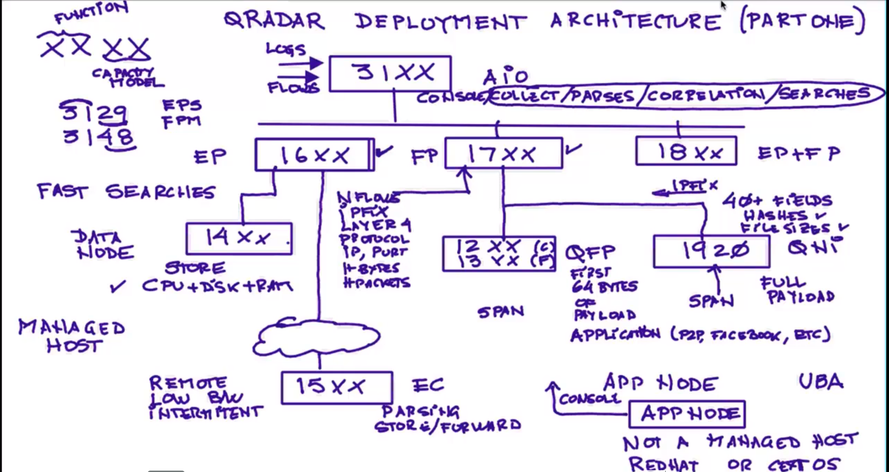
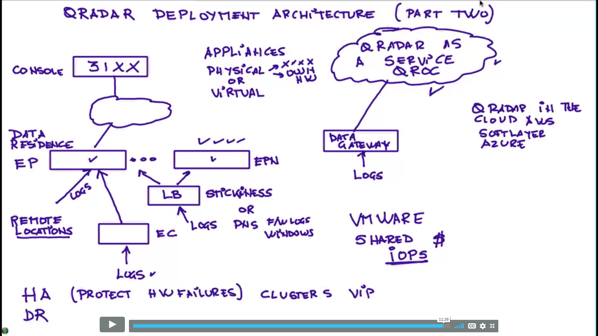
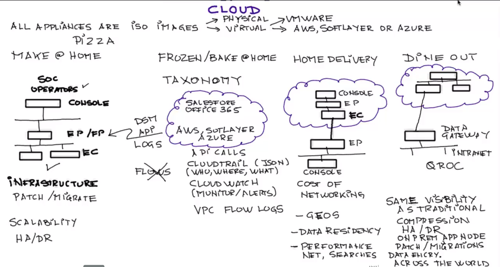
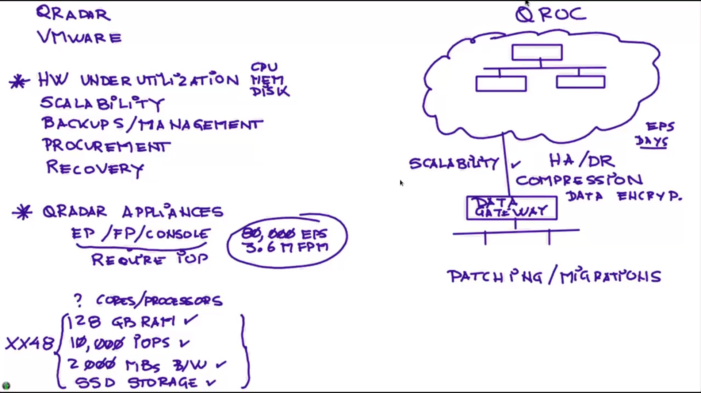

# Q-Radar Deployment Architecture

The appliances are denoted by 4 characters
+ The first 2 describe the function of an appliance
+ The last 2 have to do with the capacity of the machine, type of tech

e.g 3148 - console (all-in-one = 31), SSV drives machine (48)

***31XX is an all-in-one (AIO) machine***. Functions:
+ console
+ event collection
+ event parsing
+ correlation
+ searching
+ logs & flows connect to it

There's are certain processing caps, known as **Flows per minute (FPM)** and **Events per second (EPS)**.

+ ***16XX is an event processor (EP)***.
+ ***16XX is a flow processor (FP)***.
+ ***18XX is an event & a flow processor (EP & FP)***.

Types of # apps:
+ **N-flow processor** - network flows, IPFIX, J-flows, *layer 4 info* (type of protocol)
+ **Q-flow processor** - first 64 bytes of payload (determine type of app. e.g *P2P, FB, S2C*, ...)
  - ***12XX is copper Q-flow processor***
  - ***12XX is fiber Q-flow processor***
+ **QNI** - ***1920*** (first 40 fields of data, compute hashes, file sizes, ...)
+ **Event collector** - ***15XX*** (parsing, storing, forwarding of messages into EP)
+ **Data note** - increase storage (CPU, Disk, RAM) (***14XX***)
+ **Managed host**
+ **App node** - Any redhat and CentOS

Remote locations: the best is to be in the same LAN as the console (only the metadata goes into the actual console)

